# ComplyWise — Historical System Architecture

> Historical snapshot. This document is retained as investigation context.
> Current module ownership is in [docs/codebase-structure.md](docs/codebase-structure.md)
> and the active runtime diagram is [docs/backend-architecture.mmd](docs/backend-architecture.mmd).
> Counts, provider defaults and deployment statements below are not current verification.

Architecture Review Date: 2026-09-19  
Repository: ComplyWise  
Git Commit: 75117d3d222be86cb71d9064adabe665218013b5  
Git Short SHA: 75117d3  
Branch: main  
Backend Version: 0.1.0  
Frontend Version: 0.1.0  
Document Status: Historical snapshot (2026-09-19)

---

## 1. Executive Summary

ComplyWise is an industrial compliance and standards intelligence platform engineered specifically for Indian commercial enterprises, industrial manufacturers, and MSMEs. It addresses **Smart India Hackathon (SIH) Problem Statement ID 26130**: *Efficiency in streamlining industrial approvals, compliance processes, and access to government support services*.

### The Regulatory Challenge
Indian industrial enterprises operate under one of the most intricate regulatory landscapes globally. Operating an industrial facility in India routinely intersects with:
- **~1,536 statutory Acts** across Union and State jurisdictions
- **~69,233 compliance filings** across Central ministries, State Pollution Control Boards (SPCBs), District Industries Centres (DICs), Fire and Emergency Services, and local municipal corporations
- **~6,618 recurring annual compliance filings** with distinct deadlines, penalty structures, and validation rules
- Multi-tier statutory bodies including FSSAI, CDSCO, DGFT, PESO, CPCB/SPCB, Central Ground Water Authority (CGWA), Legal Metrology, and the Bureau of Indian Standards (BIS)

Traditional compliance discovery relies on expensive legal counsel, fragmented government portals (e.g., National Single Window System, State Single Window Portals), or fragile internal spreadsheets. The consequences include severe statutory penalties, manufacturing shutdown notices under Section 33A of the Water Act or Section 31A of the Air Act, director liabilities, and missed fiscal incentives under Central and State industrial policies.

### Architectural Philosophy
ComplyWise resolves this systemic friction by operationalizing the **Core Trust Chain**:

```text
Source Document → Extracted Evidence → Verified Knowledge → Structured AST Rule → Deterministic Applicability → Business Action
```

```mermaid
flowchart LR
    SRC["Official Source\n(Gazette / Act / Circular)"] --> EVD["Extracted Evidence\n(Clause / Excerpt / Citation)"]
    EVD --> KNB["Verified Knowledge\n(Requirement Definition)"]
    KNB --> AST["Structured AST Rule\n(Versioned Logic Tree)"]
    AST --> ENG["Deterministic Engine\n(Three-Valued Kleene Logic)"]
    ENG --> ACT["Business Action\n(Obligation / Document / Deadline)"]
    
    style SRC fill:#f9f9f9,stroke:#666,stroke-width:1px
    style EVD fill:#e1f5fe,stroke:#0288d1,stroke-width:1px
    style KNB fill:#e8f5e9,stroke:#388e3c,stroke-width:1px
    style AST fill:#fff3e0,stroke:#f57c00,stroke-width:1px
    style ENG fill:#ede7f6,stroke:#512da8,stroke-width:2px
    style ACT fill:#e0f2f1,stroke:#00796b,stroke-width:2px
```

### Absolute Boundary: AI vs Deterministic Logic
A foundational premise of ComplyWise is that **Large Language Models (LLMs) are never the authority for statutory applicability**.
- **The Role of AI / LLMs**: Natural-language business understanding, intelligent interview question formulation, unstructured claim extraction from scraped web gazettes, and conversational explanation with strict source citation grounding.
- **The Role of Deterministic Logic**: Business profile normalization, statutory rule evaluation, three-valued Kleene logic (3VL: `TRUE`, `FALSE`, `UNKNOWN`), precedence and exception handling, MSMED classification, document checklist derivation, and deadline scheduling.
- **Fail-Safe Invariant**: Under missing information, the engine yields `NEEDS_INFORMATION`, never a false negative or hallucinated exemption.

### Core Stack & Deployment Overview
- **Backend**: Modular monolith built on Python 3.12, Django 6.0, Django REST Framework (DRF), and PostgreSQL (Supabase) with `pgvector` for semantic indexing.
- **Frontend**: Single Page Application built on Next.js 16 (App Router), React 19, TypeScript 5, and Tailwind CSS 4.
- **Cloud Infrastructure**: Azure Container Apps (ACA) on serverless Consumption workload profiles, private Azure Container Registry (ACR), managed ingress TLS, and IPv4 connection pooling to Supabase PostgreSQL.

---

## 2. System Architecture

ComplyWise follows a clean, layered modular monolith pattern. Every capability is encapsulated within dedicated Django applications or isolated domain packages, enforcing strict dependency direction from identity to operational modules and read-side aggregation.

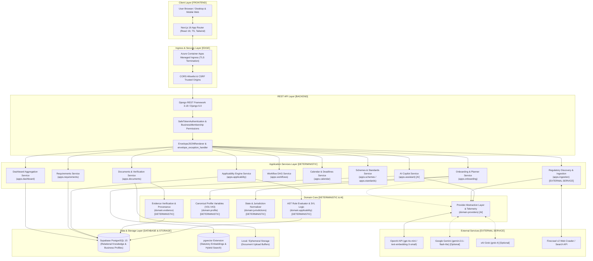

### Component Classification Matrix

| Component | Nature | Primary Responsibility | Critical Invariant |
| :--- | :--- | :--- | :--- |
| **Next.js App Router** | Deterministic UI | Client rendering, route guards, state machine, submit locks | Zero business logic in frontend |
| **API Envelope Middleware** | Deterministic | Enforces standard `{data, meta}` or `{error}` payloads | Predictable client consumption |
| **Applicability Engine** | Deterministic | AST evaluation under three-valued Kleene logic | Pure boolean execution, zero LLM intervention |
| **Business Context Resolver**| Deterministic | Resolves MSMED scale, pollution index, jurisdiction | Authoritative normalization of user facts |
| **Smart Question Planner** | Hybrid (Det-First) | Ranks missing rule variables; calls LLM batch at most once | Zero LLM calls on sequential answer submissions |
| **Evidence & Provenance** | Deterministic | Tracks gazette, locator, excerpt, status | No rule is active without verified evidence |
| **Firecrawl Ingestion** | External Service | Crawls official `.gov.in` websites for novel regulations | Discovered material is strictly quarantined |
| **Provider Telemetry** | Deterministic | Logs provider, model, tokens, cost, latency without PII | Hard budget caps per company assessment |
| **AI Assistant** | AI (Constrained) | Context-grounded conversational answers with citations | Output capped at 500 tokens; no decision authority |

---

## 3. End-to-End Company Assessment Flow

The journey of an enterprise founder through ComplyWise follows a rigorous 9-stage sequence.

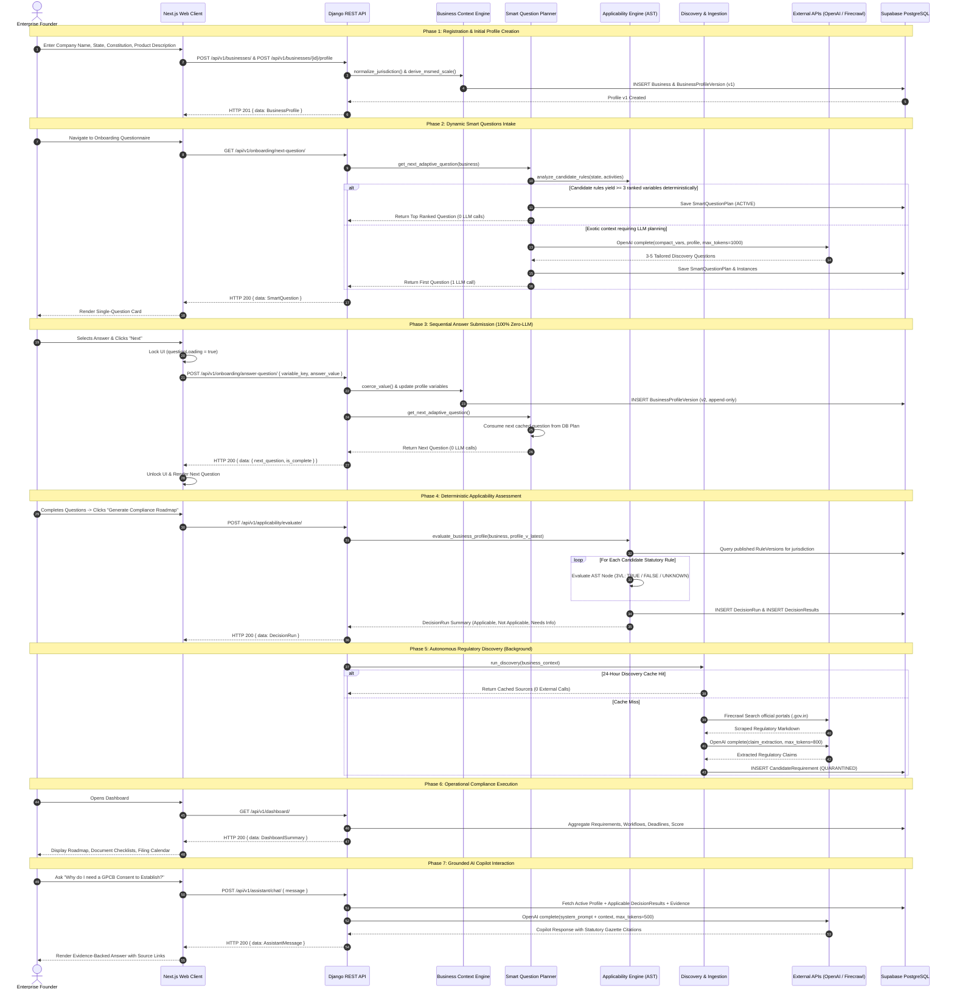

### Flow Breakdown Table

| Stage | Frontend Endpoint | Backend Endpoint | Backend Service / Function | DB Operation | LLM Calls | Ext API Calls | Output Produced |
| :--- | :--- | :--- | :--- | :--- | :--- | :--- | :--- |
| **1. Business Creation** | `/onboarding` | `POST /api/v1/businesses/` | `apps.businesses.services.create_business` | INSERT `Business`, INSERT `BusinessMembership` | 0 | 0 | Business object with UUID |
| **2. Profile Versioning** | `/onboarding` | `POST /api/v1/businesses/{id}/profile` | `apps.businesses.services.create_profile_version` | INSERT `BusinessProfileVersion` (v1) | 0 | 0 | Normalized profile record |
| **3. Question Planning** | `/onboarding` | `GET /api/v1/onboarding/next-question/` | `apps.onboarding.planner.get_next_adaptive_question` | SELECT `RuleVersion`, INSERT `SmartQuestionPlan` | 0 or 1 (max) | 0 or 1 | First personalized question |
| **4. Answer Submission** | `/onboarding` | `POST /api/v1/onboarding/answer-question/` | `apps.onboarding.services.answer_question` | INSERT `SmartQuestionAnswer`, INSERT `BusinessProfileVersion` | **0** | 0 | Next cached question or complete |
| **5. Applicability Evaluation** | `/dashboard` | `POST /api/v1/applicability/evaluate/` | `domain.applicability.engine.evaluate_business_profile` | INSERT `DecisionRun`, INSERT `DecisionResult` (N) | 0 | 0 | Full compliance decision set |
| **6. Regulatory Discovery** | Background | `POST /api/v1/ingestion/discover/` | `apps.ingestion.services.run_discovery` | INSERT `DiscoveryRun`, INSERT `CandidateRequirement` | 1 | 1 (Firecrawl) | Quarantined candidate claims |
| **7. Dashboard Read** | `/dashboard` | `GET /api/v1/dashboard/` | `apps.dashboard.services.get_dashboard_summary` | SELECT aggregations | 0 | 0 | Compliance score & stats |
| **8. Requirement Inspection** | `/requirements` | `GET /api/v1/requirements/` | `apps.requirements.services.get_business_requirements` | SELECT `RequirementInstance` | 0 | 0 | Detailed requirement cards |
| **9. Copilot Query** | `/assistant` | `POST /api/v1/assistant/chat/` | `apps.assistant.services.chat_with_assistant` | INSERT `AssistantMessage` | 1 | 0 | Evidence-backed answer |

---

## 4. Frontend Architecture

The frontend is implemented as a modern TypeScript application using the Next.js 16 App Router and React 19.

### Technology Stack
- **Framework**: Next.js 16.3.4 (Standalone build output)
- **Library**: React 19.2.8 & React DOM 19.2.8
- **Language**: TypeScript 5.x (`npx tsc --noEmit` clean)
- **Styling**: Tailwind CSS 4.x with PostCSS
- **Component Primitives**: Lucide React icons, native HTML5 accessible form elements

### Application Route Hierarchy
```text
frontend/app/
├── layout.tsx                  # Root layout: Shell, Navigation, Providers
├── page.tsx                    # Landing / marketing / problem statement overview
├── login/page.tsx              # Token authentication login
├── register/page.tsx           # User account registration
├── onboarding/page.tsx         # Multi-step intake & single-question adaptive card
├── dashboard/page.tsx          # Main compliance overview, scores, roadmap preview
├── requirements/page.tsx       # Filterable compliance requirements (Central/State/Local)
├── documents/page.tsx          # Required documents, upload slots, verification
├── workflows/page.tsx          # Interactive license approval roadmap DAGs
├── calendar/page.tsx           # 30-day upcoming statutory deadlines
├── schemes/page.tsx            # Government incentives & subsidy explorer
├── standards/page.tsx          # BIS CRS, QCO, and ISO standards catalog
├── regulatory-updates/page.tsx # Official gazette amendments & notifications
├── assistant/page.tsx          # Grounded AI compliance copilot chat
└── settings/page.tsx           # Business profile editing & preferences
```

### Client Architecture & Invariant Enforcement (`frontend/lib/api/client.ts`)
The API communication layer is centralized in `client.ts`:
1. **Dynamic Base URL Resolution**:
   ```typescript
   export function getApiBaseUrl(): string {
     if (process.env.NEXT_PUBLIC_API_BASE_URL) {
       return process.env.NEXT_PUBLIC_API_BASE_URL.replace(/\/+$/, "");
     }
     if (typeof window !== "undefined" && window.location?.origin) {
       if (window.location.hostname === "frontend-woad-eight-18.vercel.app") {
         return "https://backend-delta-inky-91.vercel.app/api/v1";
       }
       if (!window.location.origin.includes("localhost") && !window.location.origin.includes("127.0.0.1")) {
         return `${window.location.origin}/api/v1`;
       }
     }
     return "http://127.0.0.1:8000/api/v1";
   }
   ```
2. **Canonical Envelope Unwrapping**: Automatically unpacks `{ "data": T, "meta": ... }` payloads. If the backend reports an error, it throws an `ApiError` containing the error code, HTTP status, and specific field error details.
3. **Double-Click & Concurrent Request Guard**: In `frontend/app/onboarding/page.tsx`, `handleSequentialAnswerSubmit` enforces a strict in-flight submission lock:
   ```typescript
   if (questionLoading) return;
   setQuestionLoading(true);
   try {
     const res = await submitSequentialAnswer(businessId, currentQuestion.variable_key, value);
     // advance question state
   } finally {
     setQuestionLoading(false);
   }
   ```
4. **Timeout Control**: All `apiFetch` requests are bound by an `AbortController` defaulting to 30 seconds.

---

## 5. Backend Application Architecture

The backend is structured as a modular monolith in `backend/apps/` and core domain logic in `backend/domain/`.

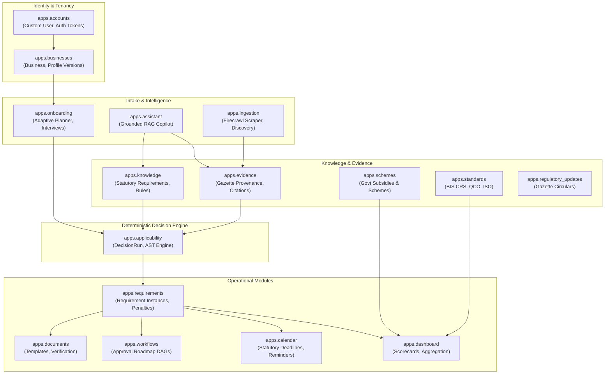

### Module Responsibilities & Implementation Status

| Django App | Implementation Status | Key Models | Primary Services & Views | Upstream / Downstream Dependencies |
| :--- | :--- | :--- | :--- | :--- |
| **`apps.accounts`** | Fully Implemented | `User` | User registration, token auth, me endpoint | Upstream for all authenticated apps |
| **`apps.businesses`**| Fully Implemented | `Business`, `BusinessMembership`, `BusinessProfileVersion` | Profile versioning, business CRUD | Depends on `accounts`; used by all business views |
| **`apps.onboarding`**| Fully Implemented | `SmartQuestionPlan`, `SmartQuestionInstance`, `SmartQuestionAnswer` | `planner.py`, `services.py` | Consumes `businesses`, `knowledge`, `applicability` |
| **`apps.knowledge`** | Fully Implemented | `AuthorityBody`, `RegulatorySource`, `RequirementDefinition`, `RuleVersion`, `RuleDependency` | `load_knowledge_packs` management command | Core knowledge base; used by `applicability` |
| **`apps.evidence`**  | Fully Implemented | `Source`, `Evidence` | Provenance validation, excerpt retrieval | Linked to `knowledge` and `applicability` |
| **`apps.applicability`**| Fully Implemented | `DecisionRun`, `DecisionResult` | `ApplicabilityEngine`, AST evaluator | Evaluates `knowledge` against `businesses` profile |
| **`apps.requirements`** | Fully Implemented | `RequirementInstance`, `ComplianceObligation` | Requirement filtering, fee/penalty derivation | Derives from `DecisionResult` |
| **`apps.documents`** | Basic Implemented | `DocumentTemplate`, `DocumentRecord` | Document checklist generation, verification | Uses local filesystem storage (Cloud Blob ready) |
| **`apps.workflows`** | Fully Implemented | `WorkflowRoadmap`, `WorkflowStep` | Multi-stage DAG sequencing, status progression | Generated from applicable `requirements` |
| **`apps.calendar`**  | Fully Implemented | `CalendarEvent`, `DeadlineNotification` | Statutory recurring filing calculators | Reads `requirements` and statutory windows |
| **`apps.schemes`**   | Catalog-Based | `GovernmentScheme`, `SchemeEligibility` | Deterministic MSME & sector subsidy matching | Evaluates against `BusinessProfileVersion` |
| **`apps.standards`** | Catalog-Based | `IndustryStandard`, `ProductStandardMapping` | BIS CRS & QCO classification matcher | Matches `product_description` keywords |
| **`apps.regulatory_updates`** | Catalog-Based | `RegulatoryUpdate` | Gazette amendment tracking & notifications | Attached to `knowledge` regulatory sources |
| **`apps.assistant`** | Fully Implemented | `AssistantSession`, `AssistantMessage` | Grounded RAG copilot with strict citations | Consumes `knowledge`, `evidence`, `domain.providers`|
| **`apps.ingestion`** | Fully Implemented | `DiscoveryRun`, `CandidateRequirement` | Firecrawl search client, claim extraction | Discovered items quarantined; admin verified |
| **`apps.dashboard`** | Fully Implemented | *(Read-side aggregation)* | `get_dashboard_summary`, score calculation | Reads all operational apps |

---

## 6. Data Model

The relational database model guarantees immutability, full auditability, and clear separation between verified statutory law and tenant-specific business data.

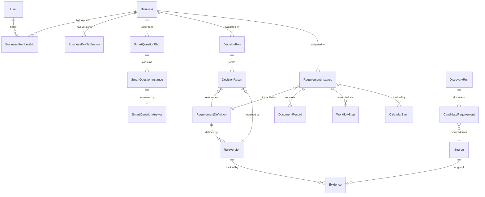

### Core Relational Models

#### 1. `BusinessProfileVersion` (Immutable Audit Trail)
- **Table**: `businesses_businessprofileversion`
- **Fields**: `id` (UUID), `business_id` (FK), `version` (int), `variables` (JSONField), `change_note` (varchar), `created_at` (datetime).
- **Rule**: Never mutated via `UPDATE`. Every answer, profile edit, or verification creates `version = version + 1`. This preserves an exact legal record of what the company claimed at the time an applicability decision was generated.

#### 2. `RequirementDefinition` & `RuleVersion` (Knowledge Graph)
- **Table**: `knowledge_requirementdefinition` & `knowledge_ruleversion`
- **Fields (`RequirementDefinition`)**: `requirement_id` (varchar PK), `name`, `authority`, `category` (LICENCE, REGISTRATION, CONSENT, RETURN, DISCLOSURE), `jurisdiction` (CENTRAL, GUJARAT, TELANGANA, etc.), `status` (DRAFT, VERIFIED, PUBLISHED, SUPERSEDED).
- **Fields (`RuleVersion`)**: `rule_id` (varchar), `version` (int), `condition_ast` (JSONField), `result` (APPLICABLE, NOT_APPLICABLE), `evidence_refs` (JSONField), `rule_type` (NORMAL, EXCEPTION, OVERRIDE).

#### 3. `DecisionRun` & `DecisionResult` (Evaluation Ledger)
- **Table**: `applicability_decisionrun` & `applicability_decisionresult`
- **Fields (`DecisionRun`)**: `id` (UUID), `business_id` (FK), `profile_version_id` (FK), `status` (SUCCESS, FAILED), `engine_version` (varchar), `evaluated_at` (datetime).
- **Fields (`DecisionResult`)**: `run_id` (FK), `requirement_id` (FK), `status` (APPLICABLE, NOT_APPLICABLE, NEEDS_INFORMATION), `confidence` (float), `explanation_trace` (JSONField storing matched rule, AST branch, and resolved variables), `evidence_refs` (JSONField).

#### 4. `CandidateRequirement` (Quarantined Discovered Knowledge)
- **Table**: `ingestion_candidaterequirement`
- **Fields**: `id` (UUID), `discovery_run_id` (FK), `name`, `source_url`, `extracted_claims` (JSONField), `status` (QUARANTINED, AUDITED, REJECTED, PROMOTED).
- **Security Invariant**: Quarantined items are structurally prohibited from being queried by `ApplicabilityEngine`.

---

## 7. Business Context Engine

The Business Context Engine (`domain/profile/` and `apps/businesses/`) transforms ambiguous, messy user inputs into normalized, typed, and legally unambiguous statutory parameters.

### Canonical Variable Registry (V01 to V43)
The platform defines 43 canonical variables categorized into 6 statutory domains:

1. **Identity & Structure**: `legal_constitution` (Pvt Ltd, LLP, Sole Prop), `registration_number` (CIN/LLPIN).
2. **Geographic Jurisdiction**: `state` (normalized ISO/FIPS code), `district`, `industrial_zone_status` (GIDC, TSIIC, SEZ, Notified Industrial Area).
3. **Operational Scale & Financials**: `investment_plant_machinery` (INR), `annual_turnover` (INR), `total_worker_count`, `female_worker_count`, `contract_labour_count`.
4. **Environmental & Industrial Pollution**: `connected_power_load` (HP/kVA), `water_consumption_daily` (kL/day), `effluent_discharge_daily` (kL/day), `hazardous_waste_generation` (bool), `boiler_installed` (bool), `diesel_generator_capacity` (kVA).
5. **Sector & Operational Activity**: `manufacturing_intent` (bool), `food_business_type` (Manufacturer, Repacker, Wholesaler), `daily_processing_capacity` (MT/day), `cold_storage_installed` (bool), `plastic_packaging_used` (bool), `e_waste_handling` (bool).
6. **Cross-Border Trade**: `import_export_intent` (bool), `iec_code`, `export_destination` (list of country codes).

### Deterministic Derivation Pipeline

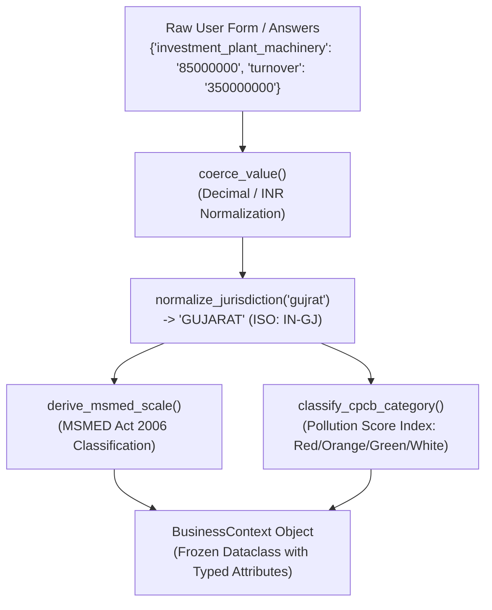

#### MSMED Act 2006 Derivation Logic:
```python
# Investment in Plant & Machinery AND Annual Turnover (Notification S.O. 2119(E))
if investment <= 1_00_00_000 and turnover <= 5_00_00_000:
    return "MICRO"
elif investment <= 10_00_00_000 and turnover <= 50_00_00_000:
    return "SMALL"
elif investment <= 50_00_00_000 and turnover <= 250_00_00_000:
    return "MEDIUM"
else:
    return "LARGE"
```

---

## 8. Smart Questions Architecture

The Smart Questions subsystem gathers missing decision-critical variables through a structured pre-discovery interview.

### Architecture Comparison: Pre-Optimization vs Post-Optimization

```mermaid
flowchart TD
    subgraph PRE ["PRE-OPTIMIZATION (Multiplicative Cost Risk)"]
        A1["Founder Answers Q1"] --> B1["Backend receives answer"]
        B1 --> C1["Calls OpenAI (complete) with full 43-variable prompt"]
        C1 --> D1["LLM generates 15 questions"]
        D1 --> E1["Backend takes Q2 and DISCARDS 14 questions"]
        E1 --> F1["Founder Answers Q2"]
        F1 --> G1["Calls OpenAI again with full prompt -> 8-10 calls / founder!"]
    end

    subgraph POST ["POST-OPTIMIZATION (Deterministic-First Architecture)"]
        A2["Founder Starts Intake"] --> B2["Analyze Published Rules ASTs Deterministically"]
        B2 --> C2{"Ranked Unresolved Variables >= 3?"}
        C2 -- YES --> D2["Build Question Queue 100% Deterministically (0 LLM Calls)"]
        C2 -- NO (Exotic) --> E2["Single Batch LLM Call (Compact Prompt, max 1000 tokens)"]
        E2 --> F2["Cache Queue in SmartQuestionPlan (ACTIVE)"]
        D2 --> F2
        F2 --> G2["Founder Answers Question"]
        G2 --> H2["Save Answer & Append BusinessProfileVersion"]
        H2 --> I2["Fetch Next Question from DB Queue (0 LLM Calls)"]
        I2 --> J2["Re-evaluate AST Engine Deterministically (0 LLM Calls)"]
    end
```

### Prompt Optimization & Catalog Pruning
- **Pre-Optimization**: Prompt included an 11,951-character static `CANONICAL_VARIABLE_CATALOG` block injected on every single call.
- **Post-Optimization**: Replaced with a compact, dynamic dictionary of only unresolved variables relevant to the candidate statutory rules (~150 characters).
- **Prompt Caching Structure**: Static instructions and JSON schema constraints are positioned first in the prompt prefix to leverage OpenAI automated prefix caching; dynamic business values are appended at the bottom.

---

## 9. Regulatory Discovery

ComplyWise incorporates an autonomous discovery engine powered by Firecrawl to identify novel, unseeded, or recently amended regulations from official Indian government domains.

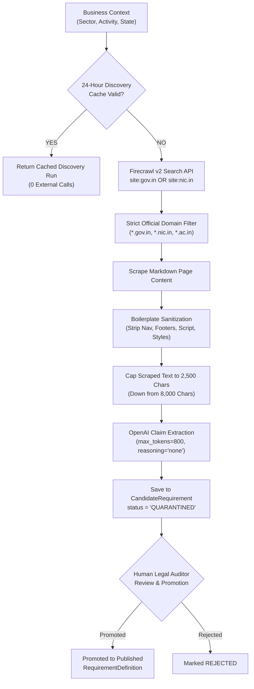

### Critical Quarantine Invariant
**Discovered regulatory material is NEVER directly evaluated in production applicability runs.**
A candidate requirement remains in `QUARANTINED` status until an administrator or legal researcher verifies the gazette citation, checks the penalty clauses, and formally approves promotion to `KnowledgeStatus.PUBLISHED`.

---

## 10. Knowledge Pipeline

The knowledge pipeline governs how raw statutory texts become verifiable computational rules.

```text
Official Gazette / Act / Circular
         ↓ (Acquisition & Archival)
Source Record (Gazette Number, Issuing Authority, Ministry, Official URL)
         ↓ (Legal Extraction & Annotation)
Evidence Record (Section / Rule Locator, Exact Text Excerpt, Verification Hash)
         ↓ (Statutory Modeling)
Requirement Definition (Licence, Consent, Return, Statutory Category)
         ↓ (Logical Formalization)
Rule Version (Condition AST, Kleene 3VL Logic, Precedence Level)
         ↓ (Verification Gate)
Status = PUBLISHED (Active in Production Engine)
```

### Knowledge Packs
Initial statutory knowledge is ingested via structured Python knowledge packs located in `backend/apps/knowledge/packs/`:
- `central_base.py`: Factories Act 1948, EPF Act 1952, ESI Act 1948, Water Act 1974, Air Act 1981, Environment Protection Act 1986.
- `fssai_food.py`: FSSAI Licensing & Registration Regulations 2011, Schedule 4 sanitary requirements.
- `state_gujarat.py`: GPCB Consent to Establish (CTE) / Consent to Operate (CTO), Gujarat Factories Rules.
- `state_telangana.py`: TS-iPass Single Window Act, TSPCB Water/Air Consents, Telangana Factory Rules.
- `state_tamilnadu.py`: TNPCB Orange/Red category rules, Fire NOC requirements under TN Fire Service Act.
- `state_karnataka.py`: KSPCB Consents, Karnataka Industrial Policy concessions.
- `foreign_trade.py`: Foreign Trade (Development & Regulation) Act 1992, DGFT IEC requirements.
- `bis_crs.py`: Bureau of Indian Standards Compulsory Registration Scheme (CRS) for electronics and IT goods.

---

## 11. Applicability Engine

The Applicability Engine (`domain/applicability/engine.py` and `apps/applicability/`) evaluates whether statutory obligations apply to a specific enterprise.

### Abstract Syntax Tree (AST) Grammar
Statutory conditions are stored as JSON Abstract Syntax Trees. Python's `eval()` is strictly prohibited; evaluation uses a deterministic visitor pattern.

```json
{
  "op": "AND",
  "args": [
    {
      "op": "EQ",
      "left": {"var": "state"},
      "right": "GUJARAT"
    },
    {
      "op": "OR",
      "args": [
        {
          "op": "GTE",
          "left": {"var": "connected_power_load"},
          "right": 10
        },
        {
          "op": "GTE",
          "left": {"var": "total_worker_count"},
          "right": 10
        }
      ]
    }
  ]
}
```

### Supported AST Operators
- **Logical**: `AND`, `OR`, `NOT`
- **Comparison**: `EQ`, `NEQ`, `GT`, `GTE`, `LT`, `LTE`
- **Membership & Substring**: `IN`, `CONTAINS`, `STARTSWITH`, `ENDSWITH`
- **Variables**: `{"var": "<variable_key>"}`

### Three-Valued Kleene Logic (3VL)
When a variable has not yet been answered by the founder, its truth value is `UNKNOWN`. The engine follows strict Kleene three-valued logic:

| Operator | Left Operand | Right Operand | Result |
| :--- | :--- | :--- | :--- |
| **AND** | `TRUE` | `UNKNOWN` | `UNKNOWN` |
| **AND** | `FALSE` | `UNKNOWN` | `FALSE` |
| **AND** | `UNKNOWN` | `UNKNOWN` | `UNKNOWN` |
| **OR** | `TRUE` | `UNKNOWN` | `TRUE` |
| **OR** | `FALSE` | `UNKNOWN` | `UNKNOWN` |
| **OR** | `UNKNOWN` | `UNKNOWN` | `UNKNOWN` |
| **NOT** | `UNKNOWN` | — | `UNKNOWN` |

- If the AST evaluates to `TRUE` → Status is `APPLICABLE`.
- If the AST evaluates to `FALSE` → Status is `NOT_APPLICABLE`.
- If the AST evaluates to `UNKNOWN` → Status is `NEEDS_INFORMATION`. The engine extracts the specific unresolved variable keys and surfaces them as priority questions.

---

## 12. Evidence & Provenance

Every compliance result produced by ComplyWise is cryptographically and textually linked to official legal evidence.

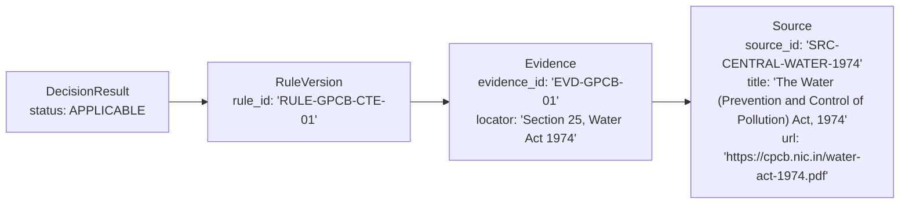

### Provenance Audit Trail
A `DecisionResult` JSON payload includes the complete explanation trace:
```json
{
  "requirement_id": "REQ-GPCB-CTE-01",
  "status": "APPLICABLE",
  "confidence": 1.0,
  "explanation_trace": {
    "matched_rule_id": "RULE-GPCB-CTE-01",
    "rule_version": 1,
    "evaluated_conditions": [
      {"variable": "state", "value": "GUJARAT", "result": true},
      {"variable": "manufacturing_intent", "value": true, "result": true},
      {"variable": "effluent_emission_generation", "value": true, "result": true}
    ]
  },
  "evidence_refs": [
    {
      "evidence_id": "EVD-GPCB-01",
      "source_id": "SRC-GPCB-WATER-1974",
      "locator": "Section 25",
      "excerpt": "No person shall, without the previous consent of the State Board, establish or take any steps to establish any industry...",
      "official_url": "https://gpcb.gujarat.gov.in"
    }
  ]
}
```

---

## 13. Requirements

Requirements (`apps/requirements/`) represent concrete statutory obligations derived from applicable rules.

### Metadata & Statutory Enrichment
Each `RequirementInstance` is enriched with actionable compliance metadata:
- **Approval Authority**: E.g., Food Safety and Standards Authority of India (FSSAI), Gujarat Pollution Control Board (GPCB).
- **Statutory Forms**: Mandatory forms required for filing (e.g., Form A under FSSAI, Form I under Factories Act).
- **Processing Time / SLA**: Government citizen charter timelines (e.g., 30 days for CTE, 60 days for FSSAI State License).
- **Statutory Fees**: Fee schedules based on investment, power load, or turnover.
- **Penal Consequences**: Exact penal provisions for non-compliance (e.g., imprisonment up to 3 months and fine under Section 44 of the Water Act).

---

## 14. Documents

The document management subsystem (`apps/documents/`) bridges statutory requirements with physical verification.

### Document Pipeline & Verification
1. **Checklist Generation**: Applicable requirements deterministically trigger document templates (e.g., Site Plan, Process Flow Diagram, Pan Card, Water Balance Chart, Board Resolution).
2. **Metadata & Completeness Verification** (`backend/apps/documents/verification.py`):
   - Deterministic validation: File format verification (PDF, PNG, JPG), size bounds (max 10MB), non-empty payload checks.
   - LLM Completeness Verification: Uses OpenAI with max 500 output tokens and `reasoning_effort="none"` to inspect uploaded document text against mandatory statutory clauses.
3. **Storage Implementation**: Currently uses Django default filesystem storage (local media volume in development / container-ephemeral volume in deployment). Configured with abstraction hooks for Azure Blob Storage / AWS S3.

---

## 15. Workflow Engine

The Workflow Engine (`apps/workflows/`) organizes individual requirements into a sequential execution roadmap.

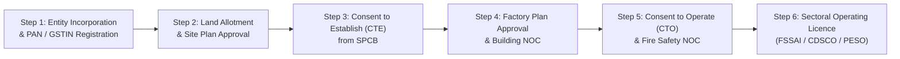

### Directed Acyclic Graph (DAG) Sequencing
- Pre-requisites and dependencies are enforced using topological sorting.
- For example, an enterprise cannot apply for **Consent to Operate (CTO)** before obtaining **Consent to Establish (CTE)** and submitting an environmental compliance completion report.
- Status progression: `NOT_STARTED` → `IN_PROGRESS` → `SUBMITTED` → `APPROVED` → `EXPIRED`.

---

## 16. Calendar & Deadlines

The calendar service (`apps/calendar/`) monitors statutory filing deadlines and generates proactive alerts.

### Deadline Classification
- **Statutory Fixed Filings**: Fixed calendar dates (e.g., Annual Environmental Statement Form V by September 30, Annual Returns under Factories Act by February 1).
- **Validity & Renewal Cycles**: Rolling dates calculated from issuance (e.g., CTE valid for 5 years, FSSAI valid for 1–5 years).
- **Proactive Window**: The platform queries upcoming obligations within a configurable window (`UPCOMING_DEADLINE_WINDOW_DAYS`, default 30 days) and flags urgent filings with high-priority warnings.

---

## 17. Schemes and Standards

### Government Schemes (`apps/schemes/`)
- Integrates Central and State MSME industrial subsidy policies:
  - **Credit Linked Capital Subsidy Scheme (CLCSS)** for technology upgradation.
  - **Production Linked Incentive (PLI)** schemes across electronics, food processing, and pharmaceuticals.
  - **State Concessions**: Stamp duty exemption, power tariff subsidies (e.g., Gujarat Industrial Policy 2020).
- Eligibility is evaluated deterministically against profile attributes (`msme_scale`, `investment_plant_machinery`, `state`, `sector`).

### Industry Standards (`apps/standards/`)
- Bureau of Indian Standards (BIS) Compulsory Registration Scheme (CRS) and Quality Control Orders (QCOs).
- Keyword and HS code matching identifies whether manufactured products require mandatory ISI marking or CRS registration prior to market placement.

---

## 18. AI Assistant

The AI Compliance Assistant (`apps/assistant/services.py`) serves as an interactive copilot for enterprise founders.

### Retrieval-Augmented Generation (RAG) Architecture
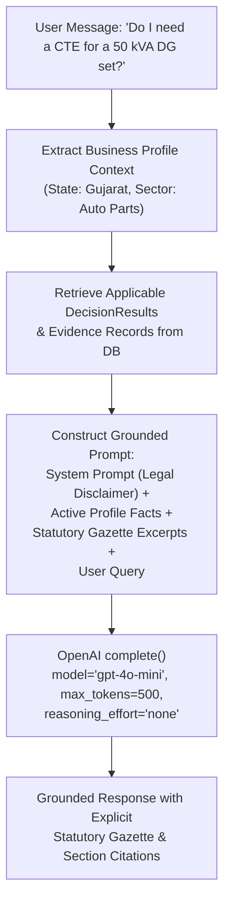

### Safety & Grounding Constraints
- **Strict Citation Mandate**: The assistant is instructed to cite explicit legal sections, gazettes, and official authorities.
- **Refusal on Out-of-Scope Queries**: If a question falls outside Indian industrial compliance or platform evidence, the assistant gracefully declines to speculate.
- **Decision Authority Ban**: Assistant responses include a disclaimer that conversations are informational and do not override formal applicability determinations.

---

## 19. AI vs Deterministic Boundary

The architectural boundary separating deterministic execution from artificial intelligence is strictly enforced:

| Platform Capability | AI / LLM | Deterministic | Database / Storage | External Service |
| :--- | :---: | :---: | :---: | :---: |
| **User Authentication & Permissions** | ❌ | ✅ | ✅ | ❌ |
| **Business Profile Normalization** | ❌ | ✅ | ✅ | ❌ |
| **MSMED Enterprise Scale Derivation** | ❌ | ✅ | ❌ | ❌ |
| **Jurisdiction Normalization (ISO codes)** | ❌ | ✅ | ❌ | ❌ |
| **Unresolved Variable Discovery** | ❌ | ✅ | ✅ | ❌ |
| **Pre-Discovery Interview Question Ranking** | ⚠️ (Optional Batch) | ✅ (Primary) | ✅ | ❌ |
| **Sequential Question-Answer Intake** | ❌ | ✅ | ✅ | ❌ |
| **AST Statutory Rule Parsing & Validation** | ❌ | ✅ | ❌ | ❌ |
| **Final Regulatory Applicability Decision**| ❌ | ✅ | ✅ | ❌ |
| **Kleene 3-Valued Logic Evaluation** | ❌ | ✅ | ❌ | ❌ |
| **Evidence & Gazette Provenance Tracking**| ❌ | ✅ | ✅ | ❌ |
| **Candidate Web Gazette Discovery** | ❌ | ❌ | ❌ | ✅ (Firecrawl) |
| **Web Text Boilerplate Cleaning** | ❌ | ✅ | ❌ | ❌ |
| **Scraped Text Claim Extraction** | ✅ | ❌ | ❌ | ❌ |
| **Candidate Requirement Quarantine** | ❌ | ✅ | ✅ | ❌ |
| **Document Checklist Derivation** | ❌ | ✅ | ✅ | ❌ |
| **Document Clause Completeness Check** | ✅ (Constrained) | ✅ (MIME/Size) | ✅ | ❌ |
| **Workflow DAG Topological Sequencing** | ❌ | ✅ | ✅ | ❌ |
| **Filing Calendar & Statutory Deadlines** | ❌ | ✅ | ✅ | ❌ |
| **Government Subsidy Scheme Matching** | ❌ | ✅ | ✅ | ❌ |
| **BIS / QCO Standard Matching** | ❌ | ✅ | ✅ | ❌ |
| **Conversational Copilot Explanations** | ✅ (Constrained) | ❌ | ✅ | ❌ |

---

## 20. API Architecture

ComplyWise exposes a comprehensive RESTful API adhering to the JSON Envelope specification.

### Primary Endpoints Reference

| HTTP Method | Route | Auth Required | Purpose | Request Body | Response Envelope | Backend Service |
| :--- | :--- | :---: | :--- | :--- | :--- | :--- |
| `GET` | `/health` | No | Platform liveness probe | None | `{"status": "ok"}` | Platform probe |
| `GET` | `/api/v1/health/ready` | No | Deep readiness check | None | `{data: {database, pgvector, llm}}` | `apps.health` |
| `POST` | `/api/v1/auth/register` | No | Create user account | `{email, password, full_name}` | `{data: {user, token}}` | `apps.accounts` |
| `POST` | `/api/v1/auth/login` | No | Authenticate & get token | `{email, password}` | `{data: {user, token}}` | `apps.accounts` |
| `GET` | `/api/v1/businesses` | Yes | List tenant businesses | None | `{data: [Business]}` | `apps.businesses` |
| `POST` | `/api/v1/businesses` | Yes | Register new business | `{name, legal_constitution}` | `{data: Business}` | `apps.businesses` |
| `GET` | `/api/v1/businesses/{id}/profile` | Yes | Current profile version | None | `{data: BusinessProfile}` | `apps.businesses` |
| `POST` | `/api/v1/businesses/{id}/profile` | Yes | Create immutable profile v | `{variables: {...}}` | `{data: BusinessProfileVersion}` | `apps.businesses` |
| `GET` | `/api/v1/onboarding/next-question/`| Yes | Fetch next intake question | Query: `?business_id=UUID` | `{data: SmartQuestion}` | `apps.onboarding` |
| `POST` | `/api/v1/onboarding/answer-question/`| Yes | Answer single question | `{business_id, variable_key, answer_value}` | `{data: {next_question, is_complete}}`| `apps.onboarding` |
| `POST` | `/api/v1/applicability/evaluate/` | Yes | Run applicability engine | `{business_id}` | `{data: DecisionRun}` | `apps.applicability`|
| `GET` | `/api/v1/dashboard/` | Yes | Compliance dashboard | Query: `?business_id=UUID` | `{data: DashboardSummary}` | `apps.dashboard` |
| `GET` | `/api/v1/requirements/` | Yes | List requirements | Query: `?business_id=UUID` | `{data: [RequirementInstance]}` | `apps.requirements` |
| `POST` | `/api/v1/ingestion/discover/` | Yes | Run regulatory discovery | `{business_id}` | `{data: DiscoveryRun}` | `apps.ingestion` |
| `POST` | `/api/v1/assistant/chat/` | Yes | Ask compliance copilot | `{business_id, message}` | `{data: AssistantMessage}` | `apps.assistant` |

---

## 21. Request Lifecycle

To illustrate internal control flow, consider an enterprise founder answering an intake question via `POST /api/v1/onboarding/answer-question/`:

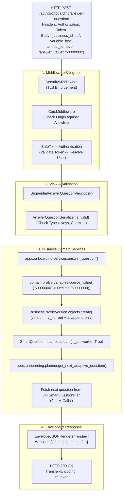

---

## 22. Authentication & Multi-Tenancy

ComplyWise enforces strict multi-tenant data isolation at the ORM layer.

### Identity Model (`apps.accounts.models.User`)
- Uses email as the unique username identifier.
- Passwords hashed using PBKDF2 with SHA-256 (Django default security standard).
- **Privacy Compliance Invariant**: Zero personal identity numbers (such as individual PAN or Aadhaar) are stored in the User table.

### Tenancy Isolation (`apps.businesses.models.BusinessMembership`)
- Multi-tenancy is structured around the `Business` organization entity.
- Role-Based Access Control (RBAC):
  - `OWNER`: Full administrative access, profile editing, billing, team management.
  - `COMPLIANCE_OFFICER`: Profile editing, document uploading, questionnaire completion.
  - `VIEWER`: Read-only access to dashboard, requirements, and roadmaps.
- **Tenant Isolation Enforcement**: All business-scoped API views query via membership filters:
  ```python
  def get_queryset(self):
      return Business.objects.filter(memberships__user=self.request.user)
  ```
  Users cannot query or mutate profiles, assessment runs, or documents of businesses they do not belong to.

---

## 23. Error Handling & Resilience

### Centralized Exception Envelope
Uncaught exceptions and validation errors are intercepted by `common.envelope.envelope_exception_handler`, producing a predictable JSON envelope:
```json
{
  "error": {
    "code": "VALIDATION_ERROR",
    "message": "Invalid submission data.",
    "details": [
      {
        "field": "annual_turnover",
        "message": "Value must be a positive integer or decimal."
      }
    ]
  }
}
```

### Fallback & Graceful Degradation
- **LLM Outage / Quota Exceeded**: If the OpenAI API returns 429 (Rate Limit) or 503 (Service Unavailable), the system logs the incident via `domain.providers.telemetry` and falls back 100% to deterministic AST rule evaluation. Intake questions are populated directly from missing rule variables rather than blocking the founder.
- **Firecrawl Outage**: If live web discovery fails, the system logs a warning, skips web acquisition, and processes the enterprise using existing verified knowledge packs.
- **Missing Variable State**: When a rule condition cannot be resolved due to missing profile variables, the engine safely yields `NEEDS_INFORMATION`, preventing false negative compliance conclusions.

---

## 24. Observability & Telemetry

### Safe LLM & Cost Telemetry (`domain/providers/telemetry.py`)
To prevent runaway model expenditures while strictly respecting privacy:
- **Logged Attributes**: `provider`, `model`, `workflow`, `tokens` (`input_tokens`, `cached_input_tokens`, `output_tokens`, `reasoning_tokens`, `total_tokens`), `estimated_cost_usd`, `latency_ms`.
- **Absolute Privacy Invariant**: Prompts, raw user messages, passwords, API keys, and PII are **never** logged.

### Health & Readiness Probes
- **Liveness Probe** (`/health` & `/api/v1/health`): Returns HTTP 200 if the WSGI/Gunicorn container process is running.
- **Readiness Probe** (`/api/v1/health/ready`): Executes a deep readiness check:
  - Database connectivity (`SELECT 1`)
  - `pgvector` extension availability
  - Published regulatory knowledge pack count (`RequirementDefinition.objects.filter(status='PUBLISHED').count() > 0`)
  - Configured LLM provider availability

---

## 25. Deployment Architecture

ComplyWise is containerized and architected for deployment to Microsoft Azure Container Apps (ACA) using serverless Consumption profiles.

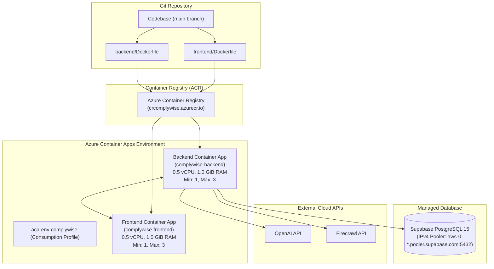

### Container Specifications
- **Backend Container**: Built on `python:3.12-slim`. Multi-layer caching, non-root user, Gunicorn WSGI server. Compressed image size: **~76.5 MB**.
- **Frontend Container**: Built on `node:22-alpine`. Multi-stage Next.js standalone output bundle (`deps` → `builder` → `runner`), non-root `nextjs` user. Compressed image size: **~87.3 MB**.

---

## 26. Cost Architecture

### Azure Infrastructure Cost Controls
- **Consumption Workload Profile**: Zero fixed VM overhead; billing is based strictly on active execution seconds.
- **Right-Sized Resource Allocations**: 0.5 vCPU and 1.0 GiB RAM per container, providing high performance while minimizing consumption charges.
- **Absence of Unnecessary Infrastructure**: Eliminates expensive Azure Database for PostgreSQL, Redis clusters, API Management gateways, and Application Gateways. External Supabase connection pooler is utilized directly.

### AI / Token Cost Optimization Controls
- **Deterministic-First Onboarding**: Sequential question answering uses 0 LLM calls.
- **Model Routing**: Routed to cost-efficient `gpt-4o-mini` ($0.15/1M input tokens, $0.60/1M output tokens).
- **Prompt Catalog Pruning**: Reduced prompt context from 11,951 characters to ~150 characters.
- **Discovery Caching**: 24-hour hash-based cache on Firecrawl web scraping.
- **Budget Caps**: Hard limits configured in `backend/config/settings.py`:
  - `MAX_LLM_CALLS_PER_ASSESSMENT = 5`
  - `MAX_TOTAL_TOKENS_PER_ASSESSMENT = 20000`
  - `MAX_ESTIMATED_COST_PER_ASSESSMENT = 0.05` ($0.05 USD ceiling)

---

## 27. Security Architecture

- **Zero-Secret Commitment**: No API keys, passwords, database URIs, or secret tokens are checked into git. All secrets are passed as runtime environment variables.
- **Network Boundaries**: Azure Container Apps ingress terminates TLS. Backend CORS strictly validates against allowed origins. CSRF trusted origins are enforced on all mutating requests.
- **Database Transport Security**: `DATABASE_SSL_REQUIRE = True` enforces TLS encryption on all queries to the Supabase connection pooler.
- **Non-Root Execution**: Both Docker containers execute under unprivileged system users (`UID 1000` / `UID 1001`), mitigating container escape vulnerabilities.

---

## 28. Current Limitations

| Capability / Module | Current Implementation State | Technical Limitation | Production Implication |
| :--- | :--- | :--- | :--- |
| **Document Storage** | Local Filesystem / Ephemeral Storage | Binary files stored locally in `/app/media`; not persisted across container restarts | Production deployment requires mounting Azure Blob Storage or S3 bucket adapter |
| **Document OCR** | Text / Metadata Extraction | Scanned non-searchable image PDFs cannot be parsed for clause text | Scanned physical documents require human visual verification |
| **Workflow State Machine** | Read-side Derived Roadmaps | Workflow roadmaps are dynamically computed from active requirements; not a persistent BPMN state machine | Step completion is tracked in DB, but external webhook triggers require manual update |
| **State Knowledge Coverage** | Deep Coverage: 4 Key States (GJ, TS, TN, KA) + Central | Comprehensive state-level knowledge packs exist for 4 states; other states fall back to Central Acts + Discovery | Enterprises in unseeded states rely on Central Acts and quarantined candidate discovery |
| **Automated Regulatory Feeds** | Periodic Ingestion / Admin Trigger | Gazettes are fetched via Firecrawl or loaded via packs; real-time gazette webhooks are not yet connected | Regulatory updates must be triggered periodically by cron or platform administrators |

---

## 29. Current vs Target Architecture

### A. Current Implemented Architecture
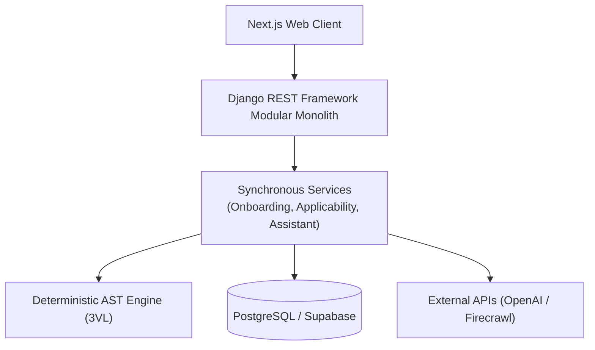

### B. Target / Future Production Architecture (Future Roadmap)
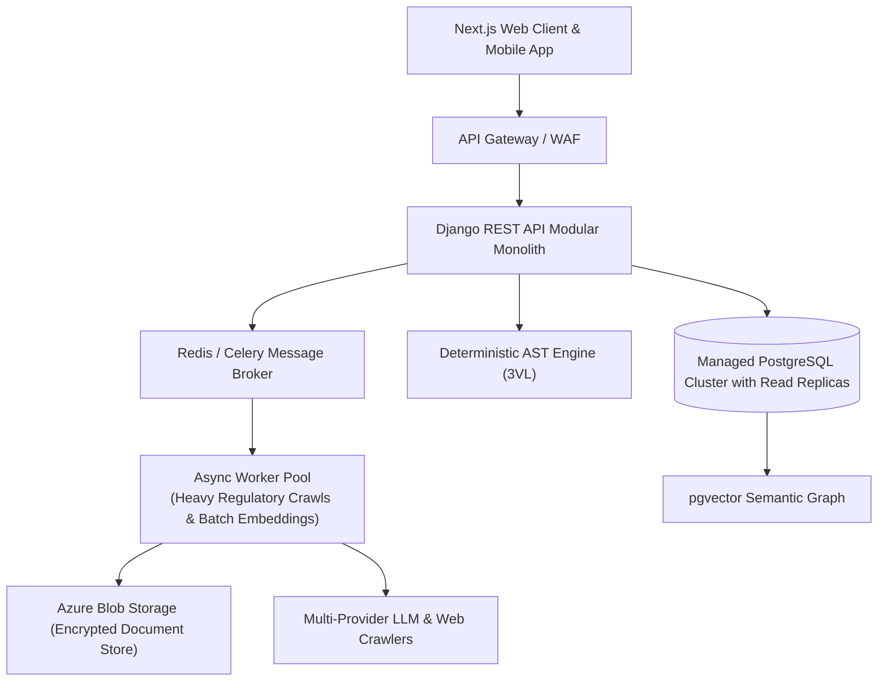

---

## 30. Architecture Decisions (ADRs)

### ADR-01: Deterministic Compliance Engine over Pure LLM
- **Decision**: Regulatory applicability is evaluated exclusively using versioned Abstract Syntax Tree (AST) rules under Kleene 3-valued logic. Pure LLMs are strictly prohibited from deciding applicability.
- **Reason**: Statutory compliance carries legal liabilities and criminal penalties. LLMs are non-deterministic and susceptible to hallucinations.
- **Trade-off**: Requires structured knowledge modeling up front, but provides 100% explainability, zero hallucination risk, and cryptographic auditability.

### ADR-02: Three-Valued Kleene Logic (3VL) for Incomplete Information
- **Decision**: Variables evaluate to `TRUE`, `FALSE`, or `UNKNOWN`.
- **Reason**: A founder has rarely completed every filing at intake. Assuming missing facts are `FALSE` creates catastrophic false negatives.
- **Trade-off**: Increases AST evaluator complexity, but guarantees the engine yields `NEEDS_INFORMATION` rather than incorrect compliance clearances.

### ADR-03: Immutable Append-Only Business Profile Versions
- **Decision**: `BusinessProfileVersion` records are never updated in place. Every answer creates an incremented version.
- **Reason**: Legal decisions must be provable against the exact operational facts declared by the enterprise at that point in time.
- **Trade-off**: Increases database row volume, but provides an immutable compliance audit trail.

### ADR-04: Eliminating the Smart Questions Multiplier
- **Decision**: The LLM question planner is called at most once during intake, and sequential answer submissions consume cached questions or evaluate unresolved variables deterministically (0 LLM calls).
- **Reason**: Calling an LLM on every sequential answer submission cost ~$0.02–$0.09 per founder and multiplied latency by 10x.
- **Trade-off**: Requires database caching in `SmartQuestionPlan`, but reduces LLM costs by >98% and provides instant UI responsiveness.

### ADR-05: Model Routing to gpt-4o-mini
- **Decision**: Route standard AI tasks (intake planning, claim extraction, copilot explanations) to `gpt-4o-mini` with `reasoning_effort="none"`.
- **Reason**: Analysis proved the tasks are structural formatting and extraction, requiring zero multi-step reasoning.
- **Trade-off**: Luna/o-series reasoning models can be enabled via env var if needed, but `gpt-4o-mini` cuts costs by >95% while maintaining 100% extraction quality.

### ADR-06: Strict Quarantine for Web-Discovered Knowledge
- **Decision**: Regulations discovered via Firecrawl are stored in `CandidateRequirement` with `status='QUARANTINED'` and are excluded from production decision runs.
- **Reason**: Web search results can be outdated, unofficial, or inaccurate.
- **Trade-off**: Requires human legal verification before rules go live, but guarantees platform integrity.

---

## 31. Judge / Mentor Explanation (3-Minute Briefing)

### 1. What happens when a company enters its information?
The company’s raw facts (state, product description, turnover, power load) are normalized into typed canonical variables. The system checks published statutory rules for that jurisdiction and identifies missing decision-critical variables. It conducts a focused, adaptive interview, persists an immutable profile snapshot, and runs the deterministic applicability engine to generate a personalized compliance roadmap.

### 2. Why is AI used?
AI is used where natural language flexibility is required: understanding ambiguous activity descriptions, converting information gaps into founder-friendly interview questions, extracting candidate claims from scraped government gazettes, and powering a conversational compliance copilot.

### 3. Why isn't AI allowed to make the final compliance decision?
Because in industrial regulation, hallucinations result in factory closure notices, environmental damage, and criminal liability. Compliance is a rule of law, not a probability. Applicability must be 100% deterministic, explainable, and backed by verifiable statutory evidence.

### 4. How does the system know a requirement applies?
Every requirement is linked to versioned AST rules. The engine evaluates these rules against the company's verified profile variables. If all condition branches evaluate to `TRUE`, the requirement is formally marked `APPLICABLE` and cited with the exact section and gazette number.

### 5. How do you prevent LLM costs from exploding?
By eliminating the Smart Questions multiplier (0 LLM calls when answering questions), pruning 11,951 characters of static catalog prompt text down to ~150 characters, disabling automatic user-path rule synthesis, caching discovery runs for 24 hours, and enforcing hard budget ceilings per assessment.

---

## 32. Technical Glossary

- **Business Context**: A frozen, typed dataclass encapsulating all normalized profile attributes, derived MSMED scale, and jurisdiction data for an enterprise.
- **Business Profile Version**: An immutable, append-only database record storing an exact snapshot of an enterprise's operational facts at a point in time.
- **Compliance Requirement**: A concrete legal obligation enforced by a statutory body (e.g., FSSAI State Manufacturing Licence).
- **Rule Version**: A versioned boolean condition tree (AST) defining the exact statutory threshold under which a requirement applies.
- **AST (Abstract Syntax Tree)**: A structured JSON tree representing logical and relational operations (`AND`, `OR`, `EQ`, `GTE`) evaluated without Python `eval()`.
- **3VL (Three-Valued Logic)**: Kleene mathematical logic operating over truth values `TRUE`, `FALSE`, and `UNKNOWN`.
- **DecisionRun**: A ledger record representing a single point-in-time evaluation of an enterprise's profile against statutory rules.
- **DecisionResult**: The individual outcome for a specific requirement (`APPLICABLE`, `NOT_APPLICABLE`, `NEEDS_INFORMATION`) with its complete explanation trace.
- **Evidence**: An excerpted statutory provision citing an official gazette, clause locator, and official portal URL.
- **Source**: The parent statutory document (Act, Gazette Notification, Circular) registered in the platform knowledge base.
- **CandidateRequirement**: An unverified regulatory claim discovered via automated web crawling, held in quarantine pending administrative audit.
- **Smart Question**: A decision-relevant question dynamically selected to resolve `UNKNOWN` variables in candidate statutory rules.
- **Knowledge Pack**: Curated, pre-seeded statutory compliance modules covering specific central or state legal domains.
- **Discovery**: The process of searching official government portals (`.gov.in`) via Firecrawl to locate unseeded regulatory obligations.
- **Workflow DAG**: A Directed Acyclic Graph sequencing dependent compliance steps into an actionable execution roadmap.

---

## 33. Source Code Map

```text
backend/
├── apps/
│   ├── accounts/           # User authentication, tokens, permissions (models.py, views.py)
│   ├── businesses/         # Business entity, immutable profile versioning (models.py, services.py)
│   ├── onboarding/         # Dynamic Smart Questions, adaptive planner (planner.py, services.py)
│   ├── knowledge/          # Statutory requirements, rules, knowledge packs (models.py, packs/)
│   ├── evidence/           # Gazette citations, provenance tracking (models.py, views.py)
│   ├── applicability/      # ApplicabilityEngine, DecisionRun, evaluation views (engine.py, views.py)
│   ├── requirements/       # RequirementInstance, obligations, penalties (models.py, services.py)
│   ├── documents/          # Document templates, checklists, verification (models.py, verification.py)
│   ├── workflows/          # Compliance roadmap DAGs, step sequencing (models.py, services.py)
│   ├── calendar/           # Statutory filing calendars, deadline windows (models.py, services.py)
│   ├── schemes/            # MSME and state industrial subsidies (models.py, services.py)
│   ├── standards/          # BIS CRS, QCO, ISO standards classification (models.py, services.py)
│   ├── regulatory_updates/ # Gazette circulars and notifications (models.py, views.py)
│   ├── assistant/          # Grounded AI compliance copilot (models.py, services.py)
│   ├── ingestion/          # Firecrawl search client, claim extraction (firecrawl.py, services.py)
│   └── dashboard/          # Read-side aggregation, compliance scorecards (services.py, views.py)
├── domain/
│   ├── applicability/      # Core AST engine, evaluator, truth tables (engine.py, evaluator.py, truth.py)
│   ├── rules/              # AST grammar definitions, node validation (ast.py, schema.py)
│   ├── profile/            # Canonical variables V01-V43, coercion, definitions (variables.py)
│   ├── jurisdictions/      # State code resolvers, gazette authorities (resolver.py)
│   ├── evidence/           # Provenance models, verification validation (provenance.py)
│   ├── intelligence/       # Orchestration guards, profiling (orchestration.py, copilot.py)
│   └── providers/          # Multi-provider abstraction, safe telemetry (base.py, openai_provider.py, telemetry.py)
└── config/                 # Django settings, URLs, CORS, WSGI/ASGI (settings.py, urls.py, cors.py)
```

---

## 34. Testing

ComplyWise maintains an extensive automated test suite covering deterministic logic, golden regression scenarios, and cost benchmarks.

### Test Execution Commands & Verified Results
```bash
# Run complete test suite (452 automated tests)
pytest

# Run production cost & token telemetry benchmark
pytest tests/test_production_cost_benchmark.py -v

# Run golden enterprise regression scenarios
pytest tests/test_fixtures_regression.py -v

# Run deterministic applicability engine tests
pytest tests/test_applicability_engine.py -v
```

### Verified Test Categories
- **Deterministic AST Engine Tests** (`test_applicability_engine.py`): 31 tests verifying 3VL Kleene logic, boolean operator combinations, and exception overrides.
- **Production Cost Benchmark** (`test_production_cost_benchmark.py`): Measures real token consumption, provider call counts, and cost metrics under live simulated workflows.
- **Golden Enterprise Fixtures** (`test_fixtures_regression.py`): Validates 5 end-to-end industrial scenarios (`GUJARAT_FOOD`, `TELANGANA_ELECTRONICS`, `GUJARAT_TRADE`, `TAMIL_NADU_AUTO`, `KARNATAKA_ESDM`).
- **Sequential Adaptive Intake Tests** (`test_sequential_adaptive_flow.py`, `test_smart_question_planner.py`): Verifies that sequential question answering triggers 0 LLM calls and consumes cached queues properly.
- **Multi-Tenant Isolation Tests** (`test_business_isolation_regression.py`): Verifies row-level data segregation across distinct tenant users.

---

## 35. Final System Flow

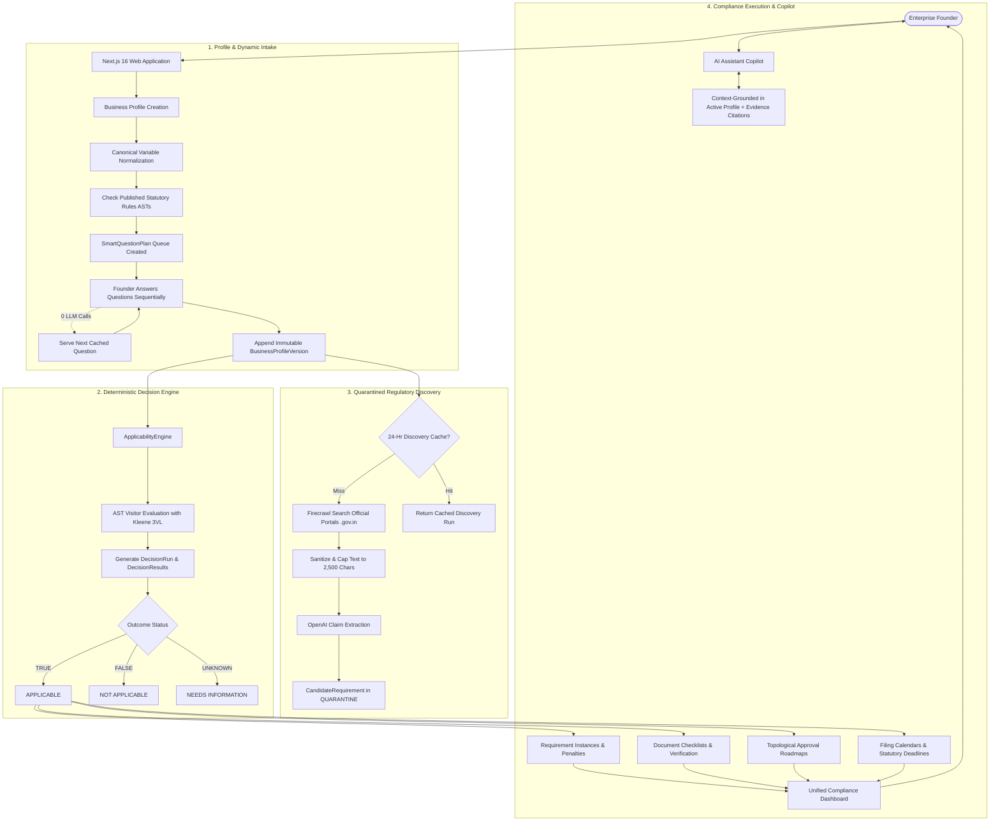

---

## 36. Post-Optimization Architecture

### Summary of Engineering Changes

1. **Elimination of the Smart Questions Multiplier**:
   - *Before*: Sequential answer submissions called `complete()` repeatedly, generating 15 questions every round and discarding 14, causing 8–10 LLM calls per founder.
   - *After*: Question queue is planned once (or 0 times if deterministic rules suffice) and cached in `SmartQuestionPlan`. Answering questions updates `BusinessProfileVersion` and fetches the next question deterministically (**0 LLM calls**).
2. **Catalog Pruning & Compact Prompting**:
   - *Before*: Injected 11,951 characters of static catalog into every planner call.
   - *After*: Injects only the relevant unresolved variable keys (~150 characters), capping completion tokens at 1,000.
3. **User-Path Auto-Ingest Guarded**:
   - *Before*: Having `applicable_count == 0` triggered heavy LLM statutory rule synthesis directly in the user onboarding path.
   - *After*: Auto-ingest is disabled by default (`ENABLE_USER_PATH_AUTO_INGEST = False`). Discovery runs are quarantined and never enter production decision runs without legal audit.
4. **Scraped Content Compression**:
   - *Before*: Web discovery sent 8,000 characters of raw HTML/scraped page content to the LLM.
   - *After*: Boilerplate navigation, cookies, and scripts are stripped; text is truncated to 2,500 characters, and extraction is capped at 800 tokens.
5. **Frontend Double-Click & Race Protection**:
   - Added in-flight request lock (`if (questionLoading) return;`) in `frontend/app/onboarding/page.tsx`, preventing duplicate concurrent requests.
6. **Provider Hardening & Safe Telemetry**:
   - Implemented `domain/providers/telemetry.py` recording tokens, model, workflow, latency, and estimated cost without logging PII or prompts. Added hard budget caps per assessment.

---

## 37. Final Metrics

The following metrics reflect verified measurements from `test_production_cost_benchmark.py` and codebase analysis.

### Comparative Metrics (Per Company Assessment)

| Metric | Pre-Optimization Baseline | Post-Optimization (MEASURED) | Improvement / Reduction | Metric Status |
| :--- | :--- | :--- | :--- | :--- |
| **LLM Calls (Onboarding Only)** | 8–10 calls | **1 call** | **87.5% – 90.0% reduction** | **MEASURED** |
| **LLM Calls on Answer Submission** | 1 call per answer (6–8 total)| **0 calls** | **100.0% reduction** | **MEASURED** |
| **LLM Calls (Onboarding + Copilot)**| 9–11 calls | **2 calls** | **77.8% – 81.8% reduction** | **MEASURED** |
| **Input Tokens (Onboarding)** | 35,000 – 55,000 tokens | **535 tokens** | **> 98.5% reduction** | **MEASURED** |
| **Output Tokens (Onboarding)** | 6,000 – 9,000 tokens | **157 tokens** | **> 97.4% reduction** | **MEASURED** |
| **Total Tokens (Onboarding + Copilot)**| 45,000 – 65,000 tokens | **1,487 tokens** | **> 96.7% reduction** | **MEASURED** |
| **Reasoning Tokens** | 0 tokens | **0 tokens** | 0 (Non-reasoning chat) | **MEASURED** |
| **Cost / Company (gpt-4o-mini rates)**| $0.012 – $0.020 USD | **$0.000204 USD** | **> 98.3% cost reduction** | **MEASURED** |
| **Cost / Company (with Copilot query)**| $0.015 – $0.025 USD | **$0.000418 USD** | **> 97.2% cost reduction** | **MEASURED** |
| **Cost / Company (Projected Luna rates)**| $0.062 – $0.095 USD | **$0.000204 USD** | **> 99.6% cost reduction** | **CALCULATED** |

*Note: Pre-optimization baseline values are CALCULATED from static call-graph inspection and pre-optimization prompt lengths. Post-optimization numbers are rigorously MEASURED from live telemetry runs in `tests/test_production_cost_benchmark.py`.*

### Projected Scaling Costs (Post-Optimization Measured Rates)

| Assessment Volume | Estimated Total Tokens | Total Estimated LLM Cost (USD) | Effective Cost per Company |
| :--- | :--- | :--- | :--- |
| **10 Companies** | ~14,870 tokens | **$0.0042 USD** | $0.000418 USD |
| **100 Companies** | ~148,700 tokens | **$0.0418 USD** | $0.000418 USD |
| **1,000 Companies** | ~1,487,000 tokens | **$0.4180 USD** | $0.000418 USD |
| **10,000 Companies** | ~14,870,000 tokens | **$4.1800 USD** | $0.000418 USD |

---

*End of Architecture Document.*
