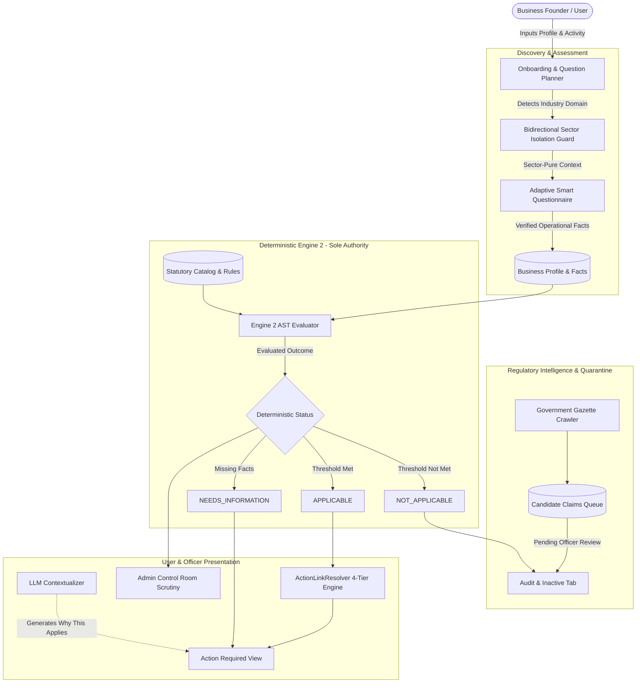

# ComplyWise — Architecture & Integration Specification

This document provides a comprehensive technical overview of the ComplyWise regulatory intelligence and statutory compliance platform, detailing system boundaries, core invariants, data flow models, and integration interfaces.

---

## 1. Absolute Architectural Invariant

$$\text{RAG RETRIEVES} \quad \longrightarrow \quad \text{RULES DECIDE} \quad \longrightarrow \quad \text{LLM EXPLAINS}$$

In ComplyWise, **no Large Language Model (LLM) is ever permitted to make a binding legal compliance determination.**

### The Three Separation Rings

1. **RAG (Retrieval-Augmented Generation / Semantic Search)**:
   - **Role**: Discovers, fetches, and indexes candidate regulatory documents, gazette notifications, circulars, and statutes from official government gazettes.
   - **Constraint**: Emits only *candidate facts* and *statutory references*. Never decides applicability.

2. **Rules (Deterministic Engine 2 / AST Evaluator)**:
   - **Role**: The **sole legal authority** in the platform. Evaluates strict Boolean Abstract Syntax Tree (AST) rules against verified business facts.
   - **Outputs**: Emits strictly one of three legal states:
     - `APPLICABLE`: Business meets all statutory thresholds and mandatory criteria.
     - `NOT_APPLICABLE`: Deterministic rule proved the business does not cross statutory thresholds.
     - `NEEDS_INFORMATION`: Vital business facts are missing to reach a definitive determination.
   - **Constraint**: Code-based, deterministic, auditable, and immutable per evaluation run.

3. **LLM (Natural Language Generation & Contextual Explanation)**:
   - **Role**: Generates founder-friendly explanations, executive summaries, procedural step guidance, and document checklists.
   - **Constraint**: Consumes evaluated outcomes from Engine 2. It **cannot** promote, demote, alter, or inject compliance obligations into the final determination.

---

## 2. End-to-End System Data Flow

---

## 3. Subsystem Architecture

### 3.1 Adaptive Smart Question Planner (`backend/apps/onboarding/planner.py`)

The question planner conducts contextual discovery while maintaining strict **bidirectional sector isolation**:
- **Domain Detectors**: Identifies industry domain (e.g., EV Charging, Civil Infrastructure, Textile Export, Data Centres, NBFC Microfinance, Pharmaceutical Formulations).
- **Sector Isolation Guards**: Prevents cross-contamination of questions. For example:
  - An export trading company is shielded from industrial factory licensing, boiler inspections, and effluent discharge rules.
  - A digital data centre or fintech is shielded from air/water pollution consent questions.
- **Fail-Safe Fallback**: If LLM dynamic question generation exceeds token bounds or fails schema validation, the deterministic fallback immediately injects 3-4 domain-isolated statutory questions.

### 3.2 Controlled Scenario Catalog (`backend/demo/`)

For high-stakes evaluations and offline demonstrations, the scenario subsystem provides deterministic guarantees:
- **`resolver.py` (`DemoScenarioResolver`)**: Matches incoming business profiles against curated scenarios based on name, sector keywords, and operational facts.
- **`scenarios/`**: Contains canonical definitions for the 6 target industries:
  1. `meridian_pharma.py`: 18 statutory rules (11 Applicable, 3 Needs Info, 4 Not Applicable)
  2. `ev_charging.py`: 14 statutory rules (9 Applicable, 2 Needs Info, 3 Not Applicable)
  3. `construction.py`: 14 statutory rules (9 Applicable, 3 Needs Info, 2 Not Applicable)
  4. `textile_export.py`: 14 statutory rules (8 Applicable, 2 Needs Info, 4 Not Applicable)
  5. `data_centre.py`: 15 statutory rules (11 Applicable, 2 Needs Info, 2 Not Applicable)
  6. `microfinance.py`: 14 statutory rules (9 Applicable, 2 Needs Info, 3 Not Applicable)

### 3.3 Action Destination Resolver (`backend/demo/destinations.py`)

All statutory requirements provide direct actionable government portals classified under a 4-tier model:

1. **`EXACT_ACTION_FORM`**: Direct link to the specific statutory e-filing form (e.g. DGFT IEC Online Application, EPFO E-Sewa Registration).
2. **`OFFICIAL_SERVICE_PAGE`**: Direct link to the government service page or guideline manual (e.g. CEA Technical Standards for EVSE, Ministry of Power Guidelines).
3. **`OFFICIAL_PORTAL_REQUIRES_LOGIN`**: Direct link to the authenticated statutory portal (e.g. State PCB OCMMS, RERA Project Registration).
4. **`ACTION_PAGE_NOT_VERIFIED`**: Fallback to official statutory act schedule; never emits placeholder or broken URLs.

### 3.4 Admin Control Room Parity

The platform enforces absolute parity between founder and officer views:
- **Founder View (`/compliance`)**: Surfaces Action Required items (`APPLICABLE` + `NEEDS_INFORMATION`) in the primary tab, and safely segregates ruled-out obligations (`NOT_APPLICABLE`) in the collapsible Audit section.
- **Officer Scrutiny View (`/admin?tab=compliance`)**: Displays the full AST execution trace, fact provenance, matched variables, and audit log.
- **Parity Invariant**: $\text{User Legal Status} \equiv \text{Admin Legal Status}$ for all requirement IDs.

---

## 4. Integration Endpoints

| Method | Endpoint | Description |
|---|---|---|
| `GET` | `/api/v1/health/` | Health check probe for load balancers. |
| `POST` | `/api/v1/auth/login/` | User and Officer JWT authentication. |
| `GET` | `/api/v1/businesses/{id}/compliance/` | Evaluated statutory compliance requirements for business. |
| `GET` | `/api/v1/businesses/{id}/workflows/` | Step-by-step procedural roadmap workflows. |
| `GET` | `/api/v1/businesses/{id}/calendar/` | Statutory deadline calendar events. |
| `GET` | `/api/v1/admin/cases/business-overview/{id}/` | Full AST scrutiny cockpit data for Admin Officer. |
