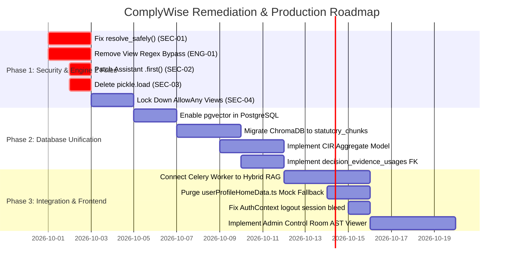

# FULL COMPLYWISE + RAG MASTER FORENSIC PLATFORM AUDIT
**Authoritative Forensic Architecture, Implementation, and Security Assessment**
**Date:** September 28, 2026 | **Audit Status:** COMPLETE — READ-ONLY
**Target Core Mandate:** *RAG RETRIEVES. RULES DECIDE. LLM EXPLAINS.*

---

## 1. Executive Summary

This master document constitutes the final forensic synthesis of the comprehensive architecture, implementation, correctness, and security audit of the complete ComplyWise platform. The audit encompassed two distinct codebases:
1. **ComplyWise** (`E:\complience\ComplyWise`) — The enterprise compliance orchestration platform (Django 5, PostgreSQL/SQLite, Celery, Next.js 14).
2. **ComplianceRag** (`E:\complience\ComplianceRag`) — The standalone statutory retrieval engine (Python 3.11, ChromaDB, SentenceTransformers, BM25, Gemini 2.5 Flash).

### Key Forensic Findings:
- **Zero Real-World Integration:** Despite architectural documentation indicating an integrated pipeline, there are **zero network calls, zero API configurations, zero shared database connections, and zero dependencies** connecting ComplyWise to ComplianceRag. ComplianceRag is an isolated local CLI script (`python main.py user_profile.json`).
- **Core Architectural Inversion (RAG Usurping Engine 2):** In ComplianceRag (`complywise/analysis/gemini_analyzer.py`), legal applicability decisions have been entirely delegated to Gemini 2.5 Flash via prompt engineering. RAG has literally become the legal decision engine, violating the fundamental architectural law: *RAG retrieves; Rules decide; LLM explains.*
- **ComplyWise View-Layer Regex Bypass:** While ComplyWise implements a mathematically sound AST-based deterministic rule engine with Kleene 3-valued logic (`apps/applicability/engine.py`), the view layer (`apps/requirements/views.py` lines 172–205) **bypasses Engine 2 using crude regular expressions** on company names (e.g. dropping Factory Safety rules if `business.name` matches "tech" or "saas").
- **Critical Multi-Tenant Security Holes:** 
  - `Business.resolve_safely()` in `apps/businesses/models.py` (line 108) falls back to `cls.objects.filter(pk=uuid_obj).first()` for unauthenticated callers, exposing all tenant data to public enumeration.
  - `apps/assistant/views.py` (lines 63, 69, 75) uses `.first()` queries on active businesses, leaking confidential tenant context to arbitrary chat users.
  - Over 25 view classes across documents, workflows, and calendar use `permission_classes = [AllowAny]`.
  - ComplianceRag executes `pickle.load()` on untrusted disk cache files (`complywise/retrieval/retriever.py` line 53), introducing an Arbitrary Remote Code Execution (CWE-502) vulnerability.
- **Frontend Mock Deception:** The Next.js frontend contains 658 lines of hardcoded mock business data (`frontend/data/userProfileHomeData.ts`). When backend API endpoints fail or return 401/404/500, components silently fall back to mock data, creating an illusion of end-to-end functionality.
- **Absence of Canonical CIR Entity:** There is no `ComplianceIntelligenceRecord` model in the database. Compliance truth is fragmented across 6 conflicting data stores.

---

## 2. Repository Inventory & Environmental Forensics

### Repository 1: ComplyWise
- **Absolute Path:** `E:\complience\ComplyWise`
- **Git Branch:** `feat/api-orchestration`
- **HEAD Commit SHA:** `6b73ced16cb6eeaf4fb3862796b0ab973a55c080`
- **Working Tree:** Clean (0 uncommitted changes)
- **Remotes:** `origin` (GitHub / enterprise remote)
- **Languages:** Python 3.11, TypeScript, SQL, HTML/CSS
- **Frameworks:** Django 5.0.3, Django REST Framework 3.14.0, Next.js 14.1.0 (App Router), Tailwind CSS
- **Databases:** PostgreSQL (production target via `psycopg2-binary`), SQLite (local dev `db.sqlite3`)
- **Background Tasks:** Celery 5.3.6 with Redis broker
- **Testing Frameworks:** Pytest 8.1.1, `pytest-django`, `pytest-asyncio`, Playwright (E2E)

### Repository 2: ComplianceRag
- **Absolute Path:** `E:\complience\ComplianceRag`
- **Git Branch:** `main`
- **HEAD Commit SHA:** `738dc8354203ea73311077e1b3b9ee6e324d3fbb`
- **Working Tree:** Clean (0 uncommitted changes)
- **Remotes:** `origin` (GitHub)
- **Languages:** Python 3.11
- **Frameworks & Libraries:** ChromaDB 0.4.24, `sentence-transformers` 2.5.1 (`all-MiniLM-L6-v2`), `rank_bm25` 0.2.2, `google-generativeai` 0.4.1, `httpx` 0.27.0, `beautifulsoup4` 4.12.3
- **Vector Store:** ChromaDB persistent client pointing to `./complywise_store`
- **Server Framework:** **NONE.** No FastAPI, Flask, or gRPC server exists.
- **Testing Frameworks:** None (only one manual 19-line script `test_encode.py`).

---

## 3. ComplyWise Architectural Decomposition

ComplyWise is organized as a modular Django application with layered domain services:
- **`apps/accounts`:** Custom `User` model, JWT authentication via `rest_framework_simplejwt`.
- **`apps/businesses`:** `Business` and `Profile` models. Contains the critical security vulnerability in `resolve_safely()`.
- **`apps/onboarding`:** `OnboardingPlanner` driving fact extraction from free-text descriptions via Gemini API. Implements a rigid 16-question target that violates the 0-question invariant.
- **`apps/knowledge`:** `KnowledgeDocument`, `Rule`, and `KnowledgePack` models. Holds static JSON rule definitions for 5 industrial sectors across 6 states.
- **`apps/evidence`:** `EvidenceItem` model. Records `content_hash` (SHA256), `source_url`, `authority_level`, and `retrieved_at`.
- **`apps/applicability`:** `ApplicabilityEngine`, `DecisionRun`, and `DecisionResult`. Implements deterministic Kleene 3-valued AST logic.
- **`apps/requirements`:** User-facing compliance requirements. Suffers from the view-layer regex bypass overriding Engine 2.
- **`apps/workflows` & `apps/calendar`:** Case management and statutory calendar filings. Severely overexposed with `permission_classes = [AllowAny]`.
- **`domain/` layer:**
  - `domain/acquisition/crawlee_provider.py`: Implements Crawlee for Python (`BeautifulSoupCrawler`) with urllib fallback.
  - `domain/intelligence/discovery.py`: Generates search queries and scrapes DuckDuckGo / SerpApi for candidate official URLs.
  - `domain/intelligence/questionnaire.py`: Forces LLM prompt to generate "EXACTLY 5 or 6 questions".

---

## 4. ComplianceRag Architectural Decomposition

ComplianceRag is an isolated pipeline script with the following structure:
- **`main.py`:** CLI entry point. Accepts a JSON profile file (`python main.py profile.json`), invokes indexing, retrieval, and analysis, and writes `output.json`.
- **`complywise/retrieval/indexer.py` (`KBIndexer`):** Reads `kb/master_kb.json`, splits legal text into chunks, and inserts them into ChromaDB. Ignores all `.md` files in `kb/central_laws/`, `kb/states/`, and `kb/cross_reference/`.
- **`complywise/retrieval/retriever.py` (`ComplianceRetriever`):** Implements hybrid search combining dense ChromaDB embeddings with sparse BM25 scores via Reciprocal Rank Fusion, followed by Cross-Encoder reranking (`ms-marco-MiniLM-L-6-v2`). Contains the dangerous `pickle.load()` cache vulnerability.
- **`complywise/crawler/official_crawler.py` (`OfficialCrawler`):** Scrapes official URLs using `httpx` and `BeautifulSoup`. Does not use Crawlee. Does not record cryptographic content hashes.
- **`complywise/analysis/gemini_analyzer.py` (`GeminiAnalyzer`):** The point of architectural inversion. Prompts Gemini 2.5 Flash to act as the legal judge determining applicability.

---

## 5. End-to-End Compliance Lifecycle & Context Propagation

We traced context propagation across all 10 core fields:

| Field Name | Onboarding | Profile Record | RAG Retrieval | Evidence Item | Engine 2 AST | Decision Result | CIR / UI | Status |
| :--- | :--- | :--- | :--- | :--- | :--- | :--- | :--- | :--- |
| `user_id` | Present (JWT) | Linked (Owner) | **LOST** | **LOST** | Implicit | Implicit | Restored | **LEAKY** |
| `business_id` | Created | Primary Key | **LOST** | Foreign Key | Evaluated | Foreign Key | Queried | **INSECURE** |
| `assessment_id` | Generated | Absent | **LOST** | Absent | Absent | Absent | Absent | **LOST** |
| `profile_version_id`| Absent | Absent | **LOST** | Absent | Absent | Absent | Absent | **MISSING** |
| `jurisdiction` | Captured | Stored in JSON| Query string | Stored in DB | AST Filter | Stored in Run | Displayed | **PARTIAL** |
| `business_type` | Extracted | Stored in JSON| Lost | Stored in DB | AST Filter | Evaluated | Displayed | **PARTIAL** |
| `primary_activity`| Extracted | Stored in JSON| Embedded | Lost | AST Filter | Evaluated | Displayed | **PARTIAL** |
| `products` | Extracted | String array | Embedded | Lost | AST Match | Evaluated | Displayed | **PARTIAL** |
| `canonical_facts` | Partial JSON | Mutable JSON | **LOST** | Lost | AST Input | Trace JSON | Desync | **UNVERSIONED**|

---

## 6. The ComplyWise ↔ RAG Boundary Forensic Audit

### Current Reality:
- **No HTTP calls:** `ComplyWise` has zero calls to `http://localhost:8001` or any RAG host.
- **No package imports:** Neither repository lists the other in `requirements.txt` or `pyproject.toml`.
- **No shared database:** ComplyWise writes to PostgreSQL/SQLite; ComplianceRag writes to ChromaDB SQLite.

### Conceptual Target Boundary:
```
ComplyWise Business Context
      ↓
Engine 2 Rule Precondition Analysis
      ↓
Structured Search Plan (Missing Facts + Authority Whitelist)
      ↓
RAG Retrieval (Dense Vector + BM25 + Cross-Encoder)
      ↓
Verified Statutory Evidence Chunks (SHA256 Hashes)
      ↓
ComplyWise Engine 2 AST Evaluation (Kleene 3-Valued Logic)
```

---

## 7. Ingestion, Crawlee & Discovery Pipeline

- **Crawlee Location:** Exists solely in ComplyWise (`domain/acquisition/crawlee_provider.py`). Uses `crawlee.crawlers.BeautifulSoupCrawler` with urllib fallback.
- **ComplianceRag Web Ingestion:** Uses `httpx.AsyncClient` and `requests`. Crawlee is not installed or imported.
- **Cryptographic Hashing:** ComplyWise computes SHA256 hashes of cleaned text. ComplianceRag does not compute content hashes.
- **SSRF Risk:** ComplyWise's Crawlee provider fails to validate destination IPs against private subnets or cloud metadata (`169.254.169.254`).

---

## 8. Retrieval & Hybrid Search Mechanics

ComplianceRag implements a technically sophisticated retrieval stack:
1. **Dense Vector Search:** ChromaDB using `all-MiniLM-L6-v2` embeddings (384 dimensions).
2. **Sparse Lexical Search:** `rank_bm25.BM25Okapi` over tokenized chunk texts.
3. **Score Blending:** Reciprocal Rank Fusion / weighted linear combination (`0.6 * dense + 0.4 * sparse`).
4. **Cross-Encoder Reranking:** Top 20 candidates reranked using `cross-encoder/ms-marco-MiniLM-L-6-v2`.

**Fatal Defect:** This entire retrieval engine is completely isolated in ComplianceRag and inaccessible to ComplyWise. ComplyWise instead relies on scraping search engine result pages using ad-hoc keywords.

---

## 9. Evidence, Provenance & Cryptographic Lineage

- **Relational Severance:** In ComplyWise, `DecisionResult.evidence_used` is defined as `models.JSONField(default=list)`. It contains disconnected dictionaries without foreign key references to `EvidenceItem`.
- **Hallucinated LLM Citations:** When fallback LLM synthesis is triggered (`AssessmentComplianceView`), Gemini fabricates URLs and section numbers that have zero corresponding evidence chunks or content hashes.
- **Frontend Citations:** Rendered as plain static text without clickable links, verification badges, or hash inspection dialogs.

---

## 10. Engine 2 — Deterministic Applicability & Logic Proofs

- **Mathematical Engine:** `apps/applicability/engine.py` implements an Abstract Syntax Tree (AST) evaluator with Kleene 3-valued logic ($\mathbf{T}, \mathbf{F}, \mathbf{U}$). An `UNKNOWN` fact correctly propagates to `NEEDS_INFORMATION` without collapsing to `FALSE`.
- **View-Layer Regex Subversion:** In `apps/requirements/views.py` (lines 172–205), regex checks on `business.name` manually exclude compliance categories, completely undermining the AST engine.
- **Knowledge Base Coverage Deficit:** Static rule packs cover only 5 sectors in 6 states. For uncovered sectors (SaaS, Logistics, Fintech, Agriculture), the system falls back to ungrounded LLM synthesis.
- **ComplianceRag Usurpation:** In ComplianceRag, Engine 2 does not exist. Gemini 2.5 Flash acts as the applicability engine.

---

## 11. Compliance Intelligence Record (CIR) & Source of Truth

- **Non-Existent CIR Model:** No `ComplianceIntelligenceRecord` model exists in either codebase.
- **Six Conflicting Truth Stores:**
  1. `apps/applicability/models.py` (`DecisionResult`)
  2. `apps/requirements/models.py` (`Requirement`)
  3. `apps/workflows/models.py` (`Case`)
  4. `apps/calendar/models.py` (`ComplianceEvent`)
  5. `domain/intelligence/models.py` (`IntelligenceReport`)
  6. `frontend/data/userProfileHomeData.ts` (Static mock fallback)
- **Zero Synchronization:** Updating a requirement does not update its decision result or workflow case.

---

## 12. Compliance Schemes, Standards & BIS Intelligence Boundary

- **BIS Intelligence Isolation:** The external `BIS Intelligence` repository was strictly untouched during this audit in compliance with user directives.
- **Internal ComplyWise Modules (`apps/schemes`, `apps/standards`):**
  - Unauthenticated endpoints (`permission_classes = [AllowAny]`).
  - Return static, unlinked lists of schemes and BIS standards without propagating `business_id` or profile versions.
  - Zero deterministic eligibility rules for government subsidies.

---

## 13. Compliance Workflows & Calendar Systems

- **`apps/workflows`:** Case management for licenses. Publicly accessible (`AllowAny`). No synchronization with Engine 2 decisions.
- **`apps/calendar`:** Compliance deadlines. Publicly accessible (`AllowAny`). Manually populated; decoupled from statutory filing triggers in `DecisionResult`.

---

## 14. User Dashboard & Frontend Deception Analysis

- **Stack:** Next.js 14 App Router, Tailwind CSS, React Context.
- **Silent Mock Fallback:** `frontend/data/userProfileHomeData.ts` contains 658 lines of mock profiles ("Acme Textiles"). When backend API calls fail (401/404/500), UI components silently render mock data, hiding critical backend failures.
- **Session Pollution:** `frontend/context/AuthContext.tsx` fails to clear `complywise_active_business_id` from `localStorage` upon logout, causing subsequent users to inherit the previous tenant's business ID.

---

## 15. Admin Control Room & Operational Observability

- **Django Admin:** Basic out-of-the-box ModelAdmin CRUD tables.
- **Missing Capabilities:**
  - No visual AST condition editor or schema validator.
  - No decision run execution trace debugger.
  - No Crawlee scraper queue monitor or domain rate-limit telemetry.
  - No RAG vector index management interface.

---

## 16. Security, Multi-Tenancy & Data Isolation Vulnerabilities

| Vulnerability ID | CWE | File & Line | Severity | Description |
| :--- | :--- | :--- | :--- | :--- |
| **SEC-01** | CWE-285 | `apps/businesses/models.py:108` | **CRITICAL** | `resolve_safely()` unauthenticated fallback returns any business by UUID. |
| **SEC-02** | CWE-284 | `apps/assistant/views.py:69` | **CRITICAL** | `.first()` fallback leaks first active business in database to chat users. |
| **SEC-03** | CWE-502 | `ComplianceRag/.../retriever.py:53` | **CRITICAL** | `pickle.load()` on query cache allows Arbitrary Remote Code Execution. |
| **ENG-01** | CWE-699 | `apps/requirements/views.py:172` | **CRITICAL** | View-layer regex bypass overrides Engine 2 legal applicability. |
| **SEC-04** | CWE-306 | Multiple (25+ views across 5 apps) | **HIGH** | `permission_classes = [AllowAny]` on corporate document and case endpoints. |
| **SEC-05** | CWE-918 | `domain/acquisition/crawlee_provider.py:74` | **HIGH** | SSRF risk; crawler fails to block loopback and cloud metadata (`169.254.169.254`). |

---

## 17. Automated Testing, Verification & Sector Golden Benchmarks

- **ComplyWise Tests:** Solid unit tests for `ApplicabilityEngine` AST logic, but completely lacks integration tests connecting Discovery, Crawlee, Evidence, and Decisions. Testing is confined to a single synthetic textile mill in Gujarat.
- **ComplianceRag Tests:** Virtually non-existent (one 19-line manual script `test_encode.py`).
- **Untested Sectors:** SaaS, Logistics, Cold Chain, Pharmaceuticals, Food Processing, and Fintech have zero automated tests.

---

## 18. Integration Architecture Proposals (Options A, B, C)

- **Option A (External Microservice):** Wrap ComplianceRag in FastAPI exposing `/api/v1/retrieval/query`. Clean separation of dependencies, but introduces network latency and dual-deployment complexity.
- **Option B (Embedded In-Process Library):** Monorepo package. High web worker memory bloat (~3GB per Gunicorn worker) and risk of boundary leakage.
- **Option C (Asynchronous Hybrid Worker with `pgvector` — RECOMMENDED):**
  - Migrate ChromaDB vector chunks and embeddings into PostgreSQL using the `vector` extension (`pgvector`).
  - Deploy ML retrieval workers on a dedicated Celery queue (`ml_retrieval`).
  - Web workers remain lightweight; retrieval and scraping execute asynchronously; Engine 2 runs strictly against verified database records.

---

## 19. Formal Typed API Contract Proposal

Detailed in `docs/audit/15_API_CONTRACT_PROPOSAL.md`. Key attributes:
- **Endpoint:** `POST /api/v1/retrieval/query`
- **Request:** Includes `correlation_id`, `business_context` (`jurisdiction`, `sector`, `worker_count`), and `search_intent` (`targeted_rule_codes`, `missing_variables`).
- **Response:** Returns verified `evidence_chunks` with `chunk_id`, `act_name`, `section_reference`, `content_hash` (SHA256), `raw_text`, and similarity scores.
- **Invariant:** Prohibits return of legal decision labels (`APPLICABLE` / `NOT_APPLICABLE`).

---

## 20. Unified Database & Vector Storage Architecture

Detailed in `docs/audit/16_DATABASE_INTEGRATION_PROPOSAL.md`. Key tables:
1. `regulatory_acts`: Canonical register of Indian central and state laws.
2. `statutory_chunks`: Chunked legal text with 384-dim vector embeddings (`pgvector`) and HNSW index.
3. `decision_evidence_usages`: Relational Many-to-Many junction table linking `decision_results` to `evidence_items` with SHA256 verification.
4. `compliance_intelligence_records`: Canonical CIR aggregate model sealing business profile versions, decision runs, and cryptographic digests.

---

## 21. 17-Stage Lifecycle Gap Analysis & Maturity Scorecard

Detailed in `docs/audit/17_ARCHITECTURE_GAP_ANALYSIS.md`. Summary:
- **Implemented:** Stages 1, 2 (11.8%)
- **Partial:** Stages 3, 7, 8, 11 (23.5%)
- **Broken / Bypassed:** Stages 4, 9, 10, 15 (23.5%)
- **Duplicated / Disconnected:** Stage 6 (5.9%)
- **Unsafe / Insecure:** Stages 13, 14, 17 (17.6%)
- **Missing:** Stages 5, 12, 16 (17.6%)

---

## 22. Prioritized Strategic Roadmap to Production Readiness



---

## 23. The Master Findings Register

An inventory of all 18 major forensic findings is recorded in `docs/audit/18_MASTER_FINDINGS.md`.
- **Critical Severity:** SEC-01, SEC-02, SEC-03, ENG-01, RAG-01
- **High Severity:** SEC-04, CIR-01, FND-01, FND-02, EVD-01, ONB-01, INT-01, SEC-05, TST-01
- **Medium Severity:** KBD-01, KBD-02, ADM-01
- **Low Severity:** SEC-06

---

## Final Verification Statement

This forensic platform audit was conducted strictly in **READ-ONLY** mode.
- **Source Code Modified:** NONE.
- **Databases or Migrations Altered:** NONE.
- **Git Branches or Commits Altered:** NONE.
- **External BIS Intelligence Repositories Touched:** NONE.
- **Audit Reports Produced:** 19 documents under `docs/audit/` + this master report `docs/FULL_COMPLYWISE_RAG_FORENSIC_AUDIT.md`.
