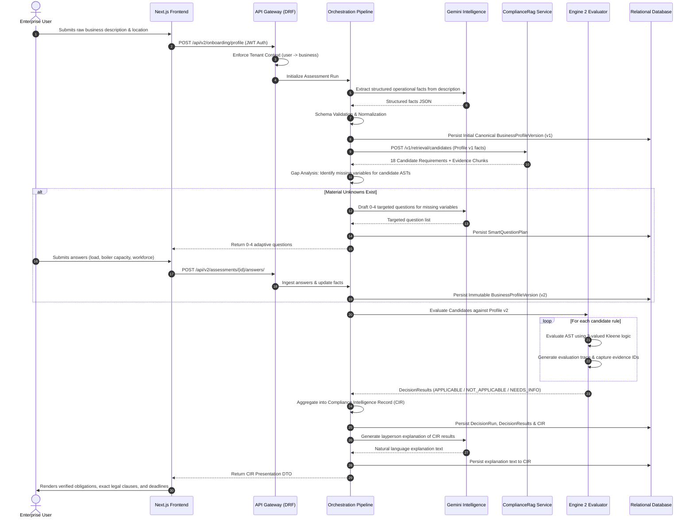
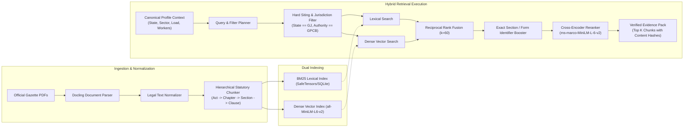
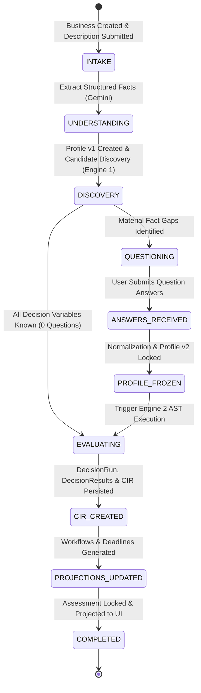

# 02. COMPLYWISE TARGET ARCHITECTURE SPECIFICATION
## SYSTEM CONTEXT, RUNTIME SEQUENCE, DATA FLOW & SUB-SYSTEM INTERFACES

- **Document ID**: `CW-ARCH-2026-V1`
- **Precedence Level**: **LEVEL 2**
- **Status**: TARGET SPECIFICATION
- **Effective Date**: September 28, 2026
- **Architecture Paradigm**: Event-Driven Service-Oriented Architecture with Clean Domain Boundaries
- **Core Axiom**: **RAG RETRIEVES. RULES DECIDE. LLM EXPLAINS.**

---

## 1. CURRENT VS. TARGET ARCHITECTURE TOPOLOGY

```
CURRENT ARCHITECTURE [VERIFIED BROKEN BASELINE]:
  [ Frontend ] ──(HTTP)──> [ DRF API (50 AllowAny Views) ]
                               │
                               ├─(Regex Bypass)─> [ Bypasses Engine 2 ]
                               │
                               ├─(Fallback)────> [ Business.objects.first() Leak ]
                               │
                               ├─(Orchestration)─> [ Engine 2 (Sound Kleene Evaluator) ]
                               │
                               ├─(Admin Overview)─> [ Legacy ComplianceCases Table ]
                               │
                               x  [ ZERO INTEGRATION / AIR-GAPPED ]
                               │
                     [ Standalone ComplianceRag ]
                       ├── Tracked .pkl caches (RCE risk)
                       └── Gemini prompted to decide APPLICABLE
```

```
TARGET ARCHITECTURE [NORMATIVE SPECIFICATION]:
  [ Next.js 15 Frontend ] ──(HTTPS / JWT)──> [ API Gateway & Tenancy Guard ]
                                                      │
                                                      ▼
                                       [ Canonical Profile Manager ]
                                                      │
                     ┌────────────────────────────────┴────────────────────────────────┐
                     ▼                                                                 ▼
      [ Engine 1: Candidate Discovery ]                              [ Gap Analysis & Questioning ]
        (ComplianceRag Private Service)                                  (0-4 Targeted Questions)
                     │                                                                 │
                     ▼                                                                 ▼
      [ Hash-Verified Evidence Pack ]                                [ Frozen Profile Version ]
                     │                                                                 │
                     └────────────────────────────────┬────────────────────────────────┘
                                                      ▼
                                      [ Engine 2: AST Evaluator ]
                                          (Kleene 3-Valued Logic)
                                                      │
                                                      ▼
                                      [ DecisionRun & DecisionResults ]
                                                      │
                                                      ▼
                                    [ Compliance Intelligence Record ]
                                                      │
                     ┌────────────────────────────────┼────────────────────────────────┐
                     ▼                                ▼                                ▼
            [ Workflow Engine ]              [ Statutory Calendar ]           [ Explainer Service ]
          (Filing State Machines)            (Scheduled Deadlines)            (Layperson Summaries)
                     │                                │                                │
                     └────────────────────────────────┼────────────────────────────────┘
                                                      ▼
                                        [ Read-Only UI Projections ]
                                            (User Dashboard & Admin)
```

---

## 2. ENGINE 1 VS. ENGINE 2 ARCHITECTURAL SEPARATION

A foundational flaw in the previous system was the conflation of candidate search with legal applicability. The target architecture establishes a strict two-stage evaluation model:

```
┌─────────────────────────────────────────────────────────────────────────────┐
│                 ENGINE 1: CANDIDATE DISCOVERY (RAG / SEARCH)                │
├─────────────────────────────────────────────────────────────────────────────┤
│  Responsibility : Broad statutory candidate discovery & evidence gathering. │
│  Input          : Canonical business facts, state, sector, activities.      │
│  Output         : Candidate Requirement IDs (e.g. 25 possible obligations). │
│  Tolerance      : High recall; tolerant of false positives.                 │
│  Authority      : ZERO LEGAL AUTHORITY. Candidate list only.                │
│  Current State  : Disconnected. ComplyWise queries local YAML packs.        │
│  Target State   : Private microservice RPC query to ComplianceRag.          │
└─────────────────────────────────────────────────────────────────────────────┘
                                       │
                                       ▼ Candidate Requirements + Evidence Pack
┌─────────────────────────────────────────────────────────────────────────────┐
│             ENGINE 2: DETERMINISTIC APPLICABILITY (AST EVALUATOR)           │
├─────────────────────────────────────────────────────────────────────────────┤
│  Responsibility : Precise statutory evaluation against business facts.      │
│  Input          : Canonical Profile Version + Versioned Rule ASTs.          │
│  Output         : TRUE (APPLICABLE) / FALSE (NOT_APPLICABLE) / UNKNOWN.     │
│  Logic          : 3-valued Kleene Boolean Logic (never coerces UNKNOWN).    │
│  Authority      : SOLE LEGAL APPLICABILITY AUTHORITY. Immutable audit trace.│
│  Current State  : Core engine sound, but bypassed downstream by regexes.    │
│  Target State   : Pure, uncompromised applicability authority.              │
└─────────────────────────────────────────────────────────────────────────────┘
```

---

## 3. END-TO-END RUNTIME FLOW

The complete user lifecycle follows an unbroken, deterministic pipeline:



---

## 4. CANONICAL DATA FLOW ARCHITECTURE

```
RAW USER INPUT
  (Description, Form Inputs)
        │
        ▼
BUSINESS UNDERSTANDING
  (Gemini Fact Extraction)
        │
        ▼
NORMALIZATION & PROVENANCE
  (Unit conversion, Type Coercion, Source stamping)
        │
        ▼
CANONICAL BUSINESS PROFILE VERSION
  (Immutable JSON/Relational Schema)
        │
        ├─────────────────────────────────────────────────┐
        ▼                                                 ▼
ENGINE 1: CANDIDATE DISCOVERY                    GAP ANALYSIS & QUESTIONING
  (ComplianceRag Hybrid Search)                    (0-4 targeted questions)
        │                                                 │
        ▼                                                 ▼
EVIDENCE PACK (Hash-verified clauses)            UPDATED PROFILE VERSION (v2)
        │                                                 │
        └────────────────────────┬────────────────────────┘
                                 ▼
                     ENGINE 2: AST EVALUATOR
            (Kleene Logic: TRUE / FALSE / UNKNOWN)
                                 │
                                 ▼
                           DECISION RUN
                     (Set of DecisionResults)
                                 │
                                 ▼
                  COMPLIANCE INTELLIGENCE RECORD
                                 │
        ┌────────────────────────┼────────────────────────┐
        ▼                        ▼                        ▼
WORKFLOW ACTIONS         STATUTORY DEADLINES      SCHEMES & STANDARDS
(Application tasks)      (Filing schedules)       (Incentive matches)
        │                        │                        │
        └────────────────────────┼────────────────────────┘
                                 ▼
                        FRONTEND PROJECTION
                    (Next.js User & Admin UI)
```

---

## 5. RAG RETRIEVAL & EVIDENCE PIPELINE

ComplianceRag is redesigned from an ad-hoc script into an industrial evidence pipeline:



### Statutory Chunker Invariant
Statutory text must never be split across arbitrary character boundaries. The chunker preserves legal document structures:
- **Level 1**: Act / Regulation Title, Notification Number, Issuing Authority.
- **Level 2**: Chapter / Part / Sub-chapter.
- **Level 3**: Section / Rule number with statutory heading.
- **Level 4**: Clause / Sub-rule / Proviso / Explanation.

Every chunk inherits parent metadata (Act title, notification date, jurisdiction).

---

## 6. CIR (COMPLIANCE INTELLIGENCE RECORD) SPECIFICATION

The **Compliance Intelligence Record (CIR)** is the central domain entity that unifies all assessment determinations into an immutable, versioned document:
- **Legal Authority**: Derived strictly from `DecisionResult` objects produced by Engine 2.
- **Integrity**: Hash-verified using RFC 8785 JSON Canonicalization Scheme (JCS) and signed by the internal ComplyWise authority key.
- **Projections**: Derives Workflows, Statutory Deadlines, Schemes, and Standards without mutating underlying compliance determinations.

---

## 7. ASSESSMENT LIFECYCLE STATE MACHINE


- **Lifecycle Invariant**: `Assessment.decision_run` must link directly to the authoritative `DecisionRun`. The system must never rely on unscoped "latest" lookups.
