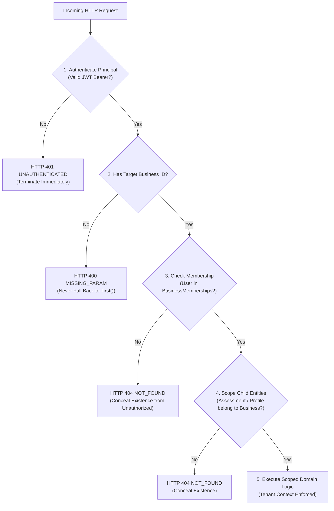
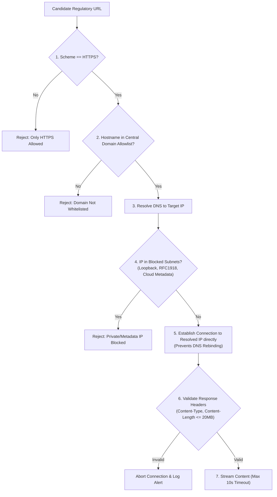

# 07. COMPLYWISE SECURITY & TENANCY ARCHITECTURE
## MULTI-TENANT ISOLATION, DEFENSE-IN-DEPTH & THREAT MITIGATION

- **Document ID**: `CW-SEC-2026-V1`
- **Precedence Level**: **LEVEL 7**
- **Status**: MANDATORY / NORMATIVE
- **Effective Date**: September 28, 2026
- **Classification**: Confidential / Security Architecture Specification
- **Core Rule**: Invariant tenant isolation. Zero fallback tenancy. Zero unauthenticated business resolution.

---

## 1. THREAT MODEL & SECURITY POSTURE

ComplyWise processes highly sensitive enterprise data: confidential factory designs, connected power demand, worker payroll counts, proprietary chemical processes, effluent volumes, and statutory violations. 
Any leak between enterprise tenants or to anonymous external actors is a catastrophic security failure.

### Top Threat Vectors
1. **Broken Object-Level Authorization (BOLA)**: Anonymous or low-privilege callers accessing another tenant's business UUID.
2. **Arbitrary Business Fallback**: Code defaulting to the oldest active business when context parameters are absent.
3. **Insecure Deserialization**: Malicious bytecode execution via untrusted pickle files.
4. **Server-Side Request Forgery (SSRF)**: Crawler harvesting internal cloud metadata (`169.254.169.254`) or scanning private subnets.
5. **Session State Pollution**: Stale business IDs persisting in browser local storage across logout events.

---

## 2. STRICT TENANT ISOLATION INVARIANT

The platform enforces an unbroken, multi-tiered authorization chain on every business-scoped transaction:

$$\text{Authenticated Principal} \longrightarrow \text{Authorized Business Membership} \longrightarrow \text{Scoped Assessment} \longrightarrow \text{Frozen Profile Version} \longrightarrow \text{Decision Run}$$



### Prohibited Code Patterns
The following patterns represent critical security vulnerabilities and are permanently forbidden:
```python
# FORBIDDEN: Line 108 of old apps/businesses/models.py
return cls.objects.filter(pk=uuid_obj).first() # FALLS THROUGH FOR ANONYMOUS

# FORBIDDEN: Line 75 of old apps/assistant/views.py
business = Business.objects.filter(is_active=True).first() # FALLBACK LEAK

# FORBIDDEN: Line 70 of old apps/workflows/views.py
return Business.objects.filter(is_active=True).first() # DEFAULT BUSINESS

# FORBIDDEN: Unscoped latest object
assessment = Assessment.objects.latest('created_at')

# FORBIDDEN: Global permission override
permission_classes = [AllowAny] # ON ANY BUSINESS-SCOPED ENDPOINT
```

---

## 3. REMEDIATED CANONICAL RESOLVER SPECIFICATION

The new, hardened implementation of `Business.resolve_authorized()` replaces the flawed `resolve_safely()`:

```python
@classmethod
def resolve_authorized(cls, business_id: str | uuid.UUID, user: AbstractBaseUser | None) -> "Business":
    """
    Authoritatively resolve a business entity strictly within the caller's tenancy context.
    
    SECURITY INVARIANTS:
    1. If user is None or AnonymousUser -> Raises AuthenticationFailed.
    2. If user is authenticated non-staff -> Strictly filtered by memberships__user=user.
    3. If user is staff/superuser -> Allows resolution, but logs an AUDIT event.
    4. Never falls through to an unscoped .first() query.
    5. Never returns another user's business.
    """
    if user is None or not user.is_authenticated:
        raise AuthenticationFailed("Authentication required to access business context.")

    try:
        uuid_obj = uuid.UUID(str(business_id))
    except (ValueError, TypeError):
        raise ValidationError("Invalid business UUID format.")

    if getattr(user, "is_staff", False):
        logger.info("Admin staff %s accessed business %s", user.email, uuid_obj)
        biz = cls.objects.filter(pk=uuid_obj).first()
        if not biz:
            raise NotFound("Business not found.")
        return biz

    biz = cls.objects.filter(pk=uuid_obj, memberships__user=user).first()
    if not biz:
        # Return 404 rather than 403 to prevent UUID enumeration attacks
        raise NotFound("Business not found.")
        
    return biz
```

---

## 4. ANONYMOUS REQUEST GOVERNANCE

1. **Permitted Anonymous Endpoints (Public Only)**:
   - `POST /api/v2/auth/register/` (User registration)
   - `POST /api/v2/auth/login/` (JWT token generation)
   - `POST /api/v2/auth/refresh/` (JWT token refresh)
   - `GET /api/v2/health/` (System liveness probe)
2. **Strictly Forbidden Anonymous Access**:
   - Any endpoint containing `/businesses/`, `/assessments/`, `/onboarding/`, `/compliance/`, `/documents/`, `/calendar/`, or `/admin/`.
   - Any endpoint passing an `X-Business-ID` header.
   - Any assistant conversation endpoint.

---

## 5. SERVICE-TO-SERVICE AUTHENTICATION (COMPLYWISE ↔ COMPLIANCERAG)

Communication between ComplyWise and the ComplianceRag microservice is restricted to a private virtual network using **Mutual TLS (mTLS)** and **HMAC Request Signing**:

```
[ ComplyWise Backend ]  ──(HTTPS + Shared Secret HMAC)──>  [ ComplianceRag Service ]
Headers:
  X-ComplyWise-Signature: sha256=<hex_hmac>
  X-ComplyWise-Timestamp: 1727521800
  X-ComplyWise-Nonce: 4f3a2b1c-9e8d-7c6b-5a4f-3e2d1c0b9a8f
  X-Correlation-ID: req-9a1d48c8-3801-447a
```

### HMAC Request Signing Protocol
1. **Canonical Request Representation**:
   $$\text{StringToSign} = \text{HTTP\_METHOD} + \text{"\textbackslash n"} + \text{PATH} + \text{"\textbackslash n"} + \text{TIMESTAMP} + \text{"\textbackslash n"} + \text{NONCE} + \text{"\textbackslash n"} + \text{SHA256(REQUEST\_BODY)}$$
2. **Signature Calculation**:
   $$\text{Signature} = \text{HMAC-SHA256}(\text{COMPLYWISE\_RAG\_SECRET}, \text{StringToSign})$$
3. **Replay Defense**:
   - The receiver validates that $|\text{CurrentTime} - \text{Timestamp}| \le 30\text{ seconds}$.
   - Nonces are stored in an in-memory/Redis cache with a 60-second TTL. If a nonce is observed twice within the window, the request is rejected immediately with HTTP 401.
4. **Key Rotation**: The service supports dual concurrent active keys (`COMPLYWISE_RAG_KEY_PRIMARY`, `COMPLYWISE_RAG_KEY_SECONDARY`).
5. **Strict Segregation Rule**: **JWT bearer tokens are NEVER forwarded to ComplianceRag.** ComplianceRag has zero awareness of user identity, organizations, or tenant memberships.

---

## 6. SSRF DEFENSE SPECIFICATION (CRAWLEE WEB ACQUISITION)

The regulatory crawler (`crawlee_provider.py`) must enforce strict multi-layered perimeter validation before initiating any outbound network connection:



### Centralized Domain Registry (`domain_registry.py`)
All allowed crawl targets must be registered centrally. Hardcoded domain lists scattered across modules are forbidden:
- `egazette.gov.in` (Official Gazette of India)
- `cpcb.nic.in` (Central Pollution Control Board)
- `gpcb.gujarat.gov.in` (Gujarat Pollution Control Board)
- `mpcb.gov.in` (Maharashtra Pollution Control Board)
- `dgft.gov.in` (Directorate General of Foreign Trade)
- `fssai.gov.in` (Food Safety & Standards Authority of India)
- `bis.gov.in` (Bureau of Indian Standards - Regulatory source only)

### Blacklisted IP Networks
- `127.0.0.0/8` (Loopback)
- `10.0.0.0/8`, `172.16.0.0/12`, `192.168.0.0/16` (RFC 1918 Private Subnets)
- `169.254.0.0/16` (Link-local / AWS/GCP/Azure Instance Metadata Services)

---

## 7. UNSAFE DESERIALIZATION REMEDIATION (PICKLE BAN)

1. **Absolute Prohibition**: Usage of `pickle.load` or `pickle.dump` is **permanently prohibited** in any production code path.
2. **Eight-Step Migration Protocol**:
   - *Step 1 (Export)*: Batch script exports BM25 term matrices and document metadata into structured Parquet and JSON files.
   - *Step 2 (Verification)*: Verify extracted document count matches current pickle index cardinality.
   - *Step 3 (Replacement)*: Build SQLite FTS5 database (`cache/bm25_index.db`).
   - *Step 4 (Checksum)*: Compute SHA-256 digest of newly created SQLite index.
   - *Step 5 (Rollback Verification)*: Validate fallback to static fixtures in case of failure.
   - *Step 6 (Deletion)*: Purge all `pickle.load` code from `indexer.py` and `hybrid.py`.
   - *Step 7 (Git Cleanup)*: Execute `git rm --cached cache/*.pkl` and add `*.pkl` to `.gitignore`.
   - *Step 8 (Regression)*: Execute query benchmark verifying identical search ranking output.

---

## 8. CACHE & BROWSER STORAGE ISOLATION

1. **Backend Cache Keys**: Must be prefixed with full tenant context:
   `cw:cache:tenant:{business_id}:assessment:{assessment_id}:v:{profile_version}:{key}`
2. **Frontend `localStorage` Sanitization**: The `logout()` routine in `AuthContext.tsx` must explicitly clear all tenant keys:
   ```typescript
   export const logout = () => {
     localStorage.removeItem("complywise_token");
     localStorage.removeItem("complywise_active_business_id");
     localStorage.removeItem("complywise_cached_businesses");
     sessionStorage.clear();
     window.location.href = "/auth/login";
   };
   ```
