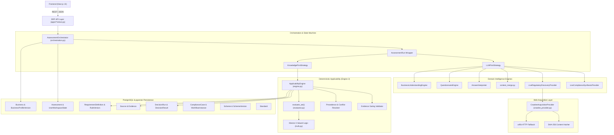

# 03 — COMPLYWISE ARCHITECTURE MAP
## COMPLETE STRUCTURAL AND COMPONENT TOPOLOGY

**Repository:** `E:\complience\ComplyWise`  
**Branch:** `feat/api-orchestration`  

---

### 1. Architectural Topology Overview

The ComplyWise backend is architected in three vertical tiers:
1. **API & Interface Tier (`apps/*/views.py`, `apps/*/serializers.py`):** DRF ViewSets, APIViews, JSON envelopes, URL routers.
2. **Domain & Orchestration Tier (`domain/*`, `apps/*/services/*`, `apps/*/engine/*`):** Pure Python domain engines, state machines, business context synthesizers, AST interpreters, provider adapters.
3. **Persistence & Knowledge Tier (`apps/*/models.py`, `knowledge_packs/*`):** PostgreSQL/pgvector tables, append-only profile versions, immutable rule versions, evidentiary sources, workflows outbox.

---

### 2. Comprehensive Component Catalog

#### 2.1 Models (Entities & Tables)

| Model Name | Application | Table Name | Key Responsibilities & Invariants |
| :--- | :--- | :--- | :--- |
| `User` | `accounts` | `accounts_user` | Extends AbstractUser with `phone_number` and `role` enum. |
| `Business` | `businesses` | `businesses_business` | Tenant boundary. Links to owner (`User`), holds active status. |
| `BusinessMembership` | `businesses` | `businesses_businessmembership` | Grants user membership access to non-owned business. |
| `BusinessProfileVersion` | `businesses` | `businesses_businessprofileversion` | **Immutable profile snapshot**. Append-only, carries `variables` JSON. |
| `Assessment` | `businesses` | `businesses_assessment` | Persistent assessment run, stores `step_state` JSON, links `decision_run`. |
| `UserWorkspaceState` | `businesses` | `businesses_userworkspacestate` | Persists user's active business and assessment context. |
| `RequirementDefinition` | `knowledge` | `knowledge_requirementdefinition` | Canonical regulatory obligation definition (`requirement_id`, authority, status). |
| `RuleVersion` | `knowledge` | `knowledge_ruleversion` | Immutable rule logic (`condition_ast`, `rule_type`, `result`, `effective_from/until`). |
| `RequirementEmbedding` | `knowledge` | `knowledge_requirementembedding` | pgvector 1536-dimensional dense embedding collection. |
| `Source` | `evidence` | `evidence_source` | Official gazette / portal source citation with SHA-256 hash. |
| `Evidence` | `evidence` | `evidence_evidence` | Grounded statutory excerpt, locator, verification status, validity window. |
| `DecisionRun` | `applicability` | `applicability_decisionrun` | Execution audit log linking business, profile_version, and evaluation date. |
| `DecisionResult` | `applicability` | `applicability_decisionresult` | Individual requirement determination with AST explanation trace and evidence refs. |
| `SmartQuestionPlan` | `onboarding` | `onboarding_smartquestionplan` | Intake interview rounds record. |
| `SmartQuestionInstance`| `onboarding` | `onboarding_smartquestioninstance` | Individual generated intake question. |
| `ComplianceCase` | `workflows` | `workflows_compliancecase` | Case management tracking progress on an applicable requirement. |
| `WorkflowDefinition` | `workflows` | `workflows_workflowdefinition` | Process template for filing, approvals, or renewals. |
| `WorkflowStep` | `workflows` | `workflows_workflowstep` | Sequential steps inside a workflow. |
| `WorkflowInstance` | `workflows` | `workflows_workflowinstance` | Runtime execution instance of a workflow for a business. |
| `DocumentSubmission` | `documents` | `documents_documentsubmission` | File upload record with OCR text and verification review. |
| `Scheme` | `schemes` | `schemes_scheme` | Canonical government scheme/subsidy registry. |
| `SchemeVersion` | `schemes` | `schemes_schemeversion` | Versioned scheme criteria with SHA-256 content hash and diffs. |
| `Standard` | `standards` | `standards_standard` | Technical and statutory standards (BIS, ISO, QCO) catalog. |
| `Deadline` | `calendar` | `calendar_deadline` | Statutory due date tracking linked to business and requirement. |

#### 2.2 Engines & Domain Interpreters

| Engine Name | File Path | Function / Method | Role & Operational Invariants |
| :--- | :--- | :--- | :--- |
| `ApplicabilityEngine` | `apps/applicability/engine.py` | `evaluate_business_profile()` | **Engine 2:** Pure deterministic rule evaluator. Evaluates only published rules. Enforces precedence (`OVERRIDE > EXEMPTION > EXCEPTION > NORMAL`). Gated by evidence. |
| `AST Evaluator` | `domain/evaluation/evaluator.py` | `evaluate_ast()` | AST recursive interpreter. Implements Kleene 3-valued logic (`TRUE`, `FALSE`, `UNKNOWN`). Preserves `EvaluationTrace`. |
| `AssessmentOrchestrator`| `domain/intelligence/orchestration.py`| `execute_stage()` | Central assessment state machine managing 16 lifecycle stages. |
| `BusinessUnderstandingEngine` | `domain/intelligence/business_understanding.py` | `analyze_business()` | LLM prompt structuring free-text descriptions into operational facts. |
| `QuestionnaireEngine` | `domain/intelligence/questionnaire.py` | `generate_questionnaire()` | LLM question generator targeting 5–6 questions with emergency fallbacks. |
| `SmartQuestionPlanner` | `apps/onboarding/planner.py` | `generate_smart_question_plan()` | Competing intake planner targeting 12–20 questions per round. |
| `CrawleeAcquisitionProvider` | `domain/acquisition/crawlee_provider.py` | `fetch_page()`, `crawl()` | Web fetcher using Crawlee Python `BeautifulSoupCrawler` with urllib fallback. |
| `SchemeMatcher` | `apps/schemes/engine/matcher.py` | `match_business_schemes()` | Deterministic MSME scale and sector matcher for schemes. |

#### 2.3 Selectors & Data Access Utilities

| Selector / Utility | Location | Method | Tenancy & Safety Evaluation |
| :--- | :--- | :--- | :--- |
| `Business.accessible_to` | `apps/businesses/models.py` | `accessible_to(user)` | **Safe:** Scopes QuerySet strictly to owned/member businesses. |
| `Business.resolve_safely`| `apps/businesses/models.py` | `resolve_safely(id, user)` | **UNSAFE:** Falls back to `cls.objects.filter(pk=uuid).first()` when user is unauthenticated. |
| `AssessmentRun.get_run` | `domain/intelligence/orchestration.py` | `get_run(run_id, user)` | **Safe:** Enforces `Assessment.accessible_to(user)` when authenticated. |
| `get_dashboard_summary` | `apps/dashboard/services.py` | `get_dashboard_summary()` | **Mixed:** Falls back to unlinked `.first()` run if `assessment_id` is missing. |

#### 2.4 Views & API Endpoints

- **Onboarding Endpoints:**
  - `POST /api/v1/onboarding/business`: Creates initial business and profile version.
  - `POST /api/v1/businesses/orchestration/runs`: Initializes or reuses an active assessment run.
  - `GET /api/v1/businesses/orchestration/runs/{id}/stages/QUESTION_GENERATION`: Generates contextual questions.
  - `POST /api/v1/businesses/orchestration/runs/{id}/answers`: Submits answers and triggers answer interpretation.
- **Compliance Endpoints:**
  - `GET /api/v1/businesses/orchestration/runs/{id}/compliance`: Retrieves structured compliance requirements (Priority 1: Engine 2 `DecisionRun`; Priority 2: LLM synthesis).
  - `GET /api/v1/businesses/{id}/requirements`: Lists evaluated requirements for Screen 08 (contains view-level regex filtering).
  - `GET /api/v1/businesses/{id}/requirements/{req_id}`: Detail view answering 4 core questions with evidence citations.
- **Schemes & Standards Endpoints:**
  - `GET /api/v1/businesses/{id}/schemes`: Matches active schemes for business (`AllowAny`).
  - `GET /api/v1/businesses/{id}/standards`: Matches statutory and voluntary standards (`AllowAny`).
- **Workflows & Documents Endpoints:**
  - `GET /api/v1/businesses/{id}/cases`: Retrieves workflow compliance cases (`AllowAny`).
  - `POST /api/v1/documents/submissions`: Uploads document for OCR and verification (`AllowAny`).
- **Admin Control Room Endpoints:**
  - `GET /api/v1/admin/businesses/{id}`: 360-degree overview for admin (`AllowAny`).
  - `POST /api/v1/admin/cases/{id}/approve`: Approves a case determination.
