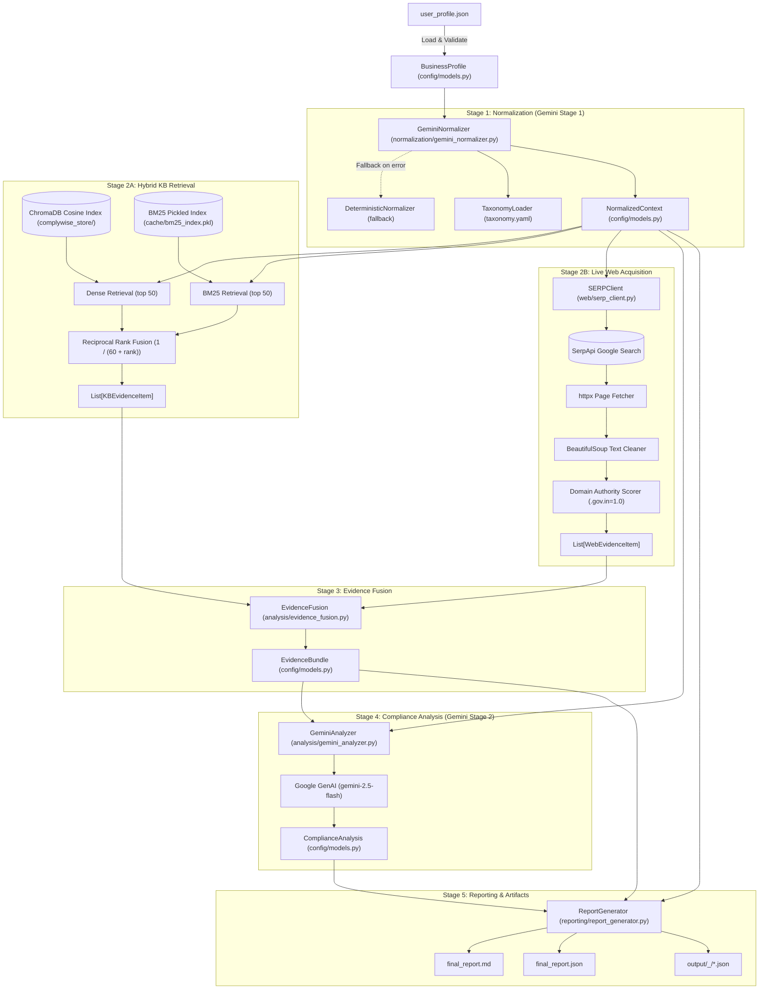

# 04 — RAG ARCHITECTURE MAP
## COMPLETE STRUCTURAL AND COMPONENT TOPOLOGY OF COMPLIANCERAG

**Repository:** `E:\complience\ComplianceRag`  
**Branch:** `main`  

---

### 1. Architectural Topology Overview

`ComplianceRag` is architected as a sequential, multi-stage data processing pipeline. It does not run as a server; it executes synchronously from the command line:



---

### 2. Component Inventory & Data Contracts

#### 2.1 Configuration & Models (`complywise/config/`)

- **`settings.py`**:
  - `KB_JSON_PATH = "./kb/master_kb.json"`
  - `CHROMA_PATH = "./complywise_store"`
  - `CHROMA_COLLECTION = "compliance_collection"`
  - `EMBEDDING_MODEL = "BAAI/bge-m3"` (fallback: `all-MiniLM-L6-v2`)
  - `BM25_CANDIDATES = 50`, `DENSE_CANDIDATES = 50`, `RRF_K = 60`, `RERANK_TOP_N = 15`
  - `GEMINI_ANALYZER_MODEL = "gemini-2.5-flash"`
- **`models.py`**:
  - `BusinessProfile`: Input profile schema. Accepts loose keys via `extra = "allow"`.
  - `NormalizedContext`: Output of Stage 1. Contains canonical domains, activities, products, processes, scale indicators, ambiguities, retrieval terms, and SERP queries.
  - `KBEvidenceItem`: Chunk retrieved from internal Chroma/BM25 KB.
  - `WebEvidenceItem`: Snippet and full-text evidence fetched via SerpApi.
  - `EvidenceBundle`: Combined and deduplicated container (`total_kb`, `total_web`).
  - `ComplianceItem`: Output compliance obligation containing statutory name, category, legal basis, portal, penalties, evidence citations, and freshness flag.
  - `GovernmentScheme`: Separate schema for subsidies/incentives (ensures schemes never appear in legal obligations).
  - `ComplianceAnalysis`: Full output of Gemini Stage 2 analysis.
  - `FinalReport`: Top-level serializable report model.

#### 2.2 Ingestion & Indexing (`complywise/retrieval/indexer.py`)

- **`flatten_kb(kb_path)`**:
  - Reads `master_kb.json`.
  - Loops over states and industry sectors.
  - Formats enriched contextual chunk text via `_enrich_chunk()`:
    ```
    Authority: {authority}
    Jurisdiction: {state} ({state_code})
    Domain: {sector}
    Policy: {policy}
    Regulatory Concept: {category}
    Document: {compliance_name}
    Governing Statute: {governing_statute}
    Threshold: {threshold}
    Frequency: {frequency}
    Content: ...
    ```
  - Yields parallel lists: `documents`, `metadatas`, `ids`.
- **`KBIndexer.build_indices()`**:
  - Re-creates Chroma collection with cosine distance (`metadata={"hnsw:space": "cosine"}`).
  - Embeds chunks in batches of 32 using BGE-M3.
  - Builds `BM25Okapi` index over lowercase whitespace-tokenized documents.
  - Pickles BM25 index to `./cache/bm25_index.pkl` and metadata store to `./cache/metadata_store.pkl`.

#### 2.3 Retrieval Engine (`complywise/retrieval/hybrid.py`)

- **Query Construction (`_build_query`)**:
  - Combines state name + top 8 `retrieval_terms` + top 3 `activities` + top 4 `regulatory_concepts`.
- **Dense Query (`_dense_retrieve`)**:
  - Queries ChromaDB collection using cosine similarity.
  - Applies metadata filter `{"state": state}`. If fewer than 5 results are returned, issues a fallback query without state filtering.
- **Sparse Query (`_bm25_retrieve`)**:
  - Evaluates BM25 scores. Enforces a strict state filter by comparing `meta["state"]` to `context.jurisdictions[0]`.
  - Normalizes BM25 scores to `[0, 1]` by dividing by `max_score`.
- **Fusion (`_rrf_fuse`)**:
  - Applies Reciprocal Rank Fusion: $RRF(d) = \sum \frac{1}{k + rank_i(d)}$ with $k = 60$.
  - Takes the top 15 results (`RERANK_TOP_N = 15`).

#### 2.4 Web Evidence Engine (`complywise/web/serp_client.py`)

- Issues queries to SerpApi (`https://serpapi.com/search`).
- Filters URLs: skips binary files (`.pdf`, `.doc`, `.zip`).
- Evaluates domain authority score:
  - Official `.gov.in`, `.nic.in`, `rbi.org.in`, `mca.gov.in`, `gst.gov.in` = `1.0`
  - `.gov.` or `.nic.` = `0.95`
  - Blocked domains (reddit, quora, wikipedia, clear tax) = `0.1`
  - General domains = `0.4`
- Fetches HTML via `httpx.get` (10s timeout).
- Parses title and cleans text using `BeautifulSoup`.
- Caches raw JSON responses in `./cache/serp_cache/` using SHA-256 query hashes.

#### 2.5 Evidence Fusion (`complywise/analysis/evidence_fusion.py`)

- Deduplicates web items by exact URL.
- Applies a +0.15 score boost to KB items whose jurisdiction matches the business's state.
- Sorts KB items by retrieval score descending; sorts web items by authority score descending.
- Bundles items into `EvidenceBundle`.

#### 2.6 LLM Compliance Analyzer (`complywise/analysis/gemini_analyzer.py`)

- Prompts Gemini 2.5 Flash as a "Senior Indian Regulatory Compliance Auditor".
- Provides business context, `[KB-n]` chunks, and `[WEB-n]` snippets.
- Instructs the LLM to categorize items into `applicable_compliances`, `potentially_applicable`, `not_applicable`, and `government_schemes`.
- Enforces strict freshness tracking (`CURRENT`, `NEEDS_REVIEW`, `STALE`, `UNKNOWN`).

#### 2.7 Report Generator (`complywise/reporting/report_generator.py`)

- Serializes artifacts into `output/<business_name>_<timestamp>/`:
  1. `normalized_context.json`
  2. `rag_results.json`
  3. `serp_results.json`
  4. `evidence.json`
  5. `compliance_analysis.json`
  6. `final_report.json`
  7. `final_report.md`
