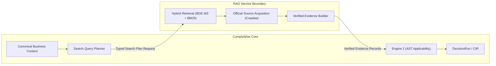

# 06 — COMPLYWISE ↔ RAG BOUNDARY AUDIT
## FORENSIC AUDIT OF THE INTEGRATION BOUNDARY

**Audit Target:** Verification of the interface, communication, and boundary contracts between ComplyWise and ComplianceRag.

---

### 1. Does ComplyWise Currently Call RAG?

### **VERDICT: NO. ABSOLUTELY NOT.**

There is **zero integration code** connecting ComplyWise to ComplianceRag. 

#### Forensic Evidence from Codebase:
1. **Zero Network Invocations:**
   - A complete regex search across all files in `ComplyWise/` for `ComplianceRag`, `compliance_rag`, port numbers (`8001`, `5000`, etc.), and RAG service URL environment variables (`RAG_URL`, `RAG_SERVICE_URL`) yields **zero matching calls**.
   - The only occurrences of the term "rag" in ComplyWise are:
     - `backend/config/settings.py:203`: A code comment: `# pgvector is required for the RAG/standards retrieval work in later tasks.`
     - `backend/apps/businesses/orchestration_views.py:477`: An audit docstring comment: `Source priority (per audit mandate — RAG retrieves, rules decide, LLM explains)...`
2. **ComplianceRag Has No Inbound Interface:**
   - ComplianceRag contains **zero web frameworks** (no FastAPI, no Flask, no Django REST framework, no aiohttp server).
   - ComplianceRag has no `app.run()`, no `uvicorn.run()`, no route decorators (`@app.get`, `@app.post`), and no listening network socket.
   - It is executable solely as a command-line script: `python main.py user_profile.json`.
3. **ComplyWise Implemented Its Own Substitute Discovery:**
   - Because ComplyWise could not communicate with ComplianceRag, the developers constructed a duplicate, in-process discovery module inside `backend/domain/intelligence/discovery.py` (`LiveRegulatoryDiscoveryProvider`) and `backend/apps/ingestion/services.py` (`run_discovery`), coupled directly to Crawlee Python.

---

### 2. Missing Integration Interface Specifications

Because ComplyWise does not call ComplianceRag, all interface parameters are currently **NOT IMPLEMENTED**:

| Interface Parameter | Current Status | Forensic Note |
| :--- | :--- | :--- |
| **Caller** | **NONE** | No Python module in ComplyWise initiates any network or IPC request to ComplianceRag. |
| **Endpoint** | **NONE** | ComplianceRag exposes no HTTP URL or RPC endpoint. |
| **Request Schema** | **NONE** | No serialized request contract exists between the repositories. |
| **Response Schema** | **NONE** | No structured ingestion or response parsing exists. |
| **Authentication** | **NONE** | No shared API key, HMAC token, mutual TLS, or bearer token is configured. |
| **Timeout Policy** | **NONE** | No HTTP client timeout or socket deadline is configured. |
| **Retry Policy** | **NONE** | No retry loop, backoff strategy, or jitter mechanism is implemented. |
| **Error Handling** | **NONE** | No fallback, circuit breaker, or degraded mode handles RAG failures. |

---

### 3. Expected Conceptual Boundary vs Reality

#### Expected Conceptual Target Boundary:

#### Invariants of the Target Boundary:
1. **RAG RETRIEVES:**
   - RAG receives business context (jurisdiction, activities, commodities, power load, worker count) and targeted search queries.
   - RAG searches internal authoritative knowledge bases (ChromaDB + BM25) and official web portals (.gov.in, gazettes).
   - RAG returns **evidence chunks** (with source URL, authority, jurisdiction, excerpt, content hash, effective dates, and verification status).
2. **RULES DECIDE:**
   - RAG **NEVER** declares whether a regulation applies to the business.
   - Engine 2 (in ComplyWise) takes the verified evidence chunks, links them to rule AST conditions, evaluates three-valued logic, resolves precedence, and outputs `DecisionResult` records.
3. **LLM EXPLAINS:**
   - An LLM takes the output of Engine 2 and explains the determination in clear, human-readable language to the founder.

---

### 4. Current Real-World Inversions

1. **RAG is Deciding:**
   In `ComplianceRag/complywise/analysis/gemini_analyzer.py`, the RAG pipeline bypasses rules entirely and instructs the Gemini LLM to decide whether regulations are `applicable_compliances`, `potentially_applicable`, or `not_applicable`.
2. **ComplyWise is Synthesizing Without RAG:**
   In `ComplyWise/backend/domain/intelligence/synthesis.py` (`LiveComplianceSynthesisProvider`), ComplyWise uses its own LLM call to invent/synthesize compliance requirements when Engine 2 has no static rule coverage.
3. **No Evidence Handshake:**
   Because the boundary does not exist, evidence acquired by ComplianceRag (from `master_kb.json` or SerpApi) never enters ComplyWise's PostgreSQL `Evidence` table. Conversely, ComplyWise's `CrawleeAcquisitionProvider` operates in total isolation from ComplianceRag's retrieval index.
