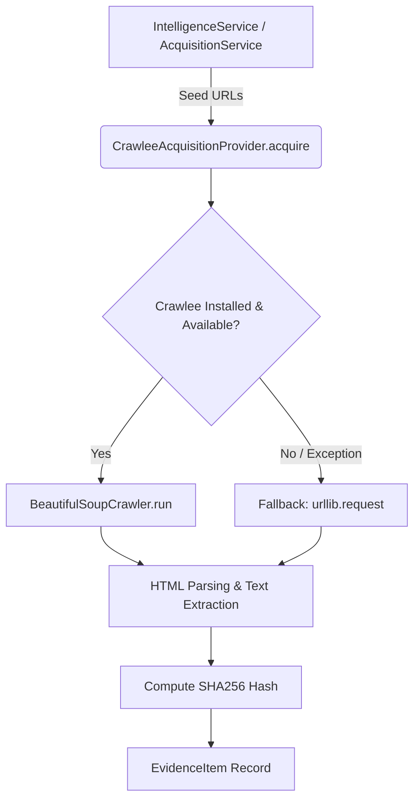

# 07. Retrieval & Crawlee Forensic Audit

## Executive Summary
This document provides a forensic audit of document retrieval, web crawling, and evidence acquisition across both `ComplyWise` and `ComplianceRag` repositories.

The central findings are:
1. **Crawlee is implemented in ComplyWise, NOT in ComplianceRag:** `ComplyWise` implements a custom `CrawleeAcquisitionProvider` utilizing Crawlee for Python (`BeautifulSoupCrawler`) with a standard `urllib` fallback. `ComplianceRag` does not use Crawlee at all; it relies on `httpx.AsyncClient` and `requests` with BeautifulSoup.
2. **Retrieval Architectures are Severely Fragmented:** `ComplianceRag` implements a multi-stage hybrid search pipeline (dense ChromaDB vector search + sparse BM25 + Reciprocal Rank Fusion + Cross-Encoder reranking), but it is completely disconnected from `ComplyWise`. `ComplyWise` independently queries external search engines (DuckDuckGo, SerpApi) via heuristic keyword queries generated from business profile text.
3. **Absence of Contextual Search Planning:** Neither repository performs business-aware retrieval guided by Engine 2 rule preconditions. Queries are generated from unstructured company descriptions rather than deterministic missing rule variables.

---

## 1. Crawlee Implementation in ComplyWise

### 1.1 Code Location & Dependencies
- **File:** `E:/complience/ComplyWise/domain/acquisition/crawlee_provider.py`
- **Class:** `CrawleeAcquisitionProvider`
- **Configuration:** `CrawleeAcquisitionConfig`
- **Underlying Library:** `crawlee.crawlers.beautifulsoup_crawler.BeautifulSoupCrawler`
- **Fallback:** Standard Python `urllib.request` / `urllib.error`

### 1.2 Architecture & Flow


### 1.3 Detailed Component Inspection

| Parameter / Step | Implementation in ComplyWise | Evaluation / Finding |
| :--- | :--- | :--- |
| **Caller** | `domain/acquisition/service.py` (`AcquisitionService.acquire()`), called by `domain/intelligence/service.py` (`IntelligenceService.acquire_evidence()`). | Well-structured service layer boundary. |
| **Input** | List of URLs (`urls: list[str]`), crawl options (`max_depth: int = 1`, `max_requests: int = 10`, `timeout_seconds: int = 30`). | Shallow crawl configuration appropriate for targeted evidence acquisition. |
| **Execution Model** | Async execution wrapped in `asyncio.run()` if called from synchronous Django context. | Can cause nested event loop issues if invoked inside an active ASGI loop. |
| **Browser vs HTTP** | Uses `BeautifulSoupCrawler` (HTTP-only). No Playwright or headless browser crawler configured in default pipeline. | Fast and lightweight, but fails on modern JavaScript-rendered government portals (e.g. state pollution control board SPOC portals). |
| **Fallback Mechanism** | If `crawlee` import fails or execution raises an unhandled exception, falls back to `_urllib_fallback()`. | Resilient against missing package installations in minimal worker environments. |
| **Extraction Quality** | Extracts HTML `<title>`, `<meta name="description">`, removes `<script>`, `<style>`, `<nav>`, `<footer>` tags, and strips whitespace. | Good basic hygiene; lacks table extraction for regulatory rate tables or fee schedules. |
| **Cryptographic Hashing** | Computes `hashlib.sha256(cleaned_text.encode('utf-8')).hexdigest()`. | **Compliant:** Ensures immutable content verification for evidence records. |
| **Authority Classification** | Cross-references domain against `domain/intelligence/discovery.py` authority lists (`OFFICIAL_DOMAINS` vs `COMMERCIAL_BLOG_DOMAINS`). | Correctly assigns authority tiers (`tier_1_government`, `tier_2_regulator`, `tier_3_statutory`, `tier_4_industry`, `tier_5_commercial`). |
| **Role Verification** | Confined strictly to discovery and evidence ingestion. | **Compliant:** Crawlee in ComplyWise does NOT evaluate legal applicability. |

---

## 2. Web Ingestion & Scraping in ComplianceRag

### 2.1 Code Location & Dependencies
- **Files:**
  - `E:/complience/ComplianceRag/complywise/crawler/official_crawler.py` (`OfficialCrawler`)
  - `E:/complience/ComplianceRag/complywise/search/serp_client.py` (`SerpApiClient`)
- **Underlying Libraries:** `httpx.AsyncClient`, `bs4.BeautifulSoup`, `requests`
- **Crawlee Usage:** **NONE.** ComplianceRag does not install or import Crawlee.

### 2.2 Mechanism
1. `SerpApiClient.search()` queries Google via SerpApi for Indian compliance notifications.
2. `OfficialCrawler.fetch_url()` uses `httpx.AsyncClient(timeout=15.0, follow_redirects=True)` with fake User-Agent headers.
3. `OfficialCrawler.extract_text()` parses HTML with BeautifulSoup, extracting paragraphs (`<p>`), headings (`<h1>`-`<h6>`), and list items (`<li>`).
4. **Flaw:** Content hashes are not calculated in `OfficialCrawler`; timestamps are generated at ingestion time without tracking HTTP `ETag` or `Last-Modified` headers.

---

## 3. Retrieval Architecture Comparison

| Feature / Dimension | ComplyWise Implementation | ComplianceRag Implementation | Architectural Gap |
| :--- | :--- | :--- | :--- |
| **Primary Retrieval Mode** | Direct SQL filtering on `KnowledgeDocument` + external search engine queries. | Hybrid Retrieval: Dense Vector (ChromaDB) + Sparse Lexical (BM25). | Systems are completely disconnected; ComplyWise lacks vector/hybrid search; RAG lacks SQL relational filters. |
| **Vector Store** | None configured in default path (Django ORM over SQLite/Postgres). | ChromaDB (`complywise_store/`) with persistent SQLite metadata. | ChromaDB index is isolated in ComplianceRag local directory. |
| **Embedding Model** | None in core app (calls Gemini API for embeddings in discovery). | Local `sentence-transformers/all-MiniLM-L6-v2` (384-dimensional). | RAG uses local CPU/GPU embedding; ComplyWise uses cloud API. |
| **Sparse / Keyword Search** | None (Django `icontains` on title/act_name). | `rank_bm25.BM25Okapi` over tokenized chunk texts. | RAG has advanced keyword matching; ComplyWise has naive SQL string search. |
| **Hybrid Fusion** | None. | Reciprocal Rank Fusion (RRF) / weighted score blending (`0.6 * dense + 0.4 * sparse`). | Highly sophisticated in RAG, but completely inaccessible to ComplyWise. |
| **Reranking** | None. | Cross-Encoder (`cross-encoder/ms-marco-MiniLM-L-6-v2`) scoring top 20 candidates. | Excellent reranking precision in RAG; completely absent in ComplyWise. |
| **Contextual Query Generation** | String concatenation: `"{sector} {jurisdiction} compliance laws India"`. | Profile text summarization embedded directly into query vector. | Neither system translates Engine 2 rule precondition gaps into targeted retrieval queries. |
| **Deduplication** | URL uniqueness constraint on `EvidenceItem.source_url`. | Document ID + Section number hashing in ChromaDB metadata. | Good within individual silos, but zero deduplication across systems. |
| **Caching** | Redis cache on view layer (timeout 300s). | Disk-based pickle cache (`cache/query_cache.pkl`) with SHA256 query keys. | ComplianceRag uses insecure Python `pickle` for query caching. |

---

## 4. Query Planning & Business Context Propagation

### 4.1 The Target Flow
```
Business Profile (Facts)
      ↓
Engine 2 Rule Preconditions (Missing Variables)
      ↓
Search Plan (Targeted Legal Acts + Jurisdiction + Domain Whitelist)
      ↓
RAG Hybrid Retrieval (ChromaDB + BM25 + Official Domain Filter)
      ↓
Verified Text Chunks (Cryptographic Provenance)
      ↓
Engine 2 Evaluation
```

### 4.2 Current Real Flow in ComplyWise
```
Business Profile (Free text: "We make garments in Surat")
      ↓
domain/intelligence/discovery.py
      ↓
Naive Heuristic: "textiles Gujarat factory pollution compliance"
      ↓
DuckDuckGo HTML Scraping / SerpApi
      ↓
Top 5 Web Pages
      ↓
Crawlee / urllib Fetch
      ↓
EvidenceItem (Stored in DB)
      ↓
NEVER fed to Engine 2 AST! (View layer runs regex or LLM synthesis)
```

### 4.3 Current Real Flow in ComplianceRag
```
user_profile.json
      ↓
gemini_analyzer.py creates textual summary
      ↓
Vector embedding of summary + BM25 tokenization
      ↓
Retrieves top 10 chunks from master_kb.json
      ↓
Chunks fed directly into Gemini prompt:
"Determine which Indian regulatory COMPLIANCES apply to THIS SPECIFIC business"
      ↓
Gemini LLM outputs JSON decisions!
(Engine 2 is completely absent!)
```

---

## 5. Security & Stability Vulnerabilities in Retrieval

### 5.1 Pickle Serialization in ComplianceRag (`cache/query_cache.pkl`)
- **File:** `E:/complience/ComplianceRag/complywise/retrieval/retriever.py` (lines 45–62)
- **Code:**
  ```python
  with open(self.cache_file, "rb") as f:
      self.cache = pickle.load(f)
  ```
- **Vulnerability:** **Critical Arbitrary Code Execution (CWE-502).** Deserializing untrusted pickle files allows remote code execution if cache files are tampered with or shared across systems. Must be replaced with JSON or Redis key-value caching.

### 5.2 SSRF Risk in ComplyWise Crawlee Acquisition
- **File:** `E:/complience/ComplyWise/domain/acquisition/crawlee_provider.py`
- **Issue:** URLs passed to `acquire()` are validated for scheme (`http://`, `https://`), but are NOT validated against private IP ranges (`127.0.0.1`, `10.0.0.0/8`, `169.254.169.254` AWS metadata).
- **Vulnerability:** **High Server-Side Request Forgery (CWE-918).** A malicious actor providing an internal URL in business onboarding could force the crawler to probe the internal network or cloud metadata service.

---

## 6. Audit Verdict
- **Crawlee Implementation:** Sound in ComplyWise, absent in ComplianceRag.
- **Retrieval Engine:** Superior in ComplianceRag (Hybrid BM25 + Vector + Cross-Encoder), but entirely disconnected from ComplyWise.
- **Business Awareness:** Both systems fail to connect retrieval to Engine 2 rule precondition ASTs.
