# 08. Evidence & Provenance Forensic Audit

## Executive Summary
This document traces the cryptographic and structural provenance of compliance evidence from origin (official regulatory sources) to consumption (user dashboard and audit trail).

The forensic audit reveals a **critical breakdown in provenance tracking**:
1. **Broken Relational Lineage in ComplyWise:** Although `apps/evidence/models.py` (`EvidenceItem`) captures SHA256 hashes and URLs, `apps/applicability/models.py` (`DecisionResult`) stores evidence as a disconnected, unindexed JSON list (`evidence_used = models.JSONField(default=list)`). No Foreign Key or Many-to-Many relation links a `DecisionResult` to an `EvidenceItem`.
2. **Hallucinated Citations in LLM Synthesis:** When ComplyWise or ComplianceRag invokes Gemini for compliance assessment, citations (`source_url`, `section_number`) are generated as free-text strings by the LLM. There is zero cryptographic verification that the cited text was present in any retrieved chunk.
3. **Frontend Citation Degeneracy:** The Next.js frontend renders citations as flat text strings without clickable deep-links, verified hash indicators, or immutable retrieval timestamps.

---

## 1. End-to-End Provenance Trace

```mermaid
flowchart TD
    subgraph Target Provenance Chain
        S1[1. Official Regulatory Source] -->|Crawlee / HTTP Fetch| S2[2. Immutable Document Artifact]
        S2 -->|SHA256 Hash + Normalization| S3[3. Chunk with Content Hash]
        S3 -->|Vector / Hybrid Indexing| S4[4. EvidenceItem FK Relation]
        S4 -->|Deterministic Precondition Match| S5[5. Engine 2 Rule AST Node]
        S5 -->|Evaluation Trace| S6[6. DecisionResult Record with Evidence FKs]
        S6 -->|Deterministic Aggregation| S7[7. Verified CIR Record]
        S7 -->|Cryptographic Verification| S8[8. User Dashboard with Immutable Citations]
    end

    subgraph Actual Real-World Breakage
        B1[ComplyWise: EvidenceItem has SHA256] -.->|LOST: Stored as raw JSON blob| B2[DecisionResult.evidence_used: JSONField]
        B2 -.->|LOST: Flattened to string array| B3[API Serializer: sources string list]
        B3 -.->|LOST: Mock fallback or flat text| B4[Frontend UI: Flat Text]

        R1[ComplianceRag: master_kb.json] -.->|Retrieved Chunks| R2[gemini_analyzer.py Prompt]
        R2 -.->|SEVERED: LLM synthesizes citations| R3[Gemini Generated JSON]
    end
```



---

## 2. Component-by-Component Provenance Audit

### 2.1 Layer 1: Official Source Discovery & Ingestion
- **ComplyWise Implementation:** `domain/acquisition/crawlee_provider.py`
  - **Captured Fields:** `source_url`, `content_hash` (SHA256), `retrieved_at` (UTC timestamp), `authority_tier`, `extracted_text`.
  - **Verdict:** **SOLID.** The raw acquisition layer properly computes cryptographic hashes and records retrieval metadata.
- **ComplianceRag Implementation:** `complywise/crawler/official_crawler.py`
  - **Captured Fields:** `url`, `extracted_text`, `crawl_timestamp`.
  - **Missing Fields:** **NO cryptographic content hash (SHA256), NO HTTP ETag or Last-Modified tracking, NO source authority validation.**

### 2.2 Layer 2: Evidence Persistence
- **ComplyWise Model:** `apps/evidence/models.py` (`EvidenceItem`)
  ```python
  class EvidenceItem(TimeStampedModel):
      id = models.UUIDField(primary_key=True, default=uuid.uuid4, editable=False)
      business = models.ForeignKey('businesses.Business', on_delete=models.CASCADE, related_name='evidence_items')
      source_url = models.URLField(max_length=2000)
      authority_level = models.CharField(max_length=50, choices=AuthorityLevel.choices)
      content_hash = models.CharField(max_length=64, db_index=True)
      raw_content = models.TextField()
      extracted_facts = models.JSONField(default=dict)
      verified_at = models.DateTimeField(null=True, blank=True)
  ```
  - **Finding:** Model design is well-formed with database indexes on `content_hash` and foreign key to `Business`.
- **ComplianceRag Ingestion:** Chunks are saved in ChromaDB SQLite (`complywise_store/chroma.sqlite3`).
  - **Finding:** Chunks lack primary key relationship back to master regulatory documents. If `master_kb.json` changes, stored vector chunks become orphaned.

### 2.3 Layer 3: Rule Evaluation & Decision Binding
- **ComplyWise Model:** `apps/applicability/models.py` (`DecisionResult`)
  ```python
  class DecisionResult(TimeStampedModel):
      id = models.UUIDField(primary_key=True, default=uuid.uuid4, editable=False)
      run = models.ForeignKey(DecisionRun, on_delete=models.CASCADE, related_name='results')
      rule = models.ForeignKey('knowledge.Rule', on_delete=models.CASCADE, related_name='decision_results')
      status = models.CharField(max_length=30, choices=ApplicabilityStatus.choices)
      evaluation_trace = models.JSONField(default=dict)
      evidence_used = models.JSONField(default=list)  # <-- ARCHITECTURAL FLAW
      confidence_score = models.FloatField(default=1.0)
  ```
  - **Critical Architectural Flaw:** `evidence_used` is a bare `JSONField(default=list)`. It contains disconnected dictionaries like `[{"url": "...", "snippet": "..."}]`.
  - **Consequence:**
    1. If the underlying `EvidenceItem` is deleted, updated, or disputed, `DecisionResult` retains stale, unreferenced text.
    2. No database-level referential integrity or cascade rules exist between decisions and evidence.
    3. Cannot perform relational queries such as *"Find all decisions depending on revoked circular X"*.

### 2.4 Layer 4: API Serialization & Transmission
- **File:** `apps/applicability/serializers.py` (`DecisionResultSerializer`)
  - Serializes `evidence_used` as a list of primitive objects.
  - Does NOT include verification badges, hash signatures, or digital signatures.
- **File:** `apps/requirements/views.py` (`RequirementListView`)
  - Merges `DecisionResult` data with `Requirement` models.
  - Flattens citations into a string array: `["Factories Act, 1948", "Rule 3"]`. All granular provenance (URL, hash, retrieval timestamp) is stripped!

### 2.5 Layer 5: Frontend Display & User Consumption
- **Files:** `frontend/app/dashboard/requirements/page.tsx`, `frontend/components/ComplianceCard.tsx`
  - Citations are rendered as plain text strings (`<span className="text-xs text-muted-foreground">{source}</span>`).
  - No hyperlink to original source URL.
  - No modal or popup showing the verified evidence excerpt or SHA256 cryptographic verification.
  - When the API fails, the frontend renders static mock data from `frontend/data/userProfileHomeData.ts`, where sources are completely fabricated strings.

---

## 3. Provenance Loss in LLM Synthesis Fallback

When a sector or jurisdiction is not covered by static knowledge packs (e.g. SaaS in Karnataka or Textile in Surat without local rule packs), ComplyWise falls back to `AssessmentComplianceView` (`apps/applicability/views.py` lines 180–240), invoking Gemini.

### The Hallucination Loop:
1. Gemini is prompted to generate compliance requirements and citations.
2. Gemini returns:
   ```json
   {
     "title": "Registration under Shops and Commercial Establishments Act",
     "act_name": "Karnataka Shops and Commercial Establishments Act, 1961",
     "source_url": "https://ekarmika.karnataka.gov.in",
     "confidence": 0.95
   }
   ```
3. ComplyWise saves this directly into the database as a `Requirement` or cached assessment result.
4. **Forensic Reality:**
   - **Zero documents were retrieved.**
   - **Zero URLs were crawled.**
   - **Zero SHA256 hashes exist.**
   - The user dashboard displays an "official citation" that is 100% fabricated by the model's internal weights.

---

## 4. Provenance Survival Scorecard

| Stage | Data Transferred | Cryptographic Hash Retained? | Relational FK Retained? | Risk of Provenance Severance |
| :--- | :--- | :--- | :--- | :--- |
| **1. Source → Ingestion** | HTML text + URL | **YES** (ComplyWise `sha256`) | N/A | Low |
| **2. Ingestion → EvidenceItem** | DB Record | **YES** (`content_hash` column) | **YES** (`business_id`) | Low |
| **3. EvidenceItem → DecisionResult** | Evaluator context | **NO** (Copied as raw JSON snippet) | **NO** (No FK or M2M relation) | **HIGH** |
| **4. DecisionResult → Requirement** | View layer transform | **NO** (Stripped) | **NO** (Manual dict merge) | **CRITICAL** |
| **5. Requirement → API Payload** | JSON REST response | **NO** (Primitive string array) | N/A | **CRITICAL** |
| **6. API Payload → Dashboard UI** | React state | **NO** (Rendered as text) | N/A | **TOTAL LOSS** |
| **7. LLM Synthesis Path** | LLM output JSON | **NEVER EXISTED** | **NEVER EXISTED** | **TOTAL LOSS** |

---

## 5. Architectural Remediation Requirements

To achieve non-repudiable legal compliance provenance, the system must enforce:
1. **Relational Evidence Binding:** Replace `DecisionResult.evidence_used = JSONField()` with a dedicated Many-to-Many junction table:
   ```python
   class DecisionEvidenceUsage(TimeStampedModel):
       decision_result = models.ForeignKey(DecisionResult, on_delete=models.CASCADE, related_name='evidence_usages')
       evidence_item = models.ForeignKey('evidence.EvidenceItem', on_delete=models.PROTECT, related_name='decision_usages')
       excerpt_used = models.TextField()
       match_score = models.FloatField()
       sha256_verified = models.BooleanField(default=True)
   ```
2. **Prohibition of Synthetic Citations:** The view layer must strictly disallow emitting citations that lack a corresponding `EvidenceItem` with a verified `content_hash`.
3. **Frontend Deep-Linking:** All dashboard citations must provide clickable links with verification modal dialogs showing the crawled excerpt, crawler timestamp, and cryptographic SHA256 fingerprint.
