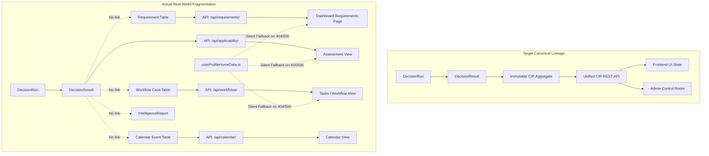

# 10. Compliance Intelligence Record (CIR) & Source of Truth Audit

## Executive Summary
This document provides a forensic audit of the **Compliance Intelligence Record (CIR)** and investigates the canonical source of truth for compliance decisions across `ComplyWise` and `ComplianceRag`.

### Central Findings:
1. **The "CIR" Does Not Exist as a Concrete Entity:** Despite being central to the platform's architectural vision, there is **no database model or entity named `ComplianceIntelligenceRecord` or `CIR`** anywhere in either codebase.
2. **Fragmentation of Compliance Truth:** Compliance status is independently stored and mutated across **six conflicting data stores**:
   - `apps/applicability/models.py` (`DecisionResult`)
   - `apps/requirements/models.py` (`Requirement`)
   - `apps/workflows/models.py` (`Case`)
   - `apps/calendar/models.py` (`ComplianceEvent`)
   - `domain/intelligence/models.py` (`IntelligenceReport`)
   - `frontend/data/userProfileHomeData.ts` (Static mock fallback)
3. **Zero State Synchronization:** Mutations in one subsystem do not propagate to others. Marking a `Requirement` as "Complied" does not update its corresponding `DecisionResult`, nor does it close the associated workflow `Case` or clear the `ComplianceEvent` on the calendar.
4. **Phantom Compliance Scores:** Dashboard health scores (e.g. 78% or 92%) are calculated ad-hoc by aggregating disparate tables or rendered from hardcoded mock constants without mathematical linkage to Engine 2 evaluation runs.

---

## 1. Tracing the Lineage of a Decision



---

## 2. Forensic Analysis of Competing Sources of Truth

### 2.1 Store 1: `DecisionResult` (`apps/applicability/models.py`)
- **Fields:** `id`, `run_id`, `rule_id`, `status` (`APPLICABLE`, `NOT_APPLICABLE`, `NEEDS_INFORMATION`), `evaluation_trace` (JSON), `evidence_used` (JSON), `confidence_score`.
- **Role:** Pure output of `ApplicabilityEngine.evaluate()`.
- **Isolation:** It has no foreign keys to `Requirement`, `Case`, or `ComplianceEvent`. Once created, it is never mutated when a user uploads documents or completes tasks.

### 2.2 Store 2: `Requirement` (`apps/requirements/models.py`)
- **Fields:** `id`, `business_id`, `title`, `description`, `category`, `jurisdiction`, `status` (`PENDING`, `IN_PROGRESS`, `COMPLIED`, `EXEMPT`), `due_date`, `penalty_details`.
- **Role:** User-facing task list of compliance obligations.
- **Synchronization Failure:** When a user marks a requirement as `COMPLIED`, the underlying `DecisionResult` still records `status = "APPLICABLE"` with an unverified trace. Furthermore, creating a new `DecisionRun` does NOT update existing `Requirement` records; it either duplicates them or leaves orphaned stale records.

### 2.3 Store 3: `Case` (`apps/workflows/models.py`)
- **Fields:** `id`, `business_id`, `title`, `status` (`OPEN`, `IN_REVIEW`, `APPROVED`, `REJECTED`), `assigned_to`, `sla_deadline`.
- **Role:** Workflow management for license applications and filings.
- **Synchronization Failure:** A workflow case can be `APPROVED` while the corresponding `Requirement` remains in `PENDING` status and the `DecisionResult` remains in `NEEDS_INFORMATION` status.

### 2.4 Store 4: `ComplianceEvent` (`apps/calendar/models.py`)
- **Fields:** `id`, `business_id`, `title`, `start_date`, `end_date`, `event_type` (`DEADLINE`, `INSPECTION`, `FILING`), `is_recurring`, `status` (`SCHEDULED`, `COMPLETED`, `OVERDUE`).
- **Role:** Calendar deadlines for statutory returns.
- **Synchronization Failure:** Calendar events are seeded independently from requirements. If a requirement deadline changes, the calendar event is not updated.

### 2.5 Store 5: `IntelligenceReport` (`domain/intelligence/models.py`)
- **Fields:** `id`, `business_id`, `report_type`, `summary`, `structured_findings` (JSON), `recommendations` (JSON).
- **Role:** Executive compliance summaries generated by background LLM tasks.
- **Conflict:** Contains an independent JSON snapshot of applicable laws that frequently contradicts the live records in `DecisionResult` and `Requirement`.

### 2.6 Store 6: `userProfileHomeData.ts` (Frontend Static Mock Fallback)
- **Location:** `E:/complience/ComplyWise/frontend/data/userProfileHomeData.ts` (658 lines)
- **Content:** Hardcoded complete profiles for:
  - "Acme Textiles Private Limited" (Surat, Gujarat)
  - "Bharat Health Solutions" (Bengaluru, Karnataka)
  - "Nova Agritech" (Pune, Maharashtra)
- **Behavior:** When any backend endpoint returns a `401`, `404`, `500`, or network timeout, the frontend components (`OverviewTab.tsx`, `ComplianceScoreCard.tsx`, etc.) fall back to `userProfileHomeData.ts`.
- **Critical Risk:** A user whose business is non-compliant or whose backend run failed can be shown a beautiful green dashboard stating *"Compliance Health: 88% - All clear"* pulled from mock data!

---

## 3. Discrepancy Matrix Across Platform Surfaces

| Surface / Endpoint | Data Source Queried | Schema / Fields Returned | Risk of Divergence |
| :--- | :--- | :--- | :--- |
| **`/api/applicability/assessments/`** | `DecisionRun` + `DecisionResult` | `status`, `rule_code`, `evaluation_trace` | Low (Internal to engine) |
| **`/api/requirements/`** | `Requirement` (with regex bypass) | `status`, `title`, `due_date`, `category` | **CRITICAL** (Differs from Engine 2) |
| **`/api/calendar/events/`** | `ComplianceEvent` | `title`, `start_date`, `status` | **HIGH** (Unsynchronized dates) |
| **`/api/workflows/cases/`** | `Case` + `Task` | `case_number`, `workflow_state` | **HIGH** (Unsynchronized status) |
| **`/api/intelligence/reports/`** | `IntelligenceReport` | JSON blob of LLM recommendations | **HIGH** (Hallucinated recommendations) |
| **Frontend Dashboard UI** | Disparate API calls + Mock fallback | Merged React state | **MAXIMUM** (Silent mock display) |

---

## 4. Required Architectural Remediation: The Canonical CIR Model

To restore a single source of truth, ComplyWise must introduce a unified **Compliance Intelligence Record (CIR)** architecture:

```python
class ComplianceIntelligenceRecord(TimeStampedModel):
    """The immutable, canonical record of compliance truth for a business profile version."""
    id = models.UUIDField(primary_key=True, default=uuid.uuid4, editable=False)
    business = models.ForeignKey('businesses.Business', on_delete=models.CASCADE, related_name='cir_records')
    profile_version = models.ForeignKey('profile.ProfileVersion', on_delete=models.PROTECT)
    decision_run = models.OneToOneField('applicability.DecisionRun', on_delete=models.PROTECT, related_name='cir')
    
    # Aggregated Truth
    overall_score = models.FloatField()
    total_applicable = models.PositiveIntegerField()
    total_compliant = models.PositiveIntegerField()
    total_needs_info = models.PositiveIntegerField()
    
    # Cryptographic Lineage
    facts_digest = models.CharField(max_length=64)  # SHA256 of canonical business facts
    rules_digest = models.CharField(max_length=64)  # SHA256 of rule registry version
    evidence_digest = models.CharField(max_length=64)  # Merkle root of evidence hashes
    signature = models.CharField(max_length=128)  # Internal cryptographic audit signature
    
    is_active = models.BooleanField(default=True)
```

### Invariants to Enforce:
1. **Single Entry Point:** `Requirement`, `Case`, and `ComplianceEvent` must be projected downward from the active `ComplianceIntelligenceRecord`. They must never be instantiated as independent, disconnected entities.
2. **Purge Mock Fallback in Production:** The frontend must display an explicit, unclosable error state (`"Failed to load compliance records from server"`) instead of silently substituting mock data from `userProfileHomeData.ts`.
3. **Event-Driven Projection:** When a user completes a task or uploads a verified document, an event must trigger an incremental `DecisionRun`, generating a new versioned `CIR` that cascades downstream updates.
