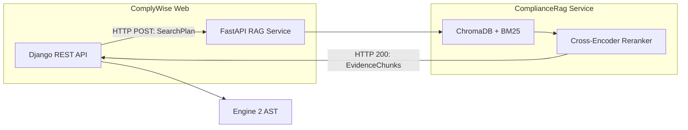
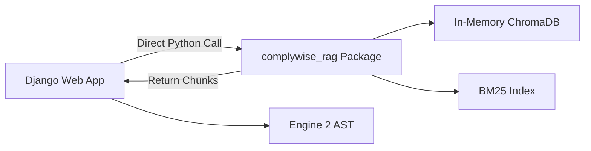
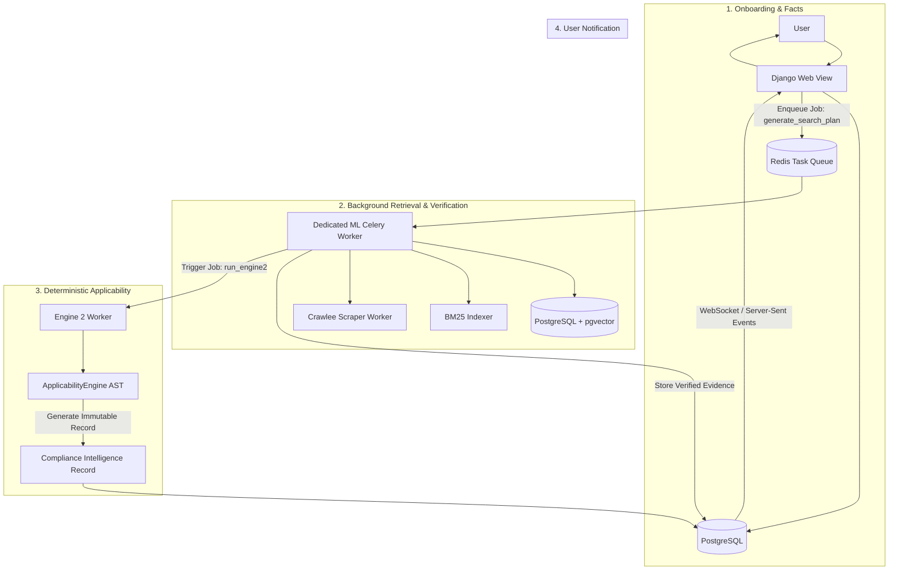

# 14. Architecture Integration Options & Trade-Off Analysis

## Executive Summary
This document analyzes three viable architectural strategies for uniting `ComplyWise` and `ComplianceRag` into a cohesive, production-grade enterprise platform, strictly enforcing the principle:
> **RAG RETRIEVES. RULES DECIDE. LLM EXPLAINS.**

---

## 1. Comparative Options Matrix

| Evaluation Criteria | Option A: External Microservice (FastAPI) | Option B: Embedded In-Process Library | Option C: Asynchronous Hybrid Worker (Recommended) |
| :--- | :--- | :--- | :--- |
| **Architectural Model** | Independent REST/gRPC service for RAG. | RAG packaged as an internal Django app / library. | Dedicated Celery/Redis background worker queue with `pgvector`. |
| **Separation of Concerns** | **Maximum:** Physical separation enforces zero leak of legal decisions. | **Moderate:** High risk of developers calling LLM analysis directly in Django views. | **High:** Async job contract enforces retrieval-only outputs. |
| **Resource Management** | High ML memory usage isolated from Django web workers. | Django web containers must load PyTorch & Cross-Encoders (~2GB+ RAM per worker). | ML workers run on dedicated compute instances with GPU/CPU scaling. |
| **Network Latency** | 20–80ms HTTP overhead per search request. | 0ms in-process function invocation. | Asynchronous job execution (non-blocking for UI onboarding). |
| **Deployment Complexity** | Multi-container orchestration (Django + FastAPI + Redis). | Single Docker image (very large size: 4GB+). | Standard Django + Celery worker pool + PostgreSQL. |
| **Core Principle Adherence** | **Strict:** API contract can reject decision payloads. | **Fragile:** Easy to bypass boundaries in code. | **Strict:** Database schema gates evidence ingestion before Engine 2 runs. |

---

## 2. Detailed Evaluation of Integration Strategies

### Option A: External Microservice (FastAPI Wrapper)

- **Description:** Wrap `ComplianceRag` in a FastAPI application running on Uvicorn. Expose `/api/v1/retrieval/query` and `/api/v1/evidence/verify`.
- **Pros:**
  1. Complete decoupling of dependencies: Django environment does not need PyTorch, CUDA, or SentenceTransformers.
  2. Independent horizontal scaling: Retrieval workers can scale based on indexing/search load without scaling Django web nodes.
- **Cons:**
  1. Requires maintaining two separate repositories, Dockerfiles, and CI/CD pipelines.
  2. Network hops introduce serialization/deserialization overhead.

---

### Option B: Embedded In-Process Library (Monorepo Package)

- **Description:** Refactor `ComplianceRag` into a standard Python package (`complywise_rag`) installed into ComplyWise's virtual environment or unified into a single monorepo under `apps/rag/`.
- **Pros:**
  1. Simplest local development experience: `python manage.py runserver` runs everything.
  2. Zero network latency for retrieval queries.
- **Cons:**
  1. **Severe Memory Bloat:** Every Gunicorn web worker process will load `sentence-transformers/all-MiniLM-L6-v2` and `cross-encoder/ms-marco-MiniLM-L-6-v2`, requiring 3GB+ RAM per worker process.
  2. High risk of developers accidentally resurrecting `gemini_analyzer.py` inside Django views.

---

### Option C: Asynchronous Hybrid Worker with `pgvector` (Recommended)

#### Detailed Architecture of Option C:
1. **Unified Storage (`pgvector`):** Eliminate standalone ChromaDB SQLite and pickle files. Enable the `vector` extension in PostgreSQL. Statutory chunks, embeddings, and metadata reside in the same relational database as `Business` and `EvidenceItem`.
2. **Dedicated Worker Queues:**
   - Web workers (`default` queue): Handle authentication, CRUD, and dashboard responses.
   - Retrieval workers (`ml_retrieval` queue): Load SentenceTransformers, BM25 indices, and execute hybrid search.
   - Acquisition workers (`crawling` queue): Run `CrawleeAcquisitionProvider` with rate limiting and domain whitelisting.
3. **Strict Stage Gating:**
   - Worker 1 generates `SearchPlan` from missing rule preconditions.
   - Worker 2 retrieves top chunks and saves them to `apps/evidence/models.py` (`EvidenceItem`).
   - Worker 3 invokes `ApplicabilityEngine.evaluate()` using ONLY the verified database records.
   - Worker 4 persists the canonical `ComplianceIntelligenceRecord`.

---

## 3. Decision Matrix & Recommended Selection

**Selection: Option C (Asynchronous Hybrid Worker with `pgvector`).**

### Justification:
1. **Adherence to Core Mandate:** Physical separation across distinct worker tasks guarantees that RAG cannot execute applicability decisions. RAG tasks terminate upon writing `EvidenceItem` records to the database.
2. **Operational Simplicity:** Eliminates the operational complexity of managing external ChromaDB clusters and standalone FastAPI microservices while preventing web-worker memory bloat.
3. **Data Integrity:** PostgreSQL transactions ensure ACID compliance across evidence ingestion and decision runs.
