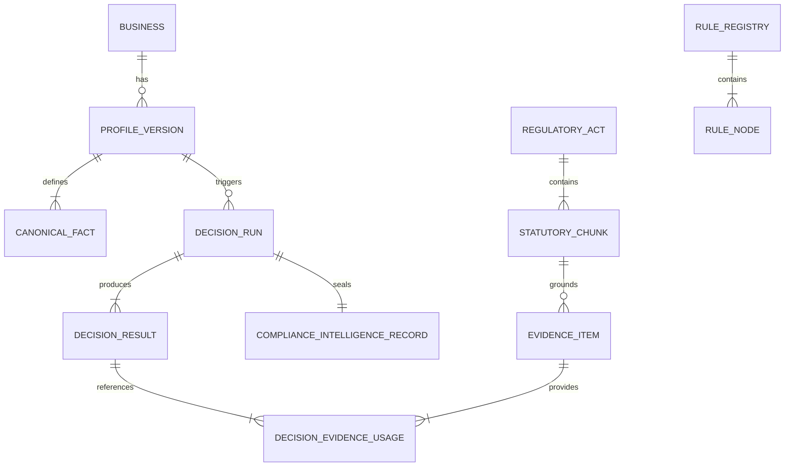
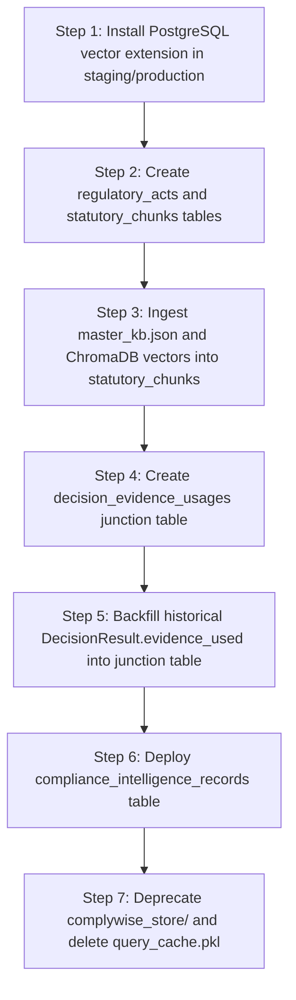

# 16. Database Architecture & Storage Integration Proposal

## Executive Summary
This document proposes a unified database architecture to consolidate the currently fragmented persistence layers across `ComplyWise` (PostgreSQL / SQLite via Django ORM) and `ComplianceRag` (ChromaDB SQLite + insecure pickle cache files).

### Core Architectural Decisions:
1. **Unify Relational Truth and Vector Embeddings in PostgreSQL (`pgvector`):** Eliminate standalone ChromaDB SQLite instances and filesystem pickle caches. Enable the `vector` extension in PostgreSQL to co-locate statutory document chunks, vector embeddings, and relational business/evidence entities.
2. **Restore Referential Integrity:** Replace disconnected JSON blobs (`DecisionResult.evidence_used`) with a formal Many-to-Many junction table (`decision_evidence_usages`) enforcing cryptographic content hash verification.
3. **Establish Immutable Snapshot Versioning:** Create formal models for `ProfileVersion`, `CanonicalFact`, and `ComplianceIntelligenceRecord (CIR)` to guarantee reproducible audit trails.

---

## 1. Unified Entity-Relationship Architecture



---

## 2. PostgreSQL Schema Specifications

### 2.1 Unified Vector Store (`pgvector`) for Statutory Chunks

Instead of storing vector embeddings in a disconnected ChromaDB SQLite file (`complywise_store/chroma.sqlite3`), store them directly in PostgreSQL using `pgvector`:

```sql
CREATE EXTENSION IF NOT EXISTS "uuid-ossp";
CREATE EXTENSION IF NOT EXISTS "vector";

-- Master Regulatory Corpus Table
CREATE TABLE regulatory_acts (
    id UUID PRIMARY KEY DEFAULT uuid_generate_v4(),
    code VARCHAR(100) UNIQUE NOT NULL,
    short_title VARCHAR(255) NOT NULL,
    official_title TEXT NOT NULL,
    jurisdiction VARCHAR(50) NOT NULL, -- 'IN-CENTRAL', 'IN-GJ', etc.
    authority_name VARCHAR(255) NOT NULL,
    authority_tier VARCHAR(50) NOT NULL, -- 'tier_1_government', 'tier_2_regulator', etc.
    source_url TEXT NOT NULL,
    enactment_date DATE,
    is_active BOOLEAN DEFAULT TRUE,
    created_at TIMESTAMPTZ DEFAULT NOW()
);

-- Chunked Statutory Text with Vector Embeddings
CREATE TABLE statutory_chunks (
    id UUID PRIMARY KEY DEFAULT uuid_generate_v4(),
    act_id UUID NOT NULL REFERENCES regulatory_acts(id) ON DELETE CASCADE,
    section_number VARCHAR(100) NOT NULL,
    heading TEXT,
    chunk_index INT NOT NULL,
    raw_text TEXT NOT NULL,
    content_hash VARCHAR(64) NOT NULL, -- SHA256
    
    -- 384-dimensional vector for all-MiniLM-L6-v2 (or 768 for larger models)
    embedding vector(384) NOT NULL,
    
    -- Full-Text Search TSVector for BM25-equivalent sparse search
    search_vector tsvector GENERATED ALWAYS AS (to_tsvector('english', raw_text)) STORED,
    
    created_at TIMESTAMPTZ DEFAULT NOW(),
    CONSTRAINT uk_act_chunk UNIQUE (act_id, section_number, chunk_index)
);

-- HNSW Vector Index for Sub-Millisecond Dense Similarity Search
CREATE INDEX idx_statutory_chunks_embedding 
ON statutory_chunks 
USING hnsw (embedding vector_cosine_ops)
WITH (m = 16, ef_construction = 64);

-- GIN Index for Fast Lexical/BM25 Search
CREATE INDEX idx_statutory_chunks_fts 
ON statutory_chunks 
USING gin (search_vector);
```

---

### 2.2 Relational Evidence Lineage Junction Table

To permanently eliminate the disconnected JSON list `evidence_used` in `DecisionResult`, implement a relational junction table:

```sql
CREATE TABLE decision_evidence_usages (
    id UUID PRIMARY KEY DEFAULT uuid_generate_v4(),
    decision_result_id UUID NOT NULL REFERENCES decision_results(id) ON DELETE CASCADE,
    evidence_item_id UUID NOT NULL REFERENCES evidence_items(id) ON DELETE RESTRICT,
    statutory_chunk_id UUID REFERENCES statutory_chunks(id) ON DELETE SET NULL,
    
    -- Verification Lineage
    excerpt_used TEXT NOT NULL,
    relevance_score FLOAT NOT NULL,
    content_hash_at_evaluation VARCHAR(64) NOT NULL,
    is_hash_verified BOOLEAN DEFAULT TRUE,
    
    created_at TIMESTAMPTZ DEFAULT NOW(),
    CONSTRAINT uk_decision_evidence UNIQUE (decision_result_id, evidence_item_id)
);

CREATE INDEX idx_decision_evidence_usage ON decision_evidence_usages(decision_result_id);
```

---

### 2.3 The Canonical Compliance Intelligence Record (CIR)

```sql
CREATE TABLE compliance_intelligence_records (
    id UUID PRIMARY KEY DEFAULT uuid_generate_v4(),
    business_id UUID NOT NULL REFERENCES businesses(id) ON DELETE CASCADE,
    profile_version_id UUID NOT NULL REFERENCES profile_versions(id) ON DELETE RESTRICT,
    decision_run_id UUID UNIQUE NOT NULL REFERENCES decision_runs(id) ON DELETE RESTRICT,
    
    -- Aggregate Health Metrics
    compliance_score FLOAT NOT NULL CHECK (compliance_score >= 0.0 AND compliance_score <= 100.0),
    total_rules_evaluated INT NOT NULL,
    total_applicable INT NOT NULL,
    total_not_applicable INT NOT NULL,
    total_needs_information INT NOT NULL,
    
    -- Cryptographic Audit Lineage
    facts_sha256 VARCHAR(64) NOT NULL,
    ruleset_sha256 VARCHAR(64) NOT NULL,
    evidence_merkle_root VARCHAR(64) NOT NULL,
    digital_signature TEXT NOT NULL,
    
    is_active BOOLEAN DEFAULT TRUE,
    sealed_at TIMESTAMPTZ DEFAULT NOW()
);

CREATE INDEX idx_cir_business_active ON compliance_intelligence_records(business_id, is_active);
```

---

## 3. Database Migration Roadmap



---

## 4. Architectural Gains

| Metric / Dimension | Current State | Proposed Unified Architecture |
| :--- | :--- | :--- |
| **Vector Engine** | ChromaDB SQLite (Isolated process) | PostgreSQL `pgvector` (Unified transactions) |
| **Search Mechanism** | Custom Python script (`retriever.py`) | Native SQL: Cosine Similarity + `ts_rank_cd` |
| **Evidence Referential Integrity** | Disconnected JSON list | `decision_evidence_usages` Foreign Key constraint |
| **Cache Security** | Vulnerable Python `pickle` file | Redis key-value cache with JSON serialization |
| **Source of Truth** | 6 fragmented, conflicting stores | Unified `compliance_intelligence_records` |
