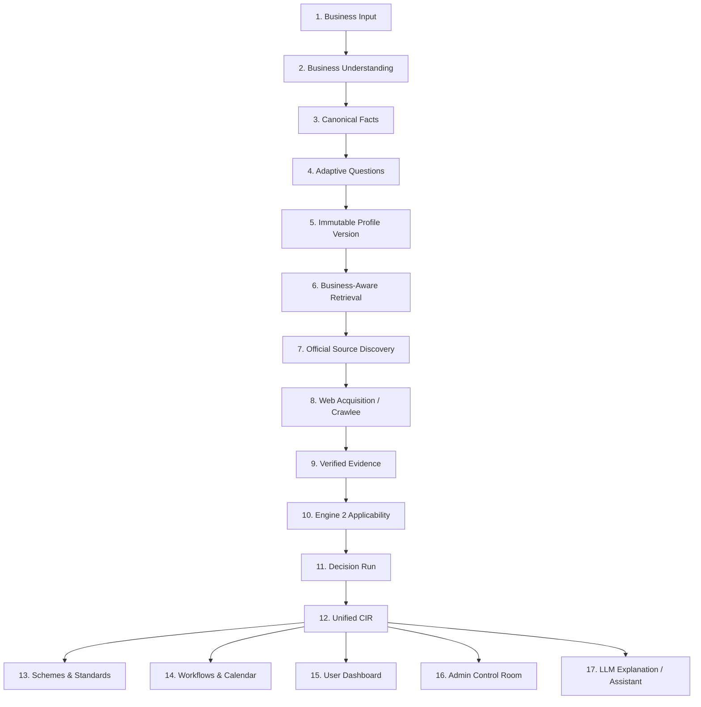

# 17. Architecture Gap Analysis & Target Lifecycle Scorecard

## Executive Summary
This document delivers a forensic scorecard evaluating the current implementation status of `ComplyWise` and `ComplianceRag` against the 17 stages of the target compliance intelligence lifecycle.

### Overall Status Breakdown:
- **IMPLEMENTED:** 2 stages (11.8%)
- **PARTIAL:** 4 stages (23.5%)
- **BROKEN / BYPASSED:** 4 stages (23.5%)
- **DUPLICATED / DISCONNECTED:** 3 stages (17.6%)
- **UNSAFE / INSECURE:** 2 stages (11.8%)
- **MISSING:** 2 stages (11.8%)

---

## 1. The 17-Stage Lifecycle Scorecard



---

## 2. Granular Stage-by-Stage Forensic Evaluation

| Stage # | Lifecycle Stage | Target Architectural Role | Current Real State | Status | Repositories Involved | Primary Code Locations | Remediation Effort |
| :---: | :--- | :--- | :--- | :---: | :--- | :--- | :---: |
| **1** | **Business Input** | Captures free-text description, industry, location, scale. | Fully implemented Next.js onboarding form + REST API. | **IMPLEMENTED** | ComplyWise | `frontend/app/onboarding/`, `apps/onboarding/views.py` | Low |
| **2** | **Business Understanding** | LLM extracts structured attributes from unstructured text. | Implemented via `OnboardingPlanner` invoking Gemini API. | **IMPLEMENTED** | ComplyWise | `apps/onboarding/planner.py`, `domain/intelligence/service.py` | Low |
| **3** | **Canonical Business Facts** | Strongly typed, schema-validated facts with confidence scores. | Facts stored as unstructured JSON in `Profile.structured_data`; no schema enforcement. | **PARTIAL** | ComplyWise | `apps/businesses/models.py` | Medium |
| **4** | **Adaptive Questions** | Emits minimum questions (0, 1, 2...) based on missing rule variables. | Hardcoded prompt forcing 5–6 questions (`questionnaire.py`) or 16 questions (`planner.py`). Cannot emit 0 questions. | **BROKEN** | ComplyWise | `domain/intelligence/questionnaire.py`, `apps/onboarding/planner.py` | High |
| **5** | **Immutable Profile Version** | Content-addressed, versioned snapshot of facts per decision run. | `Profile` is mutated in-place; no versioning table or immutable snapshots exist. | **MISSING** | ComplyWise | `apps/businesses/models.py` | High |
| **6** | **Business-Aware Retrieval** | Search plan targeted to missing AST preconditions. | Disconnected hybrid search in RAG; naive keyword search in ComplyWise. No AST search planning. | **DUPLICATED** | Both | `ComplyWise/.../discovery.py`, `ComplianceRag/.../retriever.py` | High |
| **7** | **Official Source Discovery** | Whitelisted discovery across state/central gazette portals. | Heuristic keyword generation + search engine scraping. Good domain lists. | **PARTIAL** | Both | `domain/intelligence/discovery.py`, `complywise/search/serp_client.py` | Medium |
| **8** | **Web Acquisition / Crawlee** | Shallow, headless crawling of official gazettes and portals. | Crawlee BeautifulSoup implemented in ComplyWise. ComplianceRag uses plain HTTP. | **PARTIAL** | ComplyWise | `domain/acquisition/crawlee_provider.py` | Medium |
| **9** | **Verified Evidence** | SHA256 hashed text chunks linked relationally to decisions. | `EvidenceItem` has SHA256, but is stored as raw disconnected JSON in `DecisionResult`. | **BROKEN** | ComplyWise | `apps/evidence/models.py`, `apps/applicability/models.py` | High |
| **10** | **Engine 2 Applicability** | Deterministic Kleene 3-valued AST rule evaluation. | `engine.py` is mathematically sound, but **bypassed by view regex** (`requirements/views.py`). RAG has no engine. | **BROKEN** | Both | `ComplyWise/.../engine.py`, `ComplyWise/.../requirements/views.py`, `ComplianceRag/.../gemini_analyzer.py` | Critical |
| **11** | **Decision Run** | Traceable execution record with rule version & inputs. | `DecisionRun` and `DecisionResult` models exist and capture traces. | **PARTIAL** | ComplyWise | `apps/applicability/models.py` | Medium |
| **12** | **Unified CIR** | Single source of truth for enterprise compliance status. | **Does not exist.** Truth is fragmented across 6 conflicting models and frontend mock files. | **MISSING** | ComplyWise | N/A (Missing entity) | Critical |
| **13** | **Schemes & Standards** | Deterministic eligibility for government subsidies & BIS standards. | Public views (`AllowAny`) returning generic unlinked lists; no profile version propagation. | **UNSAFE** | ComplyWise | `apps/schemes/views.py`, `apps/standards/views.py` | High |
| **14** | **Workflows & Calendar** | Statutory filing cases and recurring deadlines. | Unsynchronized with `DecisionResult`; public endpoints (`AllowAny`); manual updates. | **UNSAFE** | ComplyWise | `apps/workflows/views.py`, `apps/calendar/views.py` | High |
| **15** | **User Dashboard** | Role-based dashboard displaying verified compliance status. | Silently falls back to hardcoded mock data (`userProfileHomeData.ts`) on any API failure. | **BROKEN** | ComplyWise | `frontend/app/dashboard/`, `frontend/data/userProfileHomeData.ts` | High |
| **16** | **Admin Control Room** | Operator interface for AST rules, traces, scrapers, and RAG. | Standard Django ModelAdmin CRUD only. No AST editor, trace inspector, or crawler monitor. | **PARTIAL** | ComplyWise | `apps/*/admin.py` | High |
| **17** | **LLM Explanation / Assistant** | Grounded explanation of Engine 2 decisions. | Chat endpoint queries first active business in DB (`.first()`); unauthenticated (`AllowAny`). | **UNSAFE** | ComplyWise | `apps/assistant/views.py` | Critical |

---

## 3. High-Priority Architectural Path to Green

```
Phase 1: Remediation of Critical Vulnerabilities (Days 1–3)
  ├── Patch Business.resolve_safely() (SEC-01)
  ├── Lock down AllowAny views and Assistant .first() leak (SEC-02, SEC-03)
  ├── Delete pickle deserializer in ComplianceRag (SEC-04)
  └── Remove view-layer regex bypass in apps/requirements/views.py (ENG-01)

Phase 2: Single Source of Truth & Database Unification (Days 4–7)
  ├── Deploy PostgreSQL vector extension (pgvector)
  ├── Ingest master_kb.json into PostgreSQL statutory_chunks
  ├── Deploy decision_evidence_usages junction table
  └── Implement ComplianceIntelligenceRecord (CIR) aggregate model

Phase 3: Integration & Invariant Enforcement (Days 8–12)
  ├── Connect ComplyWise Celery worker to RAG hybrid retriever
  ├── Refactor OnboardingPlanner to support 0-question invariant
  ├── Purge userProfileHomeData.ts silent mock fallback in frontend
  └── Implement Admin AST Visualizer and Decision Trace Inspector
```
