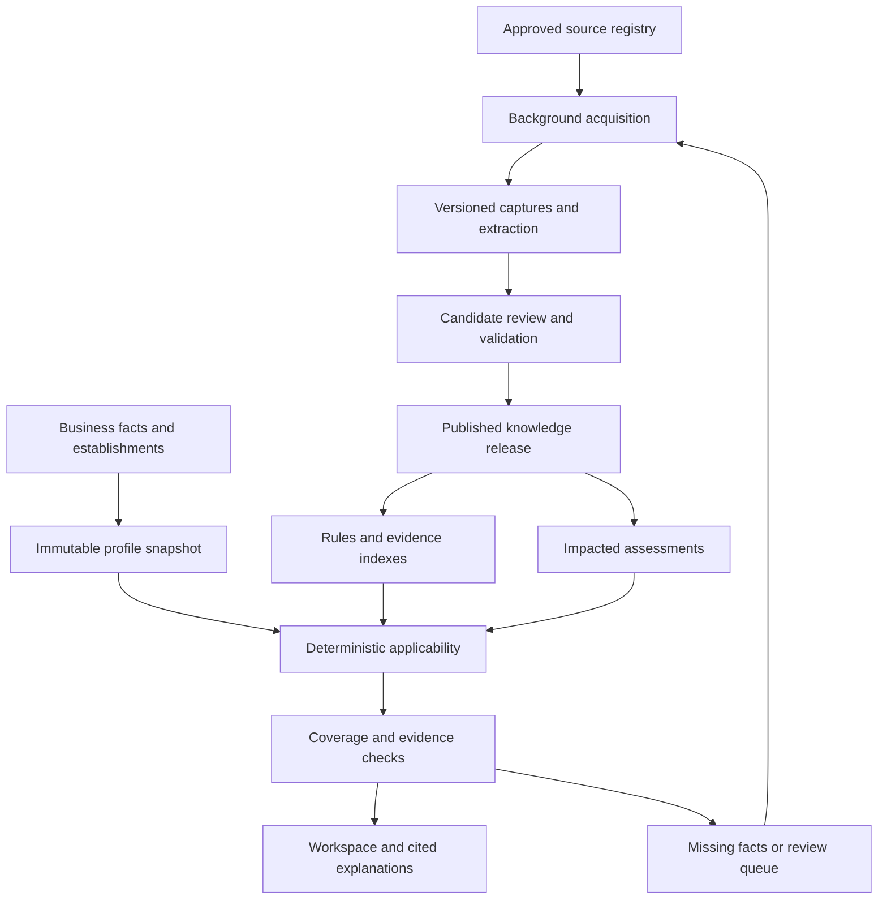

# ComplyWise: accuracy and reliability implementation instructions

Prepared 4 October 2026. Audience: coding agent working in the actual application repository.

## 1. Objective and evidence boundaries

Harden the existing Next.js / Django DRF / PostgreSQL compliance product for Indian businesses. Prioritize defensible applicability decisions, explicit knowledge coverage, traceable evidence, reliable source acquisition, and measurable quality. Implement changes, migrations, operational tooling, UI integration and tests; do not stop after writing a proposal.

This specification reviews the supplied `product-architecture-audit(2).md` and `backend-architecture(2).mmd`. It is not a new repository audit or live provider test. Treat all statements about existing implementation and test results below as attachment-reported facts until verified in the checkout. Never reuse their pass counts as results of your work.

The attachments report:

- Immutable BusinessProfileVersion; assessment-scoped runs; deterministic AST applicability; tenant guards; quarantined candidates and human publication; real document storage and review. Preserve these strengths.
- Remote ComplianceRAG health reported four indexed chunks and four requirements; local retrieval uses token overlap; pgvector is installed but local chunk/vector retrieval is unwired. This is the main reported coverage bottleneck. Four chunks cannot substantiate broad Indian business coverage.
- Firecrawl search succeeded; one scrape exceeded a 45-second application budget; direct HTTP fallback fetched an official BIS page. This does not establish current provider uptime or explain all current failures.
- The optional Python Crawlee/browser runtime was absent. A router with that name is not proof that a browser ran.
- “Surfify” appears in the user's description but is not identified in the attachments. Search repository/configuration/dependencies for its exact integration. Do not assume it means another similarly named vendor. Record NOT_IDENTIFIED if absent and continue independent work.
- Provider cooldown is process-local; publication reevaluates a linked assessment, not every impacted business.
- There are many user features, but the exact list described as “56 things” is unavailable. Inventory actual routes/modules; do not manufacture 56 modules or reinterpret API scope audits without inspecting their implementation.

Architecture alone cannot establish a numeric accuracy claim. Completing code cannot replace domain expert review, source licensing, production credentials, or a representative benchmark.

## 2. Non-negotiable implementation constraints

1. Read repository instructions and inspect working tree before edits. Map every requirement here to existing modules, reuse abstractions, preserve user edits, and use additive migrations. Avoid a framework rewrite, mass cleanup, new microservices or a new database stack.
2. Preserve published deterministic decisions independently of LLM generation, reviewer operational treatment, and contextual suggestions. No LLM output or remote VERIFIED flag may silently publish rules or become legal authority.
3. No fabricated sources, quotations, deadlines, production rules, coverage percentages, successful uploads, or provider successes. Synthetic examples are allowed only as labeled test fixtures outside production knowledge.
4. Preserve tenant, business, establishment, assessment and snapshot isolation. A company administrator does not automatically receive global legal-publisher permission.
5. Keep current authentication and working provider integrations. Do not rotate secrets, purchase services, bypass access restrictions, or deploy to production as a side effect of this implementation.
6. Keep implementing all unblocked portions. When credentials, source rights or legal review are absent, provide working adapters, pending records, reproducible commands and explicit blockers. Do not claim live success using mocks or disable a quality gate to finish.

## 3. Target workflow

Separate the knowledge maintenance path from the business assessment path. These are logical modules in the existing application plus background workers, not a mandate for separate services.



Normal assessment: save facts; resolve material ambiguity; evaluate all plausibly relevant published rules; attach evidence; expose coverage gaps; generate optional explanations; persist the result. Unknown facts trigger questions or unresolved outcomes. A cold or unsupported business receives a partial result and an asynchronous research status, never a fabricated complete workspace.

Known obligations must not be selected solely by top-k semantic search. Enumerate candidate rules using conservative jurisdiction/domain indexes, including national and overlapping rules. Evaluate the full relevant published set. Retrieval supplies evidence and discovers gaps; ranking must not silently remove a binding rule from evaluation.

## 4. P0: establish what actually works

Create a bounded `diagnose_acquisition` management command, or equivalent existing command, producing machine-readable JSON and a readable report. Resolve paths and command names from the repository.

Inventory actual search, fetch, browser, PDF, OCR, remote RAG and LLM adapters. For each report: installed/configured status, actual execution path, endpoint/API version, configuration names without values, capability, last probe time, safe failure class, latency, and next action. Separate NOT_CONFIGURED, NOT_INSTALLED, NOT_IDENTIFIED, UNTESTED, HEALTHY and DEGRADED.

Probe search independently of scrape. Use a small approved target matrix: known static official page, official text PDF, scanned PDF, and a JavaScript-dependent page where authorized. Test extraction and downstream persistence separately. A successful search does not prove a scrape works; HTTP 200 does not prove useful content; scraped text does not prove claim extraction or rule publication works.

Classify failures as authentication, credit/quota, rate limit, transient upstream, DNS/TLS/network, timeout, denied/blocked access, redirect rejection, invalid request/schema, empty/boilerplate content, parser failure, OCR unavailable, or application persistence failure. Do not call all of them “crawler failed.” Capture trace IDs and redacted metadata; never log secrets, sensitive prompts or document bodies.

Inspect Firecrawl SDK/API compatibility, timeout units and nesting, unnecessary waits, request formats, upstream status inside successful envelopes, cache age, quota and retry multiplication. Current Firecrawl documentation exposes a scrape timeout separate from application timeouts; align them explicitly. This is a diagnostic hypothesis, not proof that increasing a timeout fixes this deployment.

Verify Crawlee installation, selected HTTP/browser backend, browser binaries, OS dependencies and a real browser launch on the deployment platform. Report HTTP fallback as HTTP, never as a successful browser scrape. Pin compatible dependencies and document production installation, including OCR language packs where needed.

Acceptance: every configured adapter has a timestamped capability result; every untested adapter has a reason; forced scrape failure retains a usable HTTP/PDF result; failed extraction retains the source capture; no empty result is mislabeled complete.

## 5. P1: durable source acquisition and knowledge maintenance

### 5.1 Source registry and adapters

Extend the existing Source model where appropriate. Record authority identity, approved canonical host/path, jurisdiction, document types/languages, permitted acquisition method, discovery feed/listing, refresh policy, owner, terms/licensing constraints, last successful fetch, last successful freshness check, next check and source status.

Use authoritative sources appropriate to each supported domain: legislation and gazette publications, issuing ministries/regulators, state authorities and municipal bodies where relevant. Verify current canonical URLs and redirects; websites can migrate. A government domain is useful provenance, not proof that a document is current, applicable or legally controlling. Guidance, FAQs, schemes, voluntary standards and binding instruments need different types. Restricted standard text needs appropriate rights; do not seed full copyrighted standards from unauthorized copies.

Prefer official structured feeds/APIs/downloads when available and permitted; direct HTTP for known static pages/PDFs; source-specific browser extraction for JavaScript; the configured managed scraper as a measured alternative. Route by capability and measured source success, not an endless universal provider chain. Existing adapters remain usable. Search discovers candidates; it must not be the only way known sources are refreshed.

For example, start with configurable HTTP fetch limits of 5 seconds connect / 20 seconds total, browser or managed fetch limits of 45 seconds, and 90 seconds total per acquisition job including fallback. These are proposed engineering defaults, to tune against representative sources. Longer documents should use explicitly bounded document jobs. One retry owner controls total attempts. Retry transient failures with jitter and Retry-After; do not repeatedly retry invalid credentials, denied access or malformed requests.

Persist source/provider circuit breakers across workers with expiry and half-open probes. Isolate source-specific blocks from provider-wide outages. Prefer the existing shared cache or a PostgreSQL table; do not require Redis just to add a breaker. Avoid treating multiple API keys with the same provider/quota project as independent availability domains.

Respect source access policies and bounded per-domain concurrency. A blocked source creates an operational/manual acquisition task. Add an authorized official-document upload path with provenance review; uploaded bytes alone are not verified authority.

### 5.2 Jobs and persistence

Reuse an existing job system. If none exists, implement one documented durable worker option with deployment instructions; a PostgreSQL-backed job/outbox runner is acceptable at this scale. Do not add several competing queues. Use transactional outbox creation for publication/refresh work, leases, heartbeats, bounded retries, cancellation and a dead-letter/retry interface. Survive process restarts; do not rely on request-process threads.

Persist acquisition attempt and capture separately. Preserve raw HTML/PDF bytes in existing private object storage, content type, final validated URL, redirect history, fetch time, source publication time when known, checksum, normalized text, extractor version, page/section mapping, OCR quality and extraction warnings. Distinguish raw-byte and normalized-text hashes. Do not overwrite old captures. Conditional HTTP requests and semantic diffs should reduce unnecessary extraction/review.

Deduplicate using canonical source identity and content hash; do not collapse distinct legal instruments with coincidentally similar text. Make worker side effects idempotent with database uniqueness constraints and atomic transactions. A crash after storing bytes must not create duplicate publication or notifications when retried.

Separate Fetched -> Extracted -> Candidate -> In review -> Published -> Superseded/Withdrawn. Add explicit failed/quarantined states as needed. Publication requires source support, reviewer identity, effective-date handling, validated rule AST and audit event. Expensive extraction runs once per new capture, not once per business onboarding.

### 5.3 Security at acquisition boundaries

Validate outbound destinations and every redirect, reject private/loopback/link-local/metadata addresses, handle IPv6 and DNS rebinding, and enforce the same policy for browser subrequests and vendor-fetch inputs. Keep TLS verification enabled. Apply MIME/size/page/time limits, parser isolation and malware checks to uploaded files. Treat retrieved text as untrusted data: it cannot issue tool instructions, publish rules or request secret disclosure.

## 6. P1: explicit business facts, rules and uncertainty

### 6.1 Business facts

Preserve immutable profiles and add typed fact provenance where absent: value, units/currency, relevant accounting period, establishment, origin, confirmation status and effective period. Distinguish UNKNOWN from false and zero. Suggested facts from an LLM require confirmation before material legal decisions.

Represent multiple establishments and jurisdictions. Registered office is not automatically the location of every activity. Capture only relevant facts such as legal form, actual activities, state/locality, turnover period, worker category/count, premises, regulated products, imports/exports and event dates. Reuse existing schemas and minimize sensitive collection.

Retain the low-friction first screen with up to five prioritized questions if useful. Do not let that UX cap force a legal answer. After the first batch, material unresolved facts remain visible with targeted follow-up questions. Rank by which rule decisions the answer could resolve; show the reason for asking.

### 6.2 Typed rule semantics

Map into existing enums and models rather than duplicating engine truth. Support APPLICABLE, NOT_APPLICABLE and UNDETERMINED, with structured reasons such as MISSING_FACT, COVERAGE_GAP, CONFLICT, SOURCE_STALE or REVIEW_REQUIRED. A verified exemption with sufficient facts can produce NOT_APPLICABLE; missing evidence cannot.

Handle unknown values through three-valued logic, not false defaults. Validate AST operand types, units, inclusive/exclusive bounds, conjunctions, disjunctions, exceptions and rule dependencies. Do not execute arbitrary Python/SQL from generated ASTs. Model deadlines deterministically from cited rules and confirmed trigger dates; missing trigger date means unknown deadline. Use explicit India-local date semantics and UTC timestamps for events.

Track legal valid time separately from system knowledge time: published/effective/repealed intervals, recorded/reviewed timestamps, and explicit amendment/supersession relationships. A newer web publication is not automatically the controlling instrument. Reviewer-resolved precedence must retain reasons; unresolved legal conflicts remain unresolved. Reconstruct both “what applies as of date X” and “what the platform knew when it advised the customer.”

Record on each decision run: profile/assessment, knowledge release, rule/evidence versions, engine version, as-of date and evaluated fact trace. Explanations must not contradict that trace. Global rules remain shared; private business evidence stays tenant-scoped.

### 6.3 Coverage is an explicit product object

Create or extend CoverageManifest: business segment, domain, jurisdictions, validity interval, enumerated source/instrument inventory, reviewed requirements, documented exclusions, reviewer, review date and status. Launch broad intake but certify only bounded, reviewed segments. Start with the existing strongest segment and expand deliberately; do not invent sector-specific laws to populate a demo.

Keep separate dimensions for business-fact completeness, knowledge coverage, source freshness and decision resolution. A coverage percentage must have an explicit denominator; do not infer national coverage from rule count, retrieval score, empty search or a filled dashboard. “Complete” means complete within a named reviewed scope and as-of date, never every possible obligation for any Indian business.

## 7. P2: retrieval and constrained LLM roles

Preserve the existing remote ComplianceRAG adapter. Validate its contract, returned IDs, provenance, jurisdiction, valid dates and corpus release. Treat it as external retrieval, not a verification oracle. If its internals are unavailable, document that boundary and add consumer contract tests. Do not claim it uses BM25 or a reranker without evidence.

Wire an owned local evidence index in existing PostgreSQL: source-linked chunks, full-text search, compatible embeddings and pgvector. Chunk by section/clause/table boundaries; retain parent context, headings, definitions, exceptions, page offsets and original-language text. Store translations as derived aids linked to originals. Flag poor OCR, especially numeric thresholds and negations, for review.

Use PostgreSQL full-text ranking plus vector retrieval, fused by reciprocal rank or another measured method. PostgreSQL full-text ranking is not automatically BM25. Add reranking only if evaluation improves retrieval quality enough to justify cost. Keep embedding model/version/dimension in the index; rebuild behind a versioned switch when changing models. Never mix incompatible vectors.

Apply tenant visibility and eligibility restrictions throughout retrieval. Include national and relevant state/local instruments; resolve unknown jurisdiction metadata rather than merely filtering titles. Test filtered vector recall against exact search on a representative set; approximate nearest-neighbor filtering can under-return results. Deduplicate remote/local evidence by source version and locator, not provider rank. Preserve lexical retrieval during embedding outages.

Give LLMs bounded roles: propose facts/questions; extract evidence-linked candidate fields; explain existing decisions; draft clearly marked planning guidance. Deterministic validators check quotation spans, numeric fields, rule schema, source existence, citation support, conflicting versions and publication status. An optional second model may flag ambiguous extraction, but model agreement is not legal verification and never bypasses review.

For each user-facing legal claim store supporting evidence IDs and exact locators. Citation presence is not enough: a real page about a scheme does not prove eligibility or approval. Prefer deterministic explanation templates for thresholds/deadlines. If narrative generation fails, render the decision and its trace without it. When evidence is insufficient, return the gap and next action; do not turn generic business advice into a confirmed obligation.

## 8. P2: shared workspace truth and admin controls

Define one additive response contract reused across compliance, standards, schemes, documents, calendar, updates and other existing modules:

```json
{
  "assessment_id": "persisted ID",
  "profile_version_id": "persisted ID",
  "knowledge_release_id": "persisted ID",
  "as_of": "ISO date",
  "applicability": "APPLICABLE | NOT_APPLICABLE | UNDETERMINED",
  "basis": "PUBLISHED_RULE | HUMAN_REVIEW_RESULT | UNVERIFIED_GUIDANCE",
  "reason_codes": [],
  "rule_version_ids": [],
  "evidence_refs": [],
  "missing_fact_keys": [],
  "coverage_status": "SUPPORTED | PARTIAL | UNSUPPORTED",
  "freshness_status": "CURRENT | STALE | UNKNOWN",
  "review_status": "NOT_REQUIRED | PENDING | REVIEWED",
  "operational_treatment": null
}
```

This is an illustrative shape, not permission to rename existing public fields destructively. Optional guidance has no engine verdict; adapt nullable/type-discriminated semantics to avoid implying otherwise. Evidence references must resolve to source version, URL, passage and locator. Keep review, applicability and task completion separate dimensions.

Standards need voluntary/mandatory/contextual classification and evidence of any binding incorporation. Schemes need eligibility, application-window status and distinction from award approval. Updates need publication/effective dates and affected businesses. Calendar dates require supported deadline calculations. Document review does not certify that the entire company is compliant. Audit modules require the same provenance rules; inspect what “API scope audit” actually means before changing it.

Provide visible user states: confirmed by published rule, operational human decision, needs more information, research/review pending, unsupported scope, stale evidence, and service unavailable. Empty lists must not imply “no obligations.” Existing saved decisions remain accessible during acquisition/LLM outages with an honest as-of/freshness label.

Company admins manage their own businesses, assignments and documents. Separate global publisher/reviewer roles, source operations and tenant roles; enforce server-side object permissions. Add a source/provider health view, coverage gaps, review backlog age, old/new source diff, AST preview, conflicting evidence and publication impact preview. For material rule changes support independent second-person approval, recorded in audit history.

## 9. P2: updates, impact analysis and operational resilience

On publication, correction, repeal or profile change, compute affected rules and assessments using explicit dependencies plus conservative fallback selection. Persist a resumable batch; reevaluate all relevant active businesses, not only the originating assessment. Schedule future-effective rule transitions. Preserve historical decision runs; create new results and a before/after explanation.

Separate current business assessments from historical snapshots. Historical snapshots stay reproducible; explicit as-of replay is a separate action. Invalidate caches by profile, rule/knowledge release, query and jurisdiction. Capture freshness is not inferred from the existing one-hour/24-hour application reuse window.

Use deduplicated notification events and the existing outbox/delivery system. Show in-app changes; do not enable external sending or new destinations without configured authorization. Handle late publication/retroactive changes as reviewed cases instead of silently rewriting past advice.

Instrument stage traces: facts, rules, retrieval, acquisition, extraction, review, generation and persistence. Track usable-capture success by source/content type, freshness checks, stale critical sources, retry volume, queue age, review backlog, cost and latency. Distinguish dependency liveness, operational readiness and knowledge readiness. A passing /health endpoint does not mean a jurisdiction has sufficient knowledge.

Source freshness and reviewer turnaround need configurable risk-based targets. Proposed pilot targets: scheduled daily checks for designated high-priority sources and critical review queue escalation after one business day. These are operating targets, not a guarantee that every government change is discovered within 24 hours. Report publication-to-detection lag when publication time is known, detection-to-review lag and review-to-customer propagation lag separately.

## 10. P3: measure accuracy before making claims

Build a versioned evaluation harness before tuning on a benchmark. Use expert-authored/adjudicated cases containing business facts, jurisdiction, as-of date, the complete expected obligation set within the declared scope, exclusions, missing-fact expectations, exact evidence, deadlines and severity. LLM-generated tests may supplement engineering checks but are not expert ground truth.

Aim initially for at least 200 diverse reviewed business scenarios and at least 1,000 obligation-level judgments across the supported pilot scope. These are proposed starting sizes, not statistically sufficient certification or current achievements. Include negative cases, threshold boundaries, multi-establishment businesses, missing facts, exemptions, amendments, retroactive/future dates, source conflict, scanned tables and unsupported sectors. Track distinct businesses/instruments; repeated near-duplicates do not count as independent evidence.

Separate development and frozen holdout cases, with instrument/template/time separation where possible. Restrict benchmark labels from production prompts. Record reviewer agreement and adjudication. Benchmark the old and new pipeline on the same holdout and report slices; do not cherry-pick successful sectors.

| Metric | Definition and reporting rule |
|---|---|
| Applicability precision | Correctly predicted applicable obligations / all predicted applicable obligations. Deduplicate by obligation and establishment. |
| Applicability recall | Correctly predicted applicable obligations / all expert-applicable obligations in declared scope. Misses, abstentions and failures cannot disappear from this denominator. |
| Critical-obligation recall | Recall on separately labeled high-consequence obligations; publish sample size and each failure. |
| Resolved-case accuracy | Correct applicability labels / resolved labels; always pair with resolution/abstention rate. |
| Resolution rate | Resolved eligible decisions / all benchmark decisions, including technical failures. |
| Evidence support | Legal claims whose citations actually support the claim / all emitted legal claims; independent review, not just valid URLs. |
| Retrieval recall@k | Relevant adjudicated evidence recovered / expected relevant evidence, by jurisdiction/document type. |
| Deadline correctness | Exact rule/trigger/date match against reviewed expectations; report unresolved-date rate. |
| End-to-end completion | Assessments yielding usable persisted results / all attempted assessments; report partial and technical failures separately. |
| Freshness | Source freshness against explicit refresh policy and measured update lags; not a synonym for legal accuracy. |

Compute uncertainty intervals and denominators. For obligation metrics clustered within businesses, use a cluster bootstrap or document why an independent-binomial interval is appropriate. Publish macro averages across material slices as well as totals. Small or unreviewed slices remain unproven.

Proposed pilot gates, configurable and explicitly unachieved until measured: precision >=98%, recall >=95%, evidence support >=99%, critical recall >=99%, and resolution rate >=80% on the declared holdout. Require no known unresolved critical defect in the release. Set and disclose minimum slice sample sizes and interval expectations before looking at holdout results; a tiny sample with 100% observed success cannot justify a population guarantee. Failing quality or insufficient benchmark evidence leaves automation behind a review-only pilot flag, even when all software tests pass.

Do not optimize precision by returning almost nothing. Report unsupported businesses, abstention and human review rates together with accuracy. Measure automatic decisions separately from human-assisted results and include reviewer turnaround/cost. Source uptime and unit-test pass counts are separate operational metrics.

Investor statement template, usable only after real measurement:

“For [named business segments and jurisdictions], evaluated as of [date] on [N] independently reviewed holdout businesses and [M] obligation judgments, release [version] achieved [P]% applicability precision and [R]% recall, with [A]% unresolved decisions and [C]% evidence support. [intervals]. Uncovered domains are flagged for review. Results are reproducible from versioned facts, rules and official-source evidence.”

The present defensible claim is narrower: the supplied architecture describes mechanisms for traceable, reviewed applicability; its legal accuracy has not been established by the attachments. Do not claim “best” without a fair comparative evaluation.

## 11. Required adversarial and integration tests

1. Search succeeds, scrape times out, HTTP succeeds: retain bytes/provenance and correct stage statuses; never claim the scrape worked.
2. All acquisition providers fail: saved published decisions load without network calls; missing scope remains unresolved; retry is durable.
3. Browser package/binary missing; OCR unavailable; HTTP 200 login page; truncated PDF; empty extraction: correct classified failure, no publication.
4. Missing turnover/workforce/location does not become zero/false. Exact threshold boundaries and unknown-value AST truth tables behave correctly.
5. National plus correct-state rules apply to the relevant establishment; unrelated-state evidence cannot decide applicability; unknown metadata is not silently trusted.
6. Current/future/repealed/amended/conflicting instruments select or abstain correctly as of a date; historic decisions remain reproducible.
7. A quotation exists but contradicts the generated claim; an exception is in an adjacent section; OCR flips a threshold: reject or queue for review.
8. Remote RAG reports VERIFIED without local publication; unreviewed capture contains prompt injection: no privileged action or verified legal output.
9. Cross-tenant retrieval, object access, jobs, caches and admin paths fail closed; company admin cannot publish global rules.
10. Worker retry/crash, duplicate event, stale reviewer approval, source withdrawal and migration backfill do not cause duplicate publication, lost evidence or approval of a newer unseen version.
11. Rule publication impacts multiple relevant businesses and excludes unrelated ones; notification deduplication and future-effective scheduling work.
12. LLM/embedding outage preserves deterministic results and lexical evidence retrieval; explanations never overwrite verdicts.
13. SSRF via redirects, DNS/private IPs, IPv6 or browser subresources is blocked; file limits are enforced.
14. All existing workspace modules show consistent assessment/provenance/freshness and no invented tasks or deadlines.

Use mocked deterministic failure tests and opt-in bounded real provider probes, labeled separately. Run existing regression gates relevant to changed code, migration checks and frontend contract tests. Record exact commands, commit, environment and results; do not repeat unrelated tests without a reason.

## 12. Delivery sequence and acceptance

| Phase | Deliverable | Gate |
|---|---|---|
| P0 | Code map, capability diagnostics, benchmark schema and baseline | Know exactly which stages are installed, tested or blocked; no misleading health labels. |
| P1 | Durable acquisition, source/capture lineage, uncertainty and coverage models | Restart-safe jobs, verified traceability, no false “not applicable” from missing facts. |
| P2 | Local hybrid index, shared API/UI status, review/impact workflow | Evidence isolation, reproducible decisions, cross-business updates and existing feature regressions pass. |
| P3 | Evaluations, pilot gates, operations runbook and rollout | Real measured report or explicitly BLOCKED evidence gate; no invented accuracy. |

Implement through feature flags. Backfill existing data as UNKNOWN/unreviewed where metadata cannot be established; preserve existing evidence IDs and never mass-promote old guidance. Build new indexes/releases beside old ones and compare in shadow mode. Switch only after compatibility and quality gates; keep a reversible runtime flag and preserved prior releases. Document migration locking/backfill batching and backup/restore. Never drop existing data as a rollback strategy.

Required repository outputs: implementation and migrations; architecture diagram; diagnostics command/report; source and knowledge-release runbook; evaluation fixtures/schema/harness and measured results; rollout/rollback notes; configuration example with names/placeholders only; final change summary with files, tests and blockers. Maintain a progress checklist for resumability.

Code completion, source coverage readiness, expert review readiness, provider readiness and production readiness are separate statuses. Finish all authorized engineering work even if external review or credentials remain pending. Do not represent an empty benchmark, unreviewed seeded corpus or unavailable provider as production-ready.

## 13. Primary references and how they were used

These references were consulted for design, not to certify the application's current runtime or any particular legal obligation. Recheck relevant docs against pinned dependencies during implementation.

- Firecrawl scrape API: https://docs.firecrawl.dev/api-reference/endpoint/scrape — request options, timeout/cache controls and error envelopes support capability-specific diagnostics. Do not assume documentation defaults equal application settings.
- Crawlee Python official repository: https://github.com/apify/crawlee-python — distinguishes HTTP and browser-backed crawling; use its version-appropriate installation instructions.
- pgvector official repository: https://github.com/pgvector/pgvector — documents combining vector and PostgreSQL full-text search, fusion/reranking and filtered search considerations. The proposed local index is an architectural recommendation, not an existing implementation claim.
- Supplied audit and diagram — source of all reported application observations in section 1. No code, logs or credentials were available to the author of this specification.

## 14. Copy-paste execution prompt

Implement the attached instruction.md in this repository. Start by reading repository instructions and mapping its reported architecture to the actual code. Preserve working features, tenant isolation, immutable profiles and deterministic rule decisions. Execute P0 through P3 in order, implementing and testing all unblocked work; do not stop at a plan. Prioritize acquisition diagnostics, durable background ingestion, reviewed versioned knowledge, explicit uncertainty/coverage, local evidence retrieval, shared workspace provenance, cross-business rule updates and an honest evaluation harness. Reuse existing modules and introduce additive migrations and feature flags. Treat every accuracy threshold as an unachieved target until independently reviewed data demonstrates it. Do not fabricate sources, legal rules, successful provider probes or benchmark results. Keep a resumable progress checklist. Where credentials, exact Surfify identity, source rights or legal review are missing, record the specific blocker and continue other work. Do not deploy, purchase services, change secrets or auto-publish regulatory candidates. Finish with changed files, exact test/probe results, measured quality where available, rollout/rollback instructions and remaining external blockers.
